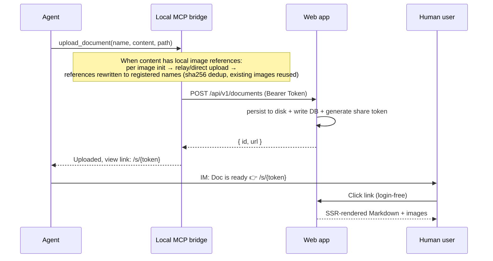

# Remote Reader

> English | [中文](./README.md)

Lets remote-working AI agents **deliver** finished Markdown documents to humans in one step: the agent uploads via MCP → gets a login-free view link → sends it over IM → the user clicks and instantly sees a fully rendered page with syntax highlighting, tables, flowcharts, and formulas.

Remote Reader is the "document delivery window" for agents — MCP on the write side, browser on the read side, all in one shot. Built to solve the problems of long documents flooding chat, incomplete Markdown rendering, and being unable to find things afterwards.

## ✨ Features

- **Native MCP upload** —— The agent uploads by calling a single `upload_document` tool; the local bridge holds the API token and never exposes it to the agent
- **Login-free one-step viewing** —— `/s/<token>` renders on click; readers need no account or sign-in
- **Complete Markdown rendering** —— GFM tables, [Shiki](https://shiki.style) code highlighting (39 languages), Mermaid flowcharts, KaTeX math (lazy-loaded on demand; zero downloads for plain text)
- **Image support** —— Local image references in `content` are auto-uploaded and rewritten (png/jpeg/gif/webp; SVG rejected); sha256 content-addressed dedup with automatic reclamation once unreferenced; presigned-URL CDN delivery on the s3 backend, login-free proxy on the local backend; clicking an image in the view page opens a **Lightbox gallery** (wheel/pinch zoom, pan, double-click, fullscreen, ←/→ navigation)
- **Idempotent uploads** —— Same path + same content never duplicates; on content update the **link stays the same** and auto-points to the latest version
- **Management UI** —— File manager (directory tree / move / rename / delete; private/shared state icons, copy share link, make private), API token management (create / revoke / one-time reveal), share link revocation
- **Multi-user isolation** —— Documents live in per-owner directory trees; SQLite foreign-key constraints enforce integrity
- **Secure by default** —— argon2id password hashing, HMAC sessions + constant-time comparison + expiry check, path-traversal protection, `html:false` for XSS defense, API tokens stored only as sha256 hashes
- **Production-ready** —— Multi-stage Docker image, non-root runtime, HEALTHCHECK, one-command Docker Compose deployment

## Architecture



Three components:

- **Web app** (`apps/web`, full-stack SvelteKit) —— storage + Markdown rendering + HTTP API + auth, deployed on the remote server
- **Local MCP bridge** (`apps/mcp-bridge`) —— deployed on the user's machine, forwards the agent's MCP tool calls (stdio) into HTTP requests against the Web API; holds the token
- **Shared layer** (`packages/shared`) —— MCP tool definitions, API client, types, shared by web and bridge

## Quick Start

### Option 1: Docker (recommended for production)

```bash
cp .env.example .env            # At minimum, change SESSION_SECRET and INITIAL_INVITE_CODE
docker compose up -d --build    # → http://localhost:3000
```

### Option 2: Local development

```bash
bun install
bun --filter remote-reader-web db:migrate   # Generates data/app.db
bun --filter remote-reader-web dev          # http://localhost:5173 (falls back to 5174 if taken)
```

Then:

1. Visit `/register` and register with `INITIAL_INVITE_CODE` (the first user automatically becomes admin; afterwards invite others via `/settings/invites`)
2. Generate an API token: `node scripts/seed-token.mjs <your-email>` (the plaintext is shown only once — save it immediately)
3. Upload a document:

   ```bash
   curl -X POST http://localhost:5173/api/v1/documents \
     -H "Authorization: Bearer <TOKEN>" -H "Content-Type: application/json" \
     -d '{"name":"hello.md","content":"# Hello","path":"demo"}'
   ```

4. Open the returned `url` (of the form `/s/<token>`) —— view the rendered result with no login

With images (optional): register the image first (`content_hash`/`content_md5` are the byte-level sha256/md5, 64/32 lowercase hex), relay the bytes, then reference it by registered name in the md:

```bash
# (1) init → {status:"relay", name, imageId} (re-init of a known hash returns {status:"exists"})
curl -X POST http://localhost:5173/api/v1/images/init \
  -H "Authorization: Bearer <TOKEN>" -H "Content-Type: application/json" \
  -d '{"name":"shot.png","content_hash":"<sha256-hex64>","content_md5":"<md5-hex32>","size_bytes":12345}'

# (2) relay the bytes (base64) → {name}
curl -X POST http://localhost:5173/api/v1/images \
  -H "Authorization: Bearer <TOKEN>" -H "Content-Type: application/json" \
  -d '{"image_id":"<imageId>","content_base64":"<base64>"}'

# (3) upload the md referencing the returned name → images render login-free (click to open the Lightbox gallery)
curl -X POST http://localhost:5173/api/v1/documents \
  -H "Authorization: Bearer <TOKEN>" -H "Content-Type: application/json" \
  -d '{"name":"report.md","content":"# Report\\n\\n","path":"demo"}'
```

(Via the MCP bridge, steps (1)–(2) are automatic — `upload_document` consumes local image references directly; see the next section.)

For full deployment (reverse proxy, HTTPS, backup, upgrade migrations), see [Installation](./docs/INSTALL.en.md).

## Agent self-service onboarding (one message to your agent)

Send this to your agent (invite codes are generated by an admin at `/settings/invites`, or use the deployment-time `INITIAL_INVITE_CODE`):

> Please visit https://your-host — the "Agent onboarding guide" in the page HTML will walk you through installing the MCP bridge and registering; use invite code `<code>` to register, and agree on email/password with me.

The agent reads the `<details id="agent-guide">` block in the login page's SSR HTML (collapsed for humans by default, always visible to agents) and automatically: installs the local MCP bridge → `POST /api/v1/auth/register` → `POST /api/v1/auth/api-token` → writes the bridge config → registers the MCP server. Existing accounts use `POST /api/v1/auth/login` instead.

## Upload via MCP (Agent)

The local MCP bridge lets an agent upload via an MCP tool call; the bridge holds the token locally and never exposes it to the agent. Once configured, the agent just calls `upload_document({ name, content, path? })` to get the view link.

**Image documents need zero extra parameters**: local image references in `content` (``, relative paths resolved against the bridge working directory) are auto-uploaded and rewritten — png/jpeg/gif/webp (SVG not supported), ≤10MB per image and ≤50 per document recommended (server rate-limit constraints); identical bytes dedup by sha256, and preflight problems (missing files / unsupported formats / oversize) are all reported at once.

Install the bridge (choose one):

- **npm package (recommended)**: `npx -y remote-reader-bridge` / `bunx remote-reader-bridge` — requires node ≥18 only, no repo clone. Register (after writing `~/.config/remote-reader/config.json` no env is needed):

  ```bash
  claude mcp add remote-reader -- npx -y remote-reader-bridge
  ```

- **From source**: `git clone https://github.com/earneet/remote-reader && bun install`. **The bridge entry path must be absolute** — the working directory an MCP client spawns the stdio process from is not guaranteed (some clients/launch paths do not pass `cwd`); a relative path fails intermittently with `Module not found` (typical symptom: "the tool works, but the client's status page shows failed").

  ```bash
  # Claude Code integration (run from the repo root; $(pwd) expands to an absolute path at registration time)
  claude mcp add remote-reader bun "$(pwd)/apps/mcp-bridge/src/index.ts" \
    -e REMOTE_READER_URL=http://localhost:5173 \
    -e REMOTE_READER_TOKEN=rr_xxx
  ```

For any other MCP client that reads a config file directly (Cursor / Cline / Windsurf / opencode / ZCode …), use the standard `mcpServers` JSON with an absolute entry path (on Windows PowerShell use `"$PWD/apps/mcp-bridge/src/index.ts"`; ZCode nests the same fields under `mcp.servers` in `~/.zcode/cli/config.json`):

```json
{
  "mcpServers": {
    "remote-reader": {
      "command": "bun",
      "args": ["/absolute/path/to/remote-reader/apps/mcp-bridge/src/index.ts"],
      "env": { "REMOTE_READER_URL": "http://localhost:5173", "REMOTE_READER_TOKEN": "rr_xxx" }
    }
  }
}
```

Alternatively, write `{ baseUrl, token }` into `~/.config/remote-reader/config.json` and register only the command (env takes precedence over the file; if config is missing, the bridge exits on startup). See [User Guide](./docs/USER_GUIDE.en.md).

## Idempotent upload semantics

Documents are located by `(owner, path, name)`; the sha256 of the content decides:

| Case | Behavior | Return |
|---|---|---|
| No document at this location | Create + persist to disk + generate share link | `{ id, url }` (new) |
| Exists, same content | **No disk write, no timestamp change** | `{ id, url }` (same) |
| Exists, different content | Overwrite on disk + update hash/size | `{ id, url }` (**id and url unchanged**) |

→ The view link for a given document stays stable long-term; after a content update the link is unchanged and auto-points to the latest version. Agents can safely re-upload.

## Tech Stack

TypeScript · Bun (package manager + dev/build host) · SvelteKit (full-stack SSR) · Drizzle ORM + SQLite (better-sqlite3) · markdown-it + Shiki · Mermaid + KaTeX · @node-rs/argon2 · vitest

> ⚠️ **Runtime split**: `better-sqlite3` is a native addon that **fails to load under bun's direct runtime** (works only under `bun + vite dev/build`). So: tests use `bun run test` (vitest, runs under node); dev/build/install use bun; **production uses `node apps/web/build/index.js`** (adapter-node output — do not start the server with `bun run`). The Docker image already follows this rule.

## Development

```bash
bun install                                   # Install all workspace dependencies
bun run test                                  # All unit tests (vitest, node runtime)
bun run test apps/web/tests/documents.test.ts # Single file
bun --filter remote-reader-web check          # svelte-check type check
bun --filter remote-reader-web dev            # Dev server
bun --filter remote-reader-web build          # Production build
```

For an end-to-end check: start the dev server in another terminal, then run `TOKEN=$(node scripts/seed-token.mjs <email> | sed 's/^TOKEN=//') API_TOKEN=$TOKEN BASE_URL=http://localhost:5174 ./scripts/e2e-check.sh`.

## Documentation

- [Installation](./docs/INSTALL.en.md) —— Docker / manual deployment / reverse proxy / backup & upgrade / configuration reference
- [User Guide](./docs/USER_GUIDE.en.md) —— Three perspectives: deployer / agent operator / reader
- [Product Overview](./docs/PRODUCT.en.md) —— Positioning, scenarios, features, roadmap
- [Design Document](./docs/superpowers/specs/2026-07-18-remote-reader-design.md) —— Architecture, data model, security model, implementation status

## License

[MIT](./LICENSE)
