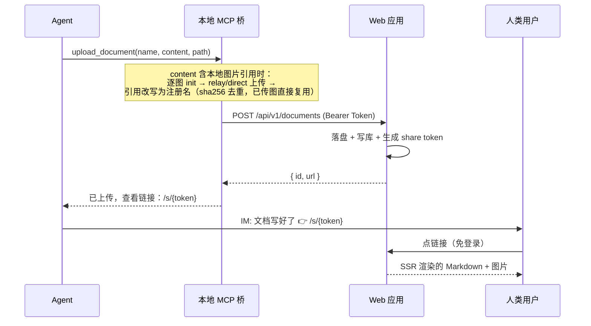

# Remote Reader

> [English](./README.en.md) | 中文

让远程工作的 AI Agent 把写好的 Markdown 文档**一步交付**给人类：Agent 通过 MCP 上传 → 拿到免登录查看链接 → 经 IM 发给用户 → 用户点开即见带语法高亮、表格、流程图、公式的完整渲染。

Remote Reader 是 Agent 的「文档交付窗口」——写入侧用 MCP，阅读侧用浏览器，一次到位。专为解决长文档在聊天里刷屏、Markdown 渲染不全、事后找不到的问题。

## ✨ 特性

- **MCP 原生上传** —— Agent 调一个 `upload_document` 工具即可上传；本地桥持有 API token，不暴露给 Agent
- **免登录一步查看** —— `/s/<token>` 点开即渲染，阅读者无需注册登录
- **完整 Markdown 渲染** —— GFM 表格、[Shiki](https://shiki.style) 代码高亮（39 种语言）、Mermaid 流程图、KaTeX 数学公式（按需懒加载，纯文本零下载）
- **图片支持** —— `content` 里的本地图片引用自动上传并改写（png/jpeg/gif/webp，SVG 拒收）；sha256 内容寻址去重、无引用自动回收；s3 后端 presigned URL CDN 直连，本地后端走免登录代理；查看页点击图片打开 **Lightbox 图集**（滚轮/pinch 缩放、拖动、双击、全屏、←/→ 切图）
- **幂等上传** —— 同路径同内容不重复生成；内容更新时**链接不变**、自动指向最新版本
- **管理 UI** —— 文件管理器（目录树 / 移动 / 重命名 / 删除；行首私有/共享状态图标、复制分享链接、转为私有）、API token 管理（创建 / 撤销 / 一次性 reveal）、分享链接撤销
- **多用户隔离** —— 文档按 owner 存于独立目录树，SQLite 外键约束保证完整
- **安全默认** —— argon2id 密码哈希、HMAC session + 常量时间比较 + 过期校验、路径穿越防护、`html:false` 防 XSS、API token 仅存 sha256 哈希
- **生产就绪** —— 多阶段 Docker 镜像、非 root 运行、HEALTHCHECK、Docker Compose 一键部署

## 架构



三大组件：

- **Web 应用**（`apps/web`，SvelteKit 全栈）—— 存储 + Markdown 渲染 + HTTP API + 认证，部署在远程服务器
- **本地 MCP 桥**（`apps/mcp-bridge`）—— 部署在用户机器，把 Agent 的 MCP 工具调用（stdio）转发为对 Web API 的 HTTP 请求，持有 token
- **共享层**（`packages/shared`）—— MCP 工具定义、API client、类型，被 web 与 bridge 共用

## 快速开始

### 方式一：Docker（推荐生产）

```bash
cp .env.example .env            # 至少改 SESSION_SECRET、INITIAL_INVITE_CODE
docker compose up -d --build    # → http://localhost:3000
```

### 方式二：本地开发

```bash
bun install
bun --filter remote-reader-web db:migrate   # 生成 data/app.db
bun --filter remote-reader-web dev          # http://localhost:5173（被占会切 5174）
```

然后：

1. 访问 `/register`，用 `INITIAL_INVITE_CODE` 注册（首个用户自动成为 admin；此后可在 `/settings/invites` 生成邀请码邀请他人）
2. 生成 API token：`node scripts/seed-token.mjs <your-email>`（明文仅显示一次，立即保存）
3. 上传文档：

   ```bash
   curl -X POST http://localhost:5173/api/v1/documents \
     -H "Authorization: Bearer <TOKEN>" -H "Content-Type: application/json" \
     -d '{"name":"hello.md","content":"# 你好","path":"demo"}'
   ```

4. 打开返回的 `url`（形如 `/s/<token>`）—— 免登录查看渲染结果

带图文档（可选）：先注册图片（`content_hash`/`content_md5` 为字节的真实 sha256/md5，各 64/32 位小写 hex），再中转字节，md 里用注册名引用：

```bash
# ① init 登记 → 返回 {status:"relay", name, imageId}（同 hash 重复 init 返回 {status:"exists"}）
curl -X POST http://localhost:5173/api/v1/images/init \
  -H "Authorization: Bearer <TOKEN>" -H "Content-Type: application/json" \
  -d '{"name":"shot.png","content_hash":"<sha256-hex64>","content_md5":"<md5-hex32>","size_bytes":12345}'

# ② relay 上传字节（base64）→ 返回 {name}
curl -X POST http://localhost:5173/api/v1/images \
  -H "Authorization: Bearer <TOKEN>" -H "Content-Type: application/json" \
  -d '{"image_id":"<imageId>","content_base64":"<base64>"}'

# ③ 上传 md，content 用返回的注册名引用 → 查看页图片免登录可见（点击进 Lightbox 图集）
curl -X POST http://localhost:5173/api/v1/documents \
  -H "Authorization: Bearer <TOKEN>" -H "Content-Type: application/json" \
  -d '{"name":"report.md","content":"# 报告\n\n","path":"demo"}'
```

（走 MCP 桥时 ①② 是自动的——`upload_document` 直接吃本地图片引用，见下节。）

完整部署（systemd 一键 / Docker / 手动 / 反向代理 / HTTPS / 备份 / 升级迁移）见 [安装指导](./docs/INSTALL.md)。

## Agent 自助接入（发给 Agent 一句话即可）

把下面这句话发给你的 Agent（邀请码由 admin 在 `/settings/invites` 生成，或用部署时的 `INITIAL_INVITE_CODE`）：

> 请访问 https://your-host，页面 HTML 中的「Agent 自动接入指南」会指导你完成 MCP 桥安装与账号注册；使用邀请码 `<邀请码>` 注册，邮箱密码由你与我商量决定。

Agent 读取登录页 SSR 输出的 `<details id="agent-guide">` 指引块（对人默认折叠、对 Agent 始终可见），自动完成：安装本地 MCP 桥 → `POST /api/v1/auth/register` 注册 → `POST /api/v1/auth/api-token` 创建 token → 写桥配置 → 注册 MCP server。已有账号时改用 `POST /api/v1/auth/login`。

## 通过 MCP 上传（Agent）

本地 MCP 桥让 Agent 以 MCP 工具调用上传，桥在本地持有 token、不暴露给 Agent。配置好后 Agent 调 `upload_document({ name, content, path? })` 即可拿到查看链接。

**带图文档零额外参数**：`content` 里的本地图片引用（``，相对路径按桥工作目录解析）会被自动上传并改写——png/jpeg/gif/webp（SVG 不支持），单图建议 ≤10MB、单文档 ≤50 张（服务端限流约束）；同字节图片 sha256 去重复用，预检问题（文件不存在/格式不支持/超大）一次性全部列出。

安装桥（二选一）：

- **npm 包（推荐）**：`npx -y remote-reader-bridge` / `bunx remote-reader-bridge`，node ≥18 即可，无需克隆仓库。注册（写了 `~/.config/remote-reader/config.json` 后无需 env）：

  ```bash
  claude mcp add remote-reader -- npx -y remote-reader-bridge
  ```

- **源码克隆**：`git clone https://github.com/earneet/remote-reader && bun install`。**桥入口必须写绝对路径**——MCP 客户端拉起 stdio 进程时的工作目录没有保证（部分客户端/启动路径不传 `cwd`），相对路径会间歇性 `Module not found`——典型症状是"工具明明能用，客户端状态页却显示 failed"。

  ```bash
  # Claude Code 接入（在仓库根目录执行；$(pwd) 在注册时展开为绝对路径）
  claude mcp add remote-reader bun "$(pwd)/apps/mcp-bridge/src/index.ts" \
    -e REMOTE_READER_URL=http://localhost:5173 \
    -e REMOTE_READER_TOKEN=rr_xxx
  ```

其他 MCP 客户端（Cursor / Cline / Windsurf / opencode / ZCode 等直接读配置文件的）用标准 `mcpServers` JSON，入口同样写绝对路径（Windows PowerShell 用 `"$PWD/apps/mcp-bridge/src/index.ts"`；ZCode 写在 `~/.zcode/cli/config.json` 的 `mcp.servers` 下，字段含义相同）：

```json
{
  "mcpServers": {
    "remote-reader": {
      "command": "bun",
      "args": ["/absolute/path/to/remote-reader/apps/mcp-bridge/src/index.ts"],
      "env": { "REMOTE_READER_URL": "http://localhost:5173", "REMOTE_READER_TOKEN": "rr_xxx" }
    }
  }
}
```

或把 `{ baseUrl, token }` 写进 `~/.config/remote-reader/config.json` 后只注册命令（env 优先于文件；配置缺失桥启动即退）。详见 [用户手册](./docs/USER_GUIDE.md)。

## 上传幂等语义

按 `(owner, path, name)` 定位文档，按 content 的 sha256 判断：

| 情况 | 行为 | 返回 |
|---|---|---|
| 该位置无文档 | 新建 + 落盘 + 生成 share link | `{ id, url }`（新） |
| 有，内容相同 | **不写盘、不改时间戳** | `{ id, url }`（同） |
| 有，内容不同 | 覆盖磁盘 + 更新 hash/size | `{ id, url }`（**id 与 url 不变**） |

→ 同一份文档的查看链接长期稳定；内容更新后链接不变、自动指向最新版本。Agent 可放心重复上传。

## 技术栈

TypeScript · Bun（包管理 + dev/build 宿主） · SvelteKit（全栈 SSR） · Drizzle ORM + SQLite（better-sqlite3） · markdown-it + Shiki · Mermaid + KaTeX · @node-rs/argon2 · vitest

> ⚠️ **运行时分工**：`better-sqlite3` 是原生 addon，**bun 直接运行时加载失败**（仅 `bun + vite dev/build` 下可用）。因此：测试用 `bun run test`（vitest，在 node 下跑）；dev/build/install 用 bun；**生产用 `node apps/web/build/index.js`**（adapter-node 产物，勿用 `bun run` 启服务）。Docker 镜像已按此处理。

## 开发

```bash
bun install                                   # 装所有 workspace 依赖
bun run test                                  # 全部单测（vitest，node 运行时）
bun run test apps/web/tests/documents.test.ts # 单个文件
bun --filter remote-reader-web check          # svelte-check 类型检查
bun --filter remote-reader-web dev            # 开发服务器
bun --filter remote-reader-web build          # 生产构建
```

端到端检查：另开终端起 dev，再跑 `TOKEN=$(node scripts/seed-token.mjs <email> | sed 's/^TOKEN=//') API_TOKEN=$TOKEN BASE_URL=http://localhost:5174 ./scripts/e2e-check.sh`。

## 文档

- [安装指导](./docs/INSTALL.md) —— systemd 一键 / Docker / 手动部署 / 反向代理 / 备份升级 / 配置参考
- [用户手册](./docs/USER_GUIDE.md) —— 部署者 / Agent 操作者 / 阅读者三视角
- [产品概览](./docs/PRODUCT.md) —— 定位、场景、功能、路线图
- [设计文档](./docs/superpowers/specs/2026-07-18-remote-reader-design.md) —— 架构、数据模型、安全模型、实现现状

## License

[MIT](./LICENSE)
