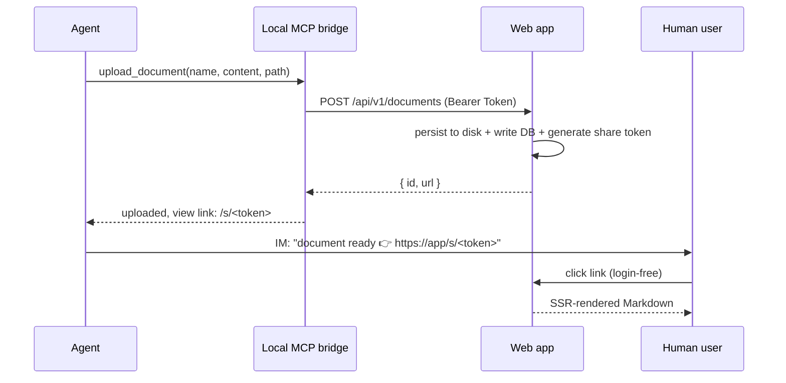

# Remote Reader · Product Overview

> English | [中文](./PRODUCT.md)

> An Agent's "document delivery window" — write side via MCP, read side via browser, done in one step.

## 1. One-line positioning

Remote Reader lets a remote AI Agent **deliver a finished Markdown document to a human user in a single step**: the Agent uploads it via MCP, receives a login-free link that opens to a fully rendered view, sends it over instant messaging, and the user clicks to see the formatted document.

## 2. Problem it solves

In remote collaboration, Agents (such as Claude Code) often need to hand **long, structured output** — weekly reports, proposals, code walkthroughs, research notes, operating manuals — to a human for review. Pasting it directly into chat:

- Long documents spam the channel and are hard to read or revisit;
- Most IM clients render Markdown incompletely (tables, code blocks, formulas);
- There is no stable link, so the content is hard to find afterward.

Remote Reader turns this into **a single MCP tool call**: the Agent calls `upload_document`, gets a persistent link, and the user sees the full render — with syntax highlighting, tables, flowcharts and formulas — in a browser.

## 3. Core scenario

Three key properties:

1. **Login-free straight to the render** — the user clicks the link and sees the result immediately, no sign-up or sign-in.
2. **Idempotent upload** — uploading the same path with the same content does not create duplicates, and the link stays stable over time; when the content changes it is overwritten in place and **the link does not change**.
3. **Private by default, shareable** — documents are not publicly listed; each upload auto-generates a "view key" (share token) whose holder can read, and the owner can revoke it.

## 4. Target users

| Role | Need |
|---|---|
| **Agent operator** (developer / remote worker) | Have their AI Agent hand long documents to themselves or teammates cleanly, without spamming the channel |
| **Reader** (teammate / client / self) | Click the received link and read immediately, zero friction, full render |
| **Small teams** | Multiple people and multiple Agents, documents isolated per owner, controllable sharing |

## 5. Feature list

### ✅ Currently implemented (sub-plans 1 + 2 + 3 all complete)

- **Upload API**: `POST /api/v1/documents`, API token authentication, content_hash idempotency, auto-generated view link.
- **Login-free view page** `/s/<token>`: server-side rendered Markdown (GFM tables, Shiki code highlighting for ~15 languages, autolinking); raw HTML is not rendered by default (XSS protection).
- **Markdown enhancements**: Mermaid flowcharts, KaTeX math formulas (lazy-loaded on the client as needed; plain-text documents download nothing extra).
- **Register / Login**: invite-code registration (the first user becomes admin automatically), argon2id password hashing, login rate limiting.
- **Secure session**: HMAC-SHA256 + constant-time comparison + expiry check; in production a missing secret fails fast at startup.
- **Path safety**: both the uploaded `path` and `name` are filtered through `parsePath` to prevent directory traversal.
- **Multi-user isolation**: documents live in per-owner directory trees; SQLite foreign-key constraints keep data consistent.
- **File manager**: dual-pane (directory tree + list), browse / create folders / move (with cycle detection) / rename / delete (cascade + disk + share cleanup); owner view page at `/d/<id>`.
- **API token management UI**: create / revoke, plaintext shown once on reveal.
- **Share link management UI**: view / revoke (after revocation `/s/<token>` returns 404 immediately).
- **Local MCP bridge** (`apps/mcp-bridge`): stdio MCP server exposing the `upload_document` tool, holds the token locally and forwards to the Web API; config = file defaults + env overrides.
- **Docker deployment**: multi-stage image, prod-only node_modules, non-root runtime, HEALTHCHECK, one-shot Docker Compose.

### 📋 Planned (Phase 3, low priority)

- Remote MCP server (Streamable HTTP, reuses `packages/shared` tools, no local bridge needed)
- Document tags + FTS5 full-text search
- Sharing with specific users (`document_readers` table)

## 6. Design philosophy (what sets it apart)

- **MCP-native, not another cloud drive**: the write entry point is the Agent's MCP tool, purpose-built for "an Agent delivering a document to a human" rather than general-purpose file storage.
- **Optimized for one-shot documents**: the main flow is "send a link → click to read"; the file manager is a secondary cleanup tool, not the entry point.
- **Private by default, sharing explicit**: nothing is public until upload; uploading generates a revocable view key, and the owner stays in control.
- **Single instance is enough**: aimed at small teams / individuals, SQLite + the local filesystem, without the operational burden of an external database / object store.

## 7. Roadmap

| Phase | Scope | Status |
|---|---|---|
| **Phase 1 · MVP** | Web core (upload API + login-free view page + auth) | ✅ Sub-plan 1 complete |
| **Phase 1 · MVP** | Local MCP bridge (`upload_document` tool) | ✅ Sub-plan 2 complete |
| **Phase 2** | File manager + token / share management UI + md enhancements (Mermaid / KaTeX) + Docker | ✅ Sub-plan 3 complete |
| **Phase 3** | Remote MCP server, tags, full-text search, targeted sharing | 📋 Low priority |

## Related documentation

- [Installation](./INSTALL.en.md) — Docker / manual deployment / reverse proxy / backup and upgrade
- [User Guide](./USER_GUIDE.en.md) — three perspectives: deployer / Agent operator / reader
- [Design document](./superpowers/specs/2026-07-18-remote-reader-design.md) — architecture, data model, security model, implementation status
- Quick start: [`README.en.md`](../README.en.md) in the repo root
