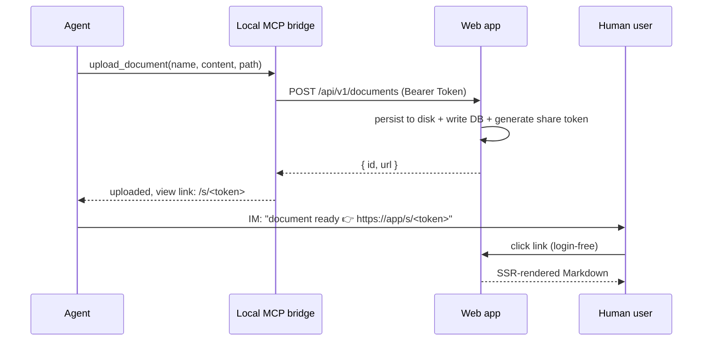

# Remote Reader · Product Overview

> English | [中文](./PRODUCT.md)

> An Agent's "document delivery window" — write side via MCP, read side via browser, done in one step.

## 1. One-line positioning

Remote Reader lets a remote AI Agent **deliver a finished Markdown document to a human user in a single step**: the Agent uploads it via MCP, receives a login-free link that opens to a fully rendered view, sends it over instant messaging, and the user clicks to see the formatted document.

## 2. Problem it solves

In remote collaboration, Agents (such as Claude Code) often need to hand **long, structured output** — weekly reports, proposals, code walkthroughs, research notes, operating manuals — to a human for review. Pasting it directly into chat:

- Long documents spam the channel and are hard to read or revisit;
- Most IM clients render Markdown incompletely (tables, code blocks, formulas);
- There is no stable link, so the content is hard to find afterward.

Remote Reader turns this into **a single MCP tool call**: the Agent calls `upload_document`, gets a persistent link, and the user sees the full render — with syntax highlighting, tables, flowcharts and formulas — in a browser.

## 3. Core scenario

```mermaid
sequenceDiagram
    participant Agent
    participant Bridge as Local MCP bridge
    participant Web as Web app
    participant User as Human user

    Agent->>Bridge: upload_document(name, content, path)
    Bridge->>Web: POST /api/v1/documents (Bearer Token)
    Web->>Web: persist to disk + write DB + generate share token
    Web-->>Bridge: { id, url }
    Bridge-->>Agent: uploaded, view link: /s/<token>
    Agent->>User: IM: "document ready 👉 https://app/s/<token>"
    User->>Web: click link (login-free)
    Web-->>User: SSR-rendered Markdown
```

Three key properties:

1. **Login-free straight to the render** — the user clicks the link and sees the result immediately, no sign-up or sign-in.
2. **Idempotent upload** — uploading the same path with the same content does not create duplicates, and the link stays stable over time; when the content changes it is overwritten in place and **the link does not change**.
3. **Private by default, shareable** — documents are not publicly listed; each upload auto-generates a "view key" (share token) whose holder can read, and the owner can revoke it.

## 4. Target users

| Role | Need |
|---|---|
| **Agent operator** (developer / remote worker) | Have their AI Agent hand long documents to themselves or teammates cleanly, without spamming the channel |
| **Reader** (teammate / client / self) | Click the received link and read immediately, zero friction, full render |
| **Small teams** | Multiple people and multiple Agents, documents isolated per owner, controllable sharing |

## 5. Feature list

### ✅ Currently implemented

**Core flow**

- **Upload API**: `POST /api/v1/documents`, API token authentication, content_hash idempotency, auto-generated view link.
- **Login-free view page** `/s/<token>`: server-side rendered Markdown (GFM tables, Shiki code highlighting for 39 languages (with text fallback for uncovered languages), autolinking, **GitHub-style heading anchors** — in-document TOC links and fragment jumps work); raw HTML is not rendered by default (XSS protection).
- **Markdown enhancements**: Mermaid flowcharts (click to zoom, re-renders with theme), KaTeX math formulas (lazy-loaded on the client as needed), fullscreen view for wide tables, **image lightbox gallery** (zoom / pan / double-tap / navigation / fullscreen).
- **Local MCP bridge** (`apps/mcp-bridge`): stdio MCP server exposing the `upload_document` tool, holds the token locally and forwards to the Web API; published as the npm package `remote-reader-bridge` (run `npx -y remote-reader-bridge` with zero cloning); config = file defaults + env overrides.

**Accounts and multi-user**

- **Register / Login**: invite-code registration (the first user becomes admin automatically), argon2id password hashing, dual-bucket login rate limiting.
- **Invite code management** (admin, `/settings/invites`): generate (1/7/30-day validity) / soft-revoke / redemption counts.
- **Agent self-onboarding**: an Agent guide block embedded in the login page (SSR-fetchable) plus register / login / token-creation JSON APIs — send an Agent one sentence and it onboards itself.
- **Secure session**: HMAC-SHA256 + constant-time comparison + expiry check; in production a missing secret fails fast at startup.
- **Multi-user isolation**: documents live in per-owner directory trees; SQLite foreign-key constraints keep data consistent.

**File manager**

- Dual-pane (directory tree + list): browse / create folders / move (with cycle detection) / rename / delete (cascade + disk + share cleanup); collapse memory and auto-expansion to the current path.
- **Three views**: directory contents ⇄ recent documents (global update order) ⇄ recently viewed (personal view order), with infinite scrolling.
- **Search and tags**: FTS5 full-text search (`/search`, snippets with match markers) + filename / tag filters; document tags (centralized management at `/settings/tags`, renames cascade).
- **Share-state visualization**: private / shared icons per row, one-click copy of the share link / convert to private; share-link management UI (`/settings/shares`, revoking makes `/s/<token>` return 404 immediately).
- **Mobile** (≤768px): fullscreen content + slide-in drawer tree + breadcrumbs + action-sheet row operations.
- **Theming**: light / dark / follow-system, site-wide single-source CSS variables.
- **API token management UI**: create / revoke, plaintext shown once on reveal.

**Storage and deployment**

- **Path safety**: both the uploaded `path` and `name` are filtered through `parsePath` to prevent directory traversal.
- **Image support**: local image references in `content` are uploaded and rewritten automatically (png/jpeg/gif/webp; SVG rejected); sha256 content addressing deduplicates across the whole library and unreferenced images are garbage-collected; presigned URLs connect directly to the CDN on the s3 backend, login-free proxying on the local backend.
- **Cold/hot tiering (optional)**: after configuring `OBJECT_STORE_*`, stale cold documents are archived to S3-compatible object storage automatically — synchronously fetched for viewing, rewarmed in the background, titles stay searchable; disabled by default with unchanged behavior.
- **Deployment**: three systemd scripts (install / update / uninstall, with unit hardening + automatic rollback on failed upgrades) + Docker (multi-stage image, non-root runtime, HEALTHCHECK, one-shot Compose).

### 📋 Planned (low priority)

- Remote MCP server (Streamable HTTP, reuses `packages/shared` tools, no local bridge needed)
- Sharing with specific users (`document_readers` table)

## 6. Design philosophy (what sets it apart)

- **MCP-native, not another cloud drive**: the write entry point is the Agent's MCP tool, purpose-built for "an Agent delivering a document to a human" rather than general-purpose file storage.
- **Optimized for one-shot documents**: the main flow is "send a link → click to read"; the file manager is a secondary cleanup tool, not the entry point.
- **Private by default, sharing explicit**: nothing is public until upload; uploading generates a revocable view key, and the owner stays in control.
- **Single instance is enough**: aimed at small teams / individuals, SQLite + the local filesystem to start, no external dependencies forced; cold/hot tiering is optional (after configuring `OBJECT_STORE_*`, stale cold documents are archived to S3-compatible object storage automatically — disabled by default, behavior unchanged).

## 7. Roadmap

| Phase | Scope | Status |
|---|---|---|
| **Phase 1 · MVP** | Web core (upload API + login-free view page + auth) | ✅ Sub-plan 1 complete |
| **Phase 1 · MVP** | Local MCP bridge (`upload_document` tool) | ✅ Sub-plan 2 complete |
| **Phase 2** | File manager + token / share management UI + md enhancements (Mermaid / KaTeX) + Docker | ✅ Sub-plan 3 complete |
| **Phase 2+** | Tags + full-text search, cold/hot tiering, recent-documents / recently-viewed views, theming, mobile FM, invite-code management, share-state visualization, Agent self-onboarding, image support, heading anchors | ✅ Delivered (2026-08 ~ 2026-09) |
| **Phase 3** | Remote MCP server, targeted sharing | 📋 Low priority |

## Related documentation

- [Installation](./INSTALL.en.md) — Docker / manual deployment / reverse proxy / backup and upgrade
- [User Guide](./USER_GUIDE.en.md) — three perspectives: deployer / Agent operator / reader
- [Design document](./superpowers/specs/2026-07-18-remote-reader-design.md) — architecture, data model, security model, implementation status
- Quick start: [`README.en.md`](../README.en.md) in the repo root
