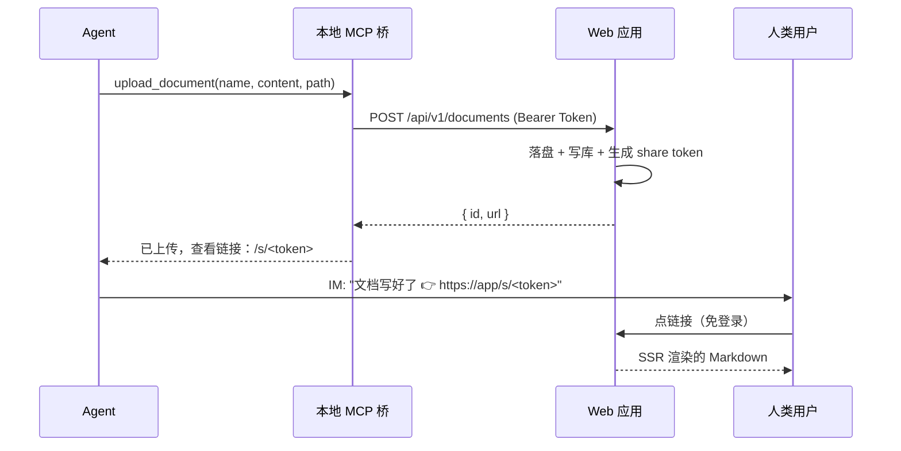

# Remote Reader · 产品概览

> [English](./PRODUCT.en.md) | 中文

> Agent 的「文档交付窗口」——写入侧用 MCP，阅读侧用浏览器，一次到位。

## 1. 一句话定位

Remote Reader 让远程工作的 AI Agent 把写好的 Markdown 文档**一步交付**给人类用户：Agent 通过 MCP 上传，拿到一个免登录、点开即见渲染结果的链接，经即时通信发给用户，用户点击就看到排版好的文档。

## 2. 解决什么问题

远程协作中，Agent（如 Claude Code）经常需要把**较长的结构化产出**——周报、方案、代码说明、调研笔记、操作手册——交给人类审阅。直接贴在聊天里：

- 长文档刷屏，难以阅读和回顾；
- Markdown 在多数 IM 里渲染不全（表格、代码块、公式）；
- 没有固定链接，事后找不到。

Remote Reader 把这件事变成**一个 MCP 工具调用**：Agent 调 `upload_document`，得到一个持久链接，用户在浏览器里看到带语法高亮、表格、流程图和公式的完整渲染。

## 3. 核心场景

三个关键性质：

1. **免登录一步到渲染**——用户点链接直接看到结果，不注册不登录。
2. **幂等上传**——同一路径同一内容重复上传不产生重复，链接长期稳定；内容变了就原地覆盖，**链接不变**。
3. **默认私有 + 可分享**——文档不公开遍历；上传时自动生成一把「查看钥匙」（share token），持有者可读，owner 可撤销。

## 4. 目标用户

| 角色 | 诉求 |
|---|---|
| **Agent 操作者**（开发者 / 远程工作者） | 让自己的 AI Agent 把长文档干净地交给自己或同事看，不刷屏 |
| **阅读者**（同事 / 客户 / 自己） | 收到链接点开就看，零门槛，渲染完整 |
| **小团队** | 多人多 Agent，文档按 owner 隔离，可控分享 |

## 5. 功能清单

### ✅ 当前已实现（子计划 1 + 2 + 3 全部完成）

- **上传 API**：`POST /api/v1/documents`，API token 认证，content_hash 幂等，自动生成查看链接。
- **免登录查看页** `/s/<token>`：服务端渲染 Markdown（GFM 表格、Shiki 代码高亮 ~15 语言、链接化），默认不渲染原始 HTML（XSS 防护）。
- **Markdown 增强**：Mermaid 流程图、KaTeX 数学公式（客户端按需懒加载，纯文本零下载）。
- **注册 / 登录**：邀请码注册（首用户自动管理员），argon2id 密码哈希，登录限流。
- **安全会话**：HMAC-SHA256 + 常量时间比较 + 过期校验；生产缺密钥启动期 fail-fast。
- **路径安全**：上传的 `path` 与 `name` 都经 `parsePath` 过滤，防目录穿越。
- **多用户隔离**：文档按 owner 存在独立目录树；SQLite 外键约束保数据完整。
- **文件管理器**：双栏（目录树 + 列表），浏览 / 新建文件夹 / 移动（含环路检测）/ 重命名 / 删除（级联 + 磁盘 + share 清理）；owner 查看页 `/d/<id>`。
- **API token 管理 UI**：创建 / 撤销，明文一次性 reveal。
- **分享链接管理 UI**：查看 / 撤销（撤销后 `/s/<token>` 立即 404）。
- **本地 MCP 桥**（`apps/mcp-bridge`）：stdio MCP server，暴露 `upload_document` 工具，本地持有 token 转发到 Web API；配置 = 文件默认 + env 覆盖。
- **Docker 部署**：多阶段镜像、prod-only node_modules、非 root 运行、HEALTHCHECK、Docker Compose 一键。

### 📋 规划中（Phase 3，低优先）

- 远程 MCP server（Streamable HTTP，复用 `packages/shared` 工具，免本地桥）
- 文档标签 + FTS5 全文搜索
- 指定用户分享（`document_readers` 表）

## 6. 设计理念（与同类区别）

- **MCP-native，不是又一个网盘**：写入入口是 Agent 的 MCP 工具，专为「Agent 交付文档给人」设计，不是通用文件存储。
- **为一次性文档优化**：主流程是「发链接 → 点开看」，文件管理器是次要整理工具，不是入口。
- **私有默认，分享显式**：不上传不公开；上传即生成一把可撤销的查看钥匙，owner 始终可控。
- **单实例够用**：面向小团队 / 个人，SQLite + 本地文件系统，不引入外部数据库 / 对象存储的运维负担。

## 7. 路线图

| 阶段 | 内容 | 状态 |
|---|---|---|
| **Phase 1 · MVP** | Web 核心（上传 API + 免登录查看页 + 认证） | ✅ 子计划 1 完成 |
| **Phase 1 · MVP** | 本地 MCP 桥（`upload_document` 工具） | ✅ 子计划 2 完成 |
| **Phase 2** | 文件管理器 + token / 分享管理 UI + md 增强（Mermaid / KaTeX）+ Docker | ✅ 子计划 3 完成 |
| **Phase 3** | 远程 MCP server、标签、全文搜索、指定分享 | 📋 低优先级 |

## 相关文档

- [安装指导](./INSTALL.md) —— Docker / 手动部署 / 反向代理 / 备份升级
- [用户手册](./USER_GUIDE.md) —— 部署者 / Agent 操作者 / 阅读者三视角
- [设计文档](./superpowers/specs/2026-07-18-remote-reader-design.md) —— 架构、数据模型、安全模型、实现现状
- 快速上手：根目录 [`README.md`](../README.md)
