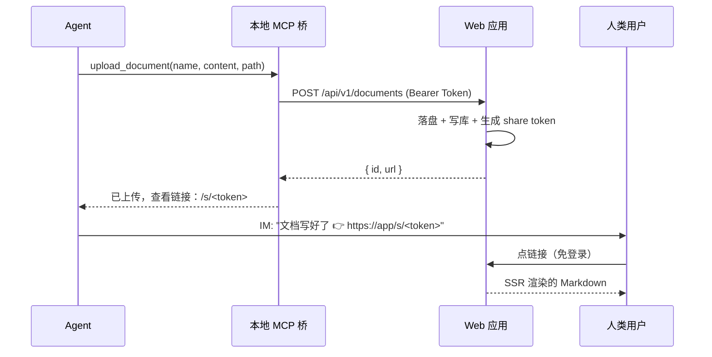

# Remote Reader · 产品概览

> [English](./PRODUCT.en.md) | 中文

> Agent 的「文档交付窗口」——写入侧用 MCP，阅读侧用浏览器，一次到位。

## 1. 一句话定位

Remote Reader 让远程工作的 AI Agent 把写好的 Markdown 文档**一步交付**给人类用户：Agent 通过 MCP 上传，拿到一个免登录、点开即见渲染结果的链接，经即时通信发给用户，用户点击就看到排版好的文档。

## 2. 解决什么问题

远程协作中，Agent（如 Claude Code）经常需要把**较长的结构化产出**——周报、方案、代码说明、调研笔记、操作手册——交给人类审阅。直接贴在聊天里：

- 长文档刷屏，难以阅读和回顾；
- Markdown 在多数 IM 里渲染不全（表格、代码块、公式）；
- 没有固定链接，事后找不到。

Remote Reader 把这件事变成**一个 MCP 工具调用**：Agent 调 `upload_document`，得到一个持久链接，用户在浏览器里看到带语法高亮、表格、流程图和公式的完整渲染。

## 3. 核心场景

```mermaid
sequenceDiagram
    participant Agent
    participant Bridge as 本地 MCP 桥
    participant Web as Web 应用
    participant User as 人类用户

    Agent->>Bridge: upload_document(name, content, path)
    Bridge->>Web: POST /api/v1/documents (Bearer Token)
    Web->>Web: 落盘 + 写库 + 生成 share token
    Web-->>Bridge: { id, url }
    Bridge-->>Agent: 已上传，查看链接：/s/<token>
    Agent->>User: IM: "文档写好了 👉 https://app/s/<token>"
    User->>Web: 点链接（免登录）
    Web-->>User: SSR 渲染的 Markdown
```

三个关键性质：

1. **免登录一步到渲染**——用户点链接直接看到结果，不注册不登录。
2. **幂等上传**——同一路径同一内容重复上传不产生重复，链接长期稳定；内容变了就原地覆盖，**链接不变**。
3. **默认私有 + 可分享**——文档不公开遍历；上传时自动生成一把「查看钥匙」（share token），持有者可读，owner 可撤销。

## 4. 目标用户

| 角色 | 诉求 |
|---|---|
| **Agent 操作者**（开发者 / 远程工作者） | 让自己的 AI Agent 把长文档干净地交给自己或同事看，不刷屏 |
| **阅读者**（同事 / 客户 / 自己） | 收到链接点开就看，零门槛，渲染完整 |
| **小团队** | 多人多 Agent，文档按 owner 隔离，可控分享 |

## 5. 功能清单

### ✅ 当前已实现

**核心链路**

- **上传 API**：`POST /api/v1/documents`，API token 认证，content_hash 幂等，自动生成查看链接。
- **免登录查看页** `/s/<token>`：服务端渲染 Markdown（GFM 表格、Shiki 代码高亮 39 种语言（未覆盖语言 text 保底降级）、链接化、**GitHub 风格标题锚点**——文档目录链接与页内跳转可用），默认不渲染原始 HTML（XSS 防护）。
- **Markdown 增强**：Mermaid 流程图（点击放大、随主题重渲）、KaTeX 数学公式（按需懒加载）、宽表全屏查看、**图片 Lightbox 图集**（缩放 / 平移 / 双击 / 切图 / 全屏）。
- **本地 MCP 桥**（`apps/mcp-bridge`）：stdio MCP server，暴露 `upload_document` 工具，本地持有 token 转发到 Web API；已发布 npm 包 `remote-reader-bridge`（`npx -y remote-reader-bridge` 零克隆直跑）；配置 = 文件默认 + env 覆盖。

**账号与多用户**

- **注册 / 登录**：邀请码注册（首用户自动管理员），argon2id 密码哈希，双桶登录限流。
- **邀请码管理**（admin，`/settings/invites`）：生成（1/7/30 天有效期）/ 软撤销 / 核销计数。
- **Agent 自助接入**：登录页内置 Agent 指引块（SSR 可抓取）+ 注册 / 登录 / 建 token JSON API——发给 Agent 一句话即可自助完成接入。
- **安全会话**：HMAC-SHA256 + 常量时间比较 + 过期校验；生产缺密钥启动期 fail-fast。
- **多用户隔离**：文档按 owner 存在独立目录树；SQLite 外键约束保数据完整。

**文件管理器**

- 双栏（目录树 + 列表），浏览 / 新建文件夹 / 移动（含环路检测）/ 重命名 / 删除（级联 + 磁盘 + share 清理）；折叠记忆、当前路径自动展开定位。
- **三个视图**：目录内容 ⇄ 最近文档（全局更新序）⇄ 最近浏览（本人浏览序），无限滚动。
- **搜索与标签**：FTS5 全文搜索（`/search`，摘要带命中标记）+ 文件名 / 标签过滤；文档标签（`/settings/tags` 集中管理、改名级联）。
- **分享状态可视化**：行首私有 / 共享图标、一键复制分享链接 / 转私有；分享链接管理 UI（`/settings/shares`，撤销后 `/s/<token>` 立即 404）。
- **移动端**（≤768px）：内容全屏 + 侧滑抽屉目录树 + 面包屑 + action sheet 行操作。
- **主题**：浅色 / 深色 / 跟随系统三档，全站单源 CSS 变量。
- **API token 管理 UI**：创建 / 撤销，明文一次性 reveal。

**存储与部署**

- **路径安全**：上传的 `path` 与 `name` 都经 `parsePath` 过滤，防目录穿越。
- **图片支持**：`content` 里的本地图片引用自动上传并改写（png/jpeg/gif/webp，SVG 拒收）；sha256 内容寻址全库去重、无引用自动回收；s3 后端 presigned URL CDN 直连，本地后端免登录代理。
- **冷热分层（可选）**：配置 `OBJECT_STORE_*` 后超期冷文档自动归档 S3 兼容对象存储，同步拉取可看 + 后台回热、标题可搜；默认关闭、行为不变。
- **部署**：systemd 三脚本（install / update / uninstall，unit 安全加固 + 升级失败自动回滚）+ Docker（多阶段镜像、非 root 运行、HEALTHCHECK、Compose 一键）。

### 📋 规划中（低优先）

- 远程 MCP server（Streamable HTTP，复用 `packages/shared` 工具，免本地桥）
- 指定用户分享（`document_readers` 表）

## 6. 设计理念（与同类区别）

- **MCP-native，不是又一个网盘**：写入入口是 Agent 的 MCP 工具，专为「Agent 交付文档给人」设计，不是通用文件存储。
- **为一次性文档优化**：主流程是「发链接 → 点开看」，文件管理器是次要整理工具，不是入口。
- **私有默认，分享显式**：不上传不公开；上传即生成一把可撤销的查看钥匙，owner 始终可控。
- **单实例够用**：面向小团队 / 个人，SQLite + 本地文件系统起步，不强制外部依赖；冷热分层为可选项（配置 `OBJECT_STORE_*` 后超期冷文档自动归档 S3 兼容对象存储，默认关闭、行为不变）。

## 7. 路线图

| 阶段 | 内容 | 状态 |
|---|---|---|
| **Phase 1 · MVP** | Web 核心（上传 API + 免登录查看页 + 认证） | ✅ 子计划 1 完成 |
| **Phase 1 · MVP** | 本地 MCP 桥（`upload_document` 工具） | ✅ 子计划 2 完成 |
| **Phase 2** | 文件管理器 + token / 分享管理 UI + md 增强（Mermaid / KaTeX）+ Docker | ✅ 子计划 3 完成 |
| **Phase 2+** | 标签 + 全文搜索、冷热分层、最近文档 / 浏览视图、主题三档、移动端 FM、邀请码管理、分享可视化、Agent 自助接入、图片支持、标题锚点 | ✅ 已交付（2026-08 ~ 2026-09） |
| **Phase 3** | 远程 MCP server、指定用户分享 | 📋 低优先级 |

## 相关文档

- [安装指导](./INSTALL.md) —— systemd 一键 / Docker / 手动部署 / 反向代理 / 备份升级
- [用户手册](./USER_GUIDE.md) —— 部署者 / Agent 操作者 / 阅读者三视角
- [设计文档](./superpowers/specs/2026-07-18-remote-reader-design.md) —— 架构、数据模型、安全模型、实现现状
- 快速上手：根目录 [`README.md`](../README.md)
