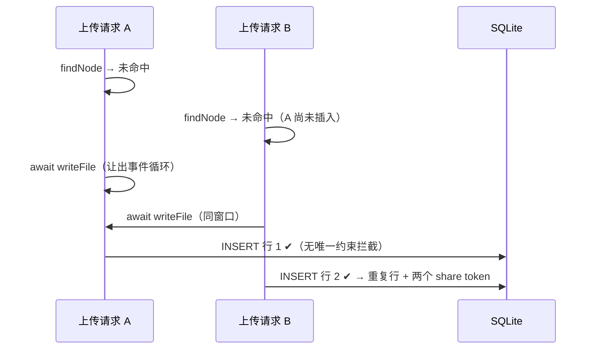

# Remote Reader 全项目审查报告（正确性 + 架构整洁性）

> 审查日期：2026-09-14 · 范围：apps/web 全部服务端与前端、packages/shared、apps/mcp-bridge、DB schema 与迁移、测试体系
> 方法：5 条领域审查线并行初审 + 逐条独立复核（对照源码、运行时复现、SvelteKit 2.70 实际产物核对），仅保留复核通过的结论。
> 基线：387/387 测试通过；svelte-check 0 错误（3 个 `autofocus` a11y 警告，有意 UX）；桥 tsc 0 错误。

## 总体结论

**无 P0。** 两轮历史审查（2026-07-19 安全、2026-07-24 全项目）的修复扎实有效；本次发现集中在两类位置：**新特性与老代码的接缝**（并发/交错路径未享受到单线程同步路径的既有防护）和**长期未审的新增面**（tiering / recent 视图 / 邀请码 / 移动端 FM）。架构纪律整体优秀（模块边界零违规、无 `as any`、无死导出），结构性风险集中在三处可低成本消除的重复/同步负担。

复核方式说明：标注 **[已复现]** 的条目均在本地以真实运行验证（临时测试 / dev server + curl / Playwright）；其余条目为源码级确认。

---

## 一、正确性

### P1（应尽快修复，4 条）

#### P1-1 并发首次上传同路径产生重复文档行，幂等契约失效 **[已复现]**

- **位置**：`apps/web/src/lib/server/documents.ts:91-160`（`uploadDocument` 新建分支）；`db/schema.ts:57`（`owner_parent_name_type_idx` 是普通索引非唯一约束）
- **问题**：`findNode`（同步）与 `db.insert` 之间隔着 `await writeFile` 的 I/O 让出点。doc 锁只在行已存在时加，**新建插入路径完全无防护**；`documents` 表对 `(owner_id, parent_id, name, type)` 无唯一约束，两次 insert 都成功。
- **触发**：Agent 并行发起两个 `upload_document`（MCP 客户端并行工具调用常见），或 HTTP 超时重试与原请求赛跑。实测 `Promise.all` 两次上传同 path/name → **2 行、2 个 share token**；此后 `findNode().get()` 固定命中其一，另一行成为内容冻结的僵尸（文件管理器显示重名条目、删其一会连累共享磁盘文件使另一行 404）。
- **修复建议**：加 NULL 安全的唯一表达式索引 `UNIQUE(owner_id, COALESCE(parent_id,''), name, type)`（先清存量重复），insert 冲突时捕获并重查走幂等/覆盖分支；或复用 `withDocLock` 以 `upload:${ownerId}:${parentId}:${name}` 为键包住"查+写+插"全程。注意 `ensureFolder` 全同步无让出点，文件夹创建无此问题，无需处理。

#### P1-2 BASE_URL 尾斜杠不归一化 → 分享链接带双斜杠直接 404 **[已复现]**

- **位置**：`apps/web/src/lib/server/env.ts:11-13`（`getBaseUrl()` 原样返回）；`shares.ts:20`、`documents.ts:69`（`${getBaseUrl()}/s/${token}` 拼接）；`startup-check.ts:36-49`（只校验必填/合法 URL/非 localhost，不查尾斜杠）
- **问题**：运维把 `BASE_URL=https://host/` 配成尾斜杠（常见习惯）→ 所有返回给 Agent 的查看链接变成 `https://host//s/<token>`。实测：`//s/<真token>` → **404**，`/s/<真token>` → 200。**用户一个链接都打不开**，且报错面在"链接 404"，极难联想到是 BASE_URL 问题。客户端 `api-client.ts:34` 专门 `replace(/\/+$/,'')` 防了同类问题，服务端生成 url 处恰恰没防。
- **修复建议**：`getBaseUrl()` 内一行 `replace(/\/+$/, '')` + 一个单测；可选在 startup-check 里顺手归一化而非报错。

#### P1-3 上传体超 BODY_SIZE_LIMIT 被吞成 `400 invalid json`；默认配置倒置且无 fail-fast

- **位置**：`apps/web/src/routes/api/v1/documents/+server.ts:31`；`startup-check.ts`（缺校验）
- **问题**：`await request.json().catch(() => error(400, 'invalid json'))` 会把请求体读取阶段的一切拒绝统一替换成 400——包括 adapter-node 在 body 超限时向流注入的 `SvelteKitError(413)`（已核对 @sveltejs/kit 2.70 `src/exports/node/index.js`，413 经 `controller.error()` 进入流）。客户端看到 `400 invalid json` 而非 413，`docs/INSTALL.md` 排障条目明确写着"上传 >512K 返回 413"，**文档承诺与实际行为相反，会把排障方向带偏**。加重因素：adapter 默认 `BODY_SIZE_LIMIT=512K`，本应用默认 `MAX_UPLOAD_BYTES=5MB`——只按启动必填三项配置的手工部署，>512KB 上传全部在路由检查前被拦且报 400。该约束目前只存在于 `.env.example` 注释，无 startup-check 兜底（M14 已为 BASE_URL 加过同类 fail-fast）。另外 content 是解码后字符串，JSON 转义（`\n`→2 字节等）使原始 body 大于 content，"BODY_SIZE_LIMIT > MAX_UPLOAD_BYTES"在控制字符密集时还需更大裕量。
- **修复建议**：① catch 透传带 `status` 的错误：`.catch((e) => { if (e && typeof e === 'object' && 'status' in e) throw e; error(400, 'invalid json'); })`；② `validateStartupConfig()` 增加 `BODY_SIZE_LIMIT`（默认按 512K 计）与 `MAX_UPLOAD_BYTES × ≥1.5 裕量` 的比较校验。

#### P1-4 file/folder 跨类型同名冲突 → 裸 500 与"陷阱目录" **[已复现]**

- **位置**：`documents.ts:84-89 + 138`（diskPath 撞实体目录 → `rename` EISDIR / `mkdir` EEXIST 裸抛）；`+page.server.ts:60-65`（`createFolder` 的 dup 检查只过滤 `type='folder'`）
- **问题**：DB 允许同 parent 下 file 与 folder 同名（findNode/M9 均按 type 区分），但**磁盘上二者是同一命名空间**。实测两个方向都炸：① 目录 `reports/` 有磁盘实体（往里传过文件）后，上传名为 `reports` 的文件 → `writeFile` 的 `rename(tmp, dir)` 抛 **EISDIR** → 未捕获 → HTTP 500；② UI 在文件 `q2.md` 旁建 folder `q2.md`（dup 检查放行，folder 无盘实体无冲突），此后任何往该"陷阱目录"的上传 → `mkdir` 撞文件抛 **EEXIST** → 500，且该目录**永久不可写入**。Agent/用户侧只能看到 Internal Server Error，无从修正。
- **修复建议**：名字跨类型互查——`uploadDocument` 落盘前 `findNode(ownerId, parentId, fileName, 'folder')` 命中即返回冲突码（路由转 409）；`createFolder`/`rename`/`move` 的 dup 检查去掉 type 过滤。

### P2（计划修复，12 条）

#### P2-1 api-client fetch 无超时，挂起响应无限期吊死工具调用

- **位置**：`packages/shared/src/api-client.ts:39-46`
- 反代/网关接受 TCP 后不回响应（或网络黑洞）→ Agent 的 `upload_document` 调用长期 pending。node/undici 默认 `headersTimeout` 300s 尚能兜底；桥明确跑在 bun 下，bun fetch 无文档化的整体默认超时。
- **修复**：`signal: AbortSignal.timeout(30_000)`，catch 分支把 `AbortError` 映射为 `ApiError(0, '上传超时')`。

#### P2-2 错误体形状不匹配：客户端读 `body.error?.message`，服务端实际返回 `{"message":...}` **[已复现]**

- **位置**：`api-client.ts:15,58`；`api-client.test.ts` 的 mock 形状与真实 wire 格式不符（测试绿但覆盖的是假形状）
- 实测 401/400 响应体均为扁平 `{"message":"..."}`（SvelteKit `error()` 经 `Accept: */*` 协商走 JSON 分支）。`body.error?.message` 恒为 `undefined` → 400 的具体原因（如"path 含非法字符"）**永远丢失**，Agent 只能看到笼统兜底文案。
- **修复**：改读 `body.message`（兼容两种形状最稳），并修测试 mock 对齐真实格式。

#### P2-3 覆盖上传写路径缺存在性/翻转守卫：与同步 delete/rename 交错留孤儿 FTS 行 + FK 500

- **位置**：`documents.ts:109-131`（`update` 结果未检查、`indexDoc` 无条件执行）；连带 `fts.ts:25-27`
- `archiveDocument`/`rewarmDocument` 都有 `SELECT changes()` 翻转守卫（防"不可上锁的同步路径 deleteNode"），覆盖上传的对称路径没有：`await writeFile` 让出期间 `deleteNode` 删光行 → update 静默落空 0 行 → `indexDoc` 为已删文档**复活一条孤儿 FTS 行** → `ensureShareUrl` 的 insert 撞外键 → 上传 500。孤儿 FTS 行还会永久抬高 `backfillFts` 的 `ftsCount >= files.length` 早退计数，可掩盖其他未索引文档的回填。同窗口若是 `renameNode` 交错则重现"DB 名与磁盘路径错位"。
- **修复**：仿 tiering 模式检查 update 的 `changes()`，为 0 则跳过 `indexDoc`/`ensureShareUrl`；rename 交错可用 `eq(storagePath, 写前路径)` 收窄 WHERE（同 rewarm 先例）。

#### P2-4 renameNode 不同步 docs_fts.name → 改名后旧名仍可搜中 **[已复现]**

- **位置**：`documents.ts:247-288`（全程未触碰 docs_fts）；`db/index.ts:88`（FTS 列定义含 name）
- 实测：`draft.md` 改名 `final.md` 后搜"draft"仍命中 1 条（snippet 为空）——用户以为还存在名为 draft 的文档。冷文档同样受影响（归档只清 content 不动 name）。
- **修复**：rename 成功后同事务执行 `UPDATE docs_fts SET name = ? WHERE doc_id = ?`（一行）。

#### P2-5 注册先核销邀请码、后查邮箱冲突——失败注册烧核销计数；并发同邮箱另一路 500

- **位置**：`register/+page.server.ts:43-47`（redeem 先于 409 检查）、`:52-63`（唯一键冲突未翻译）
- 用 DB 邀请码注册已存在邮箱 → 先核销（used_count+1、last_used_at 刷新）再 409——admin 端"核销计数/最近使用"展示失真（2026-09-14 新面的展示字段）。并发同邮箱双注册：都核销，后插者撞 `users_email_unique` 抛裸 SqliteError → 500 而非 409。
- **修复**：核销 + 邮箱占用检查 + 插入合进同一 `db.transaction`，或 409 前置 + catch UNIQUE 返回 409；保持"403 先于 409"的邮箱枚举防护语义不变。

#### P2-6 登录限流仅按 (ip, email) 键——密码喷洒（1 密码 × N 邮箱）完全不受限

- **位置**：`login/+page.server.ts:37`
- 每 (IP,邮箱) 桶独立 10 次/分：定向暴力被限（设计目的达成），但攻击者从单 IP 每次换邮箱试同一弱密码，每桶计数恒 1，永不触发——喷洒速率只受 argon2 吞吐限制。
- **修复**：叠加更宽松的 per-IP 聚合桶（如 `login-agg:${ip}` max 30/min，与上传 API 的 AUTH_FAIL 默认 30 对称），保留精确桶防定向锁定 DoS。

#### P2-7 `/api/recent` 与文件管理器把整行 `DocumentRow` 序列化给浏览器

- **位置**：`api/recent/+server.ts:38`；`+page.server.ts:25-43`（load 返回 children/folders/recent 均为完整表行）
- 载荷含 `storagePath`（服务器文件系统布局 + ownerId 目录结构）、`contentHash` 等。仅 owner 本人可见、信息价值低，但暴露部署布局且**字段面失控**——未来给表加敏感列会静默进网络响应。
- **修复**：两处改显式字段映射，把 `DocumentRow` 的 DTO 边界固化下来。

#### P2-8 归档周期无排序取前 50 + 永久 skip 候选不退队 → 冷归档饥饿

- **位置**：`tiering.ts:153-157`（`.all().filter(...).slice(50)` 无 ORDER BY）；skip 路径 `:64-72`
- 盘不可读或 hash 不符的文档每轮重新成为候选且永远 skip、不改状态不退队，固定占住批头（实践上 rowid 序）。数量达 50 后排在后面的真冷文档永远轮不到归档；只有 console.warn 无告警面。未配对象存储的存量用户后来开启分层时最易一次涌入大批候选。
- **修复**：候选查询加确定性排序（如 `ORDER BY updated_at ASC`）+ 内存记一轮 skip 名单，或把 skip 原因持久化。

#### P2-9 上传 path 无段数/总长上限：深路径 500 且残留文件夹行

- **位置**：`api/v1/documents/+server.ts:39-48`（无深度检查）；`documents.ts:84-89`（join 后超 PATH_MAX≈4096 时 ENAMETOOLONG 裸抛）
- `MAX_TREE_DEPTH=1000` 只用于树遍历防环，上传入口不受限。3000 段 path → 先插约 2000+ 个 folder 行，随后写盘 ENAMETOOLONG → 500，已建文件夹行永久残留；亦是认证内的小放大面（60 次/分 × 每次数千行）。
- **修复**：endpoint 处限制 `parts.length`（如 ≤32）与总字节长度，超限 400。

#### P2-10 文件管理器表单失败完全静默 + 无防重复提交（前端批 A）

- **位置**：`+page.svelte:214/221/259/288/315`（enhance 回调只处理 `result.type === 'success'`）；`RecentList.svelte:129-145`（fetch 版同族）
- `+page.server.ts` 的 `error(409/400/404)` 产生 failure 结果，但回调不处理也不 `applyAction`——UI 零变化。把文件重命名成已存在名称 → 点"保存" → 表单原地不动无任何提示，用户无法区分"没点上"和"失败了"。同时全部表单无 loading/disabled 防抖（已核实 SvelteKit 2.70 `forms.js` 无自动禁用，login 页有正确的 `loading + disabled` 先例可抄）。相关：`createFolder` 重名时静默返回 `{ok:true}` 且成功后输入框不清空（自定义回调不调 `update()` 则不 reset）——重名和成功都"毫无反应"。
- **修复**：回调补 failure 分支展示 `result.message`；照 login 模式加提交防抖；createFolder dup 路径 `fail(409)` + 成功回调 `form.reset()`。

#### P2-11 ActionSheet 的 close 事件异步清掉移动抽屉的滚动锁 **[已复现]**

- **位置**：`ActionSheet.svelte:16-31`（`hide()` 排队 close 事件后同步跑 `onSelect`）；`+page.svelte:56-64`（openDrawer 设锁）
- Playwright 忠实复刻"sheet 选'移动到…' → openDrawer"交错：`dialog.close()` 的 close 事件按规范异步派发，落在 `openDrawer` 设 `overflow='hidden'` **之后**执行 `onDialogClose` 清空——抽屉开着但背景滚动未锁，主要影响 iOS scroll-chaining（正是该锁的目标场景）。
- **修复**：`pick()`/`hide()` 中同步复位 overflow（在 `onSelect` 之前），或滚动锁改引用计数。

#### P2-12 Mermaid lightbox 内按 Enter 直接关闭浮层 + 其余前端小项

- **位置**：`MermaidViewer.svelte:233-235`（`onkeydown` 对 Escape/Enter 一律关闭，不判 target）
- Tab 聚焦到 +/−/⛶/✕ 按钮后按 Enter，keydown 冒泡到 overlay 先关浮层，键盘激活失效（Space 可用）。对照 `TableFullscreen.svelte` 只判 Escape，是 Mermaid 侧遗漏。修复：`&& e.target === e.currentTarget`。
- 同批小项：① `MermaidViewer` 的 `gestures` action 返回 `{}` 无 destroy（`use:gestures` 在 `{#if fullscreen}` 内，每次开关 lightbox 累积 5 个监听器与 detached DOM，组件卸载才释放——补 destroy 即可与 TableFullscreen 对齐）；② 双 FolderTree 实例（aside + 抽屉）共享 storageKey 但 expanded 状态互不同步，跨 768px 断点后桌面树显示旧折叠态（expanded 提升到页面单份持有可解）；③ `requestFullscreen?.().catch(...)` 在"方法存在但返回 undefined"的旧 WebKit（<16.4）会抛 TypeError（`const p = el?.requestFullscreen?.(); p?.catch(...)` 可防，影响很小）。

### 低优先备忘（一句话，机会性处理）

- `search.ts:129-135` 手写 SELECT 漏选 `owner_viewed_at`，`as DocumentRow[]` 是类型谎言（当前无消费方，潜伏缺陷；补一列即可）。
- `tiering.ts:78` 归档 flip 的 WHERE 缺 `eq(storagePath)`，与 rewarm 的竞态加固不对称——后果仅是 rename 撞 PUT 窗口时本地残留一份副本，顺手补齐。
- move 后覆盖上传会在新位置写盘，旧位置文件成正常流程孤儿（高频"移动+再上传"下 data/ 只增不减；覆盖分支锁内 best-effort unlink 旧路径）。
- 桥配置文件 JSON 损坏被静默吞掉（`config.ts:25-26`），缺 env 时报"缺少配置"误导排查——catch 里打一行"配置文件解析失败"即可。
- 上传 API `name`/`path` 未做 typeof 校验（content 有），非字符串静默强转文件名（MCP 链路有 zod 挡，仅裸 HTTP 受影响）。
- MCP 工具描述未告知内容大小上限（默认 5MB），Agent 只能传完才知道 413——describe 写明或 `TextEncoder` 预检。
- Android 返回键不关闭 ActionSheet 而是触发真实 history 后退（drawer 有 pushState 方案，sheet 没有；可复用同一 helper）。
- recent 视图深度滚动后跨路由往返，列表缩回 50 行且滚动位置丢失（rows 是组件本地 state；如需保持可记入 snapshot，属产品取舍）。
- 两个 lightbox `aria-modal="true"` 但无焦点圈定，Tab 可越出浮层（drawer/sheet 用原生 dialog 无此问题）。
- 3 处 `autofocus` a11y 警告（d/[id]、search、settings/tags）——有意 UX，备案即可。

---

## 二、架构整洁性

### P1（下一迭代应安排，3 条）

#### A-1 文件管理器行级 UI 存在两套平行实现

- **文件**：`routes/+page.svelte:251-331`（+样式）vs `components/RecentList.svelte:174-234`（+样式）
- 同一条文档行的全部交互各写一遍：重命名 inline 表单、标签 inline 表单、移动模式态、删除（confirm 文案两份）、ActionSheet 接线、`autofocus` action 逐字重复、`.btn/.icon-btn/.chip-static/.rename-form/.tag-form` 约 90 行 CSS 双份；表单提交也两套（目录视图 `use:enhance` vs RecentList 手写 fetch）。**下一个行级功能（如"复制分享链接"按钮）必然漏改一处**，表现为"最近视图有、目录视图没有"的静默漂移，CSS 漂移无任何检查能捕获。
- **重构（M）**：抽 `DocRow.svelte`（或先抽更小的 `RowActions` + `InlineTagForm`），差异列用 props/snippet 留 slot；`autofocus`、`submitAction` 挪进 `lib/shared`；行样式收敛单份。可分两步：先抽 actions + 两个 inline 表单，行容器后拆。

#### A-2 DB schema 三处同步只有注释护栏，且生产新部署只走其中一条路径

- **文件**：`db/index.ts:7-137`（SCHEMA_SQL + `ensureTierColumns`/`ensureOwnerViewedColumn`）、`db/schema.ts`、`db/migrations/*.sql`
- `owner_viewed_at` 一列实际改了四处。已核 **Dockerfile / docker-entrypoint.sh / docker-compose.yml 均无 migrate 步骤**——生产新部署建表 100% 依赖 `ensureSchema()`（SCHEMA_SQL），drizzle migration 只服务 dev。开发者用 drizzle-kit 加列后 dev 全绿、CI 全绿，**全新生产部署缺列即崩**；`db-init.test.ts` 只断言手写清单，不校验 schema.ts ↔ SCHEMA_SQL 等价。
- **重构（S）**：加等价性守卫测试——遍历 `schema.ts` 全表全列，断言空白库上执行 `ensureSchema()` 后 `PRAGMA table_info` 全部可见（索引同理）。一小时的测试直接封死"dev 绿、生产崩"的最大风险。长期可选：把 `ensure*Column` 增量并入 SCHEMA_SQL 执行序列。

#### A-3 测试 DB 清理级联在 20/38 个测试文件中复制粘贴

- **文件**：`apps/web/tests/*.ts` 中 20 个（8-10 行 DELETE 级联 + 建用户 + TMP DATA_DIR 样板）
- 下张表加入要改 20 个文件——`invite_codes` 落地时已经发生过一次；清理顺序写错会随机炸在无关文件里。
- **重构（S）**：`tests/helpers.ts` 提供 `resetDb()` + `insertTestUser()` + `withTmpDataDir()`，逐文件机械替换（纯删代码，`fileParallelism:false` 串行模式不变）。

### P2（机会性 / 带触发条件）

- **A-4 双 lightbox 骨架重复约 150 行**（`MermaidViewer.svelte` vs `TableFullscreen.svelte`：`gestures` ~50 行、`focusOnMount` 逐字相同、全屏切换、五键工具栏 UI 与 CSS）。缩放数学已正确抽到 `lib/shared/mermaid-zoom.ts`，手势与 chrome 没抽。触发条件：第三个 viewer 或手势统一调整时，抽 `ZoomOverlay.svelte` + 共享 action（M）。
- **A-5 login/register 整页 CSS 约 130 行逐字重复 + 4 处硬编码色漏网**（`#0969da` stroke ×2、`.submit/.chip.active #ffffff` ×3——theme spec"禁止写死主题色值"的存量违反，`.submit` 白字不在 spec 遗留备案清单，theme.css 已有 `--rr-btn-primary-text` 可用）。抽 `AuthCard.svelte` + 补变量引用（S）。
- **A-6 `documents.ts` 469 行"文档域一切"**（查询/变更/内容 IO+分层集成/浏览信号同居）。当前分区清晰尚可接受；回收站/批量操作任何一个进来都会推过 600 行。触发条件：下个 documents 域功能动工时拆 `queries/mutations/content-io`（S-M，纯移动）。
- **A-7 `deleteNode` 内联复刻 `unindexDocs` 的 SQL**（`documents.ts:387` vs `fts.ts:13-17`；`unindexDocs` 是同连接同步函数，放进事务回调语义等同，一行调用替掉内联）。
- **A-8 env 读取散点与 CLAUDE.md"单源 env"表述不符**（`documents.ts:85` DATA_DIR、`db/index.ts:91`、`register`、`crypto.ts` 就地读，env.ts 只有 4 个 getter）。就地读取多数有测试覆写的正当理由，不构成 bug；最低成本对齐：env.ts 加 `getDataDir()`（保留调用时读取），CLAUDE.md 措辞改"env 助手"。
- **A-9 theme spec 终审备案含一条与代码相反的断言**（spec:235 称"全仓 CSP 头从未在代码中设置"，实际 `svelte.config.js:15-28` 有完整 `kit.csp.reportOnly` 配置——审计者大概只 grep 了 setHeaders）。会误导下一个做"CSP 转 enforcing"的人。改 spec 一行（S）。
- **A-10 小项合集**：`folder-tree.ts` 三个祖先遍历函数同构（纯函数已单测，可合并可不合并）；settings 四页实际健康（各 47-91 行差异真实），第 5 个 settings 页出现时再抽 `RevealBox.svelte`；两处相对导入（`+page.server.ts:9`、`api/recent/+server.ts:5`）顺手统一为 `$lib` 别名；服务层错误风格两制并存（rename/move 返回 result 对象 vs setDocTags 抛异常）——在 CLAUDE.md 写一行裁定即可，不建议现在改代码。

---

## 三、复核为健康的关键面（避免未来重复排查）

- **模块边界**：`$server` 在全部 `.svelte` 与 `lib/shared` 中零引用；`lib/shared/*.ts` 零 import 纯函数；`packages/shared` 不反向依赖 apps、无死导出；无 `as any`。
- **tiering 竞态设计**：doc 锁 + `flipped` 翻转验证 + 自愈回落 + 各崩溃点推演守卫，质量很高——本次缺口只在"新建插入路径"（P1-1）与"覆盖上传路径"（P2-3）这两个未享受同等待遇的角落。
- **移动端抽屉 history 编排**（pushState/popOnce 消费顺序、返回键语义）、**view-beacon 的 lastReported 守卫**、**keyset 分页 row-value 比较**（平局无漏无重）均验证正确。
- **parsePath 路径穿越**：逐项排查 Unicode 变体/编码 `..`/反斜杠/BOM/空白段/trim 次序，POSIX 语义下无逃逸。
- **认证全景**：owner 校验覆盖所有文档端点；XFF 不可伪造（adapter-node 默认走 socket 地址，配 ADDRESS_HEADER 时取最右）；登录时序恒定；会话 cookie 标志齐全；邀请码核销事务原子、多用途为既定设计。
- **`{@html}` 面**：4 处全部受信（server markdown `html:false`、mermaid strict、snippet 先转义、表格 outerHTML 来自服务端产物）。

## 四、建议修复顺序

| 批次 | 内容 | 理由 |
|---|---|---|
| 第一批（半天） | P1-2 尾斜杠一行修 · P1-3 catch 透传 + startup 校验 · P2-2 错误形状 · P2-4 FTS 改名同步 · P2-11 滚动锁 · P2-12 Enter 判 target | 全是一行到几行的小修，收益立现 |
| 第二批（1-2 天） | P1-1 唯一索引 + 冲突重查 · P1-4 跨类型互查 · P2-3 覆盖上传守卫 · A-2 schema 等价性测试 · A-3 tests/helpers | 正确性收口 + 两个低成本护栏 |
| 第三批（随迭代） | P2-1 超时 · P2-5/6 认证面加固 · P2-7 DTO 收敛 · P2-8/9 tiering 与路径上限 · P2-10 前端表单反馈 | 独立小项，各自可单测 |
| 重构窗口 | A-1 DocRow 抽取（M）→ A-5 auth 页合并 → A-6 documents.ts 拆分 | 伴随下一个 touching feature 动工 |
