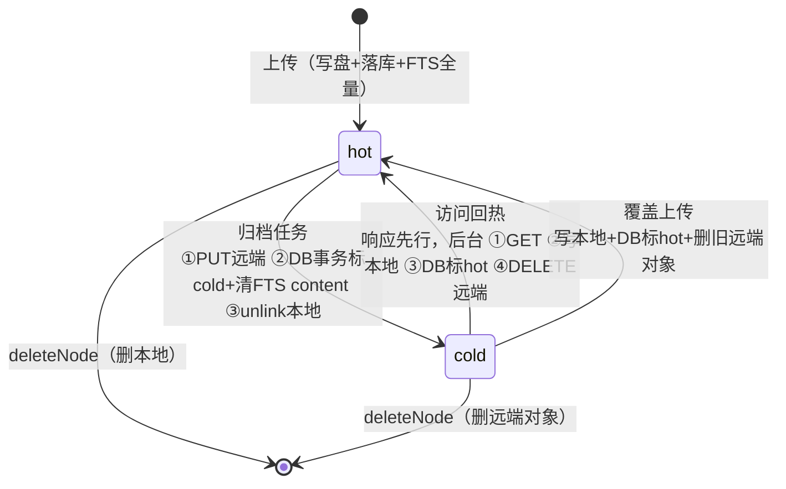

# 冷热分层归档（Cold/Hot Tiering）设计

- **创建日期**: 2026-09-04
- **状态**: 设计定稿，待实现（brainstorming 协作产出，关键决策均经用户确认）
- **上游文档**: [Remote Reader 设计文档](./2026-07-18-remote-reader-design.md)（§3 架构 / §15 实现现状）

---

## 1. 背景与问题

文档全部保存在本地磁盘 `data/documents/`，长期累积后影响运作：

| # | 现状事实 | 后果 |
|---|---|---|
| 1 | 内容实际存**两份**：磁盘文件 + `docs_fts` 表全文副本（搜索用） | 存储放大 ~2x |
| 2 | SQLite（`data/app.db`）与文档同卷 | FTS 副本不清，磁盘根本省不下来 |
| 3 | 无 `last_viewed_at`、无 TTL、无清理任务 | 增长完全无界 |
| 4 | 读取路径全部同步读本盘（`/s/<token>`、`/d/<id>`、启动 `backfillFts`） | 分层改造面集中、可控 |

## 2. 目标与非目标

### 2.1 目标

- 冷文档（长期无人访问）自动归档到**远端对象存储**，本地只留元数据，磁盘占用回归"热文档总量"
- **统一对象存储抽象层**：一套 S3 兼容实现通接七牛 Kodo / R2 / OSS S3 网关 / MinIO / COS
- 冷文档仍可正常查看（同步拉取，体验仅差首次几百 ms）与按标题搜索
- **未配置对象存储的现有部署行为 100% 不变**

### 2.2 非目标（YAGNI，明确推迟）

- 远端全量灾备（用户已明确选择纯归档模式：远端只存冷文档）
- 归档策略配置 UI / 冷热统计面板（阈值走 env，全自动）
- 冷文档批量恢复/导出工具
- 本地压缩存储（zstd 等）——与对象归档互斥的另一条路线，不做

## 3. 关键决策（均经用户确认）

| 决策点 | 结论 |
|---|---|
| 冷文档命运 | 转外部对象存储，本地只留元数据 |
| 对象存储 | 七牛云 Kodo 在用；实现为 S3 兼容抽象层，通接各家 |
| 分层模式 | **纯归档**：后台任务发现冷文档 → 上传远端 → 删本地；远端只存冷文档 |
| 回热策略 | **访问即回热**：拉取 → 回写本地 → 标 hot → 删远端对象（两态互斥） |
| 冷文档搜索 | **标题可搜**：FTS 行保留、content 置空 |
| 冷判定阈值 | `COLD_TIER_AFTER_DAYS`，默认 30 天 |

## 4. 生命周期状态机



**状态不变量**（一致性基石）：

- `hot` = 本地磁盘有内容；远端**无**该文档对象
- `cold` = 远端有内容；本地**无**文件；FTS content 为空
- `storage_path` 列在冷态**保留**，记录「文件回热时应落地的规范本地路径」（回热无需从 parent 链重建路径；rename 冷分支直接更新它）；**`storage_tier` 才是内容位置的唯一事实源**

### 4.1 崩溃窗口分析（沿用 H1/H2 原子写哲学）

归档顺序刻意设计为 `PUT → DB commit → unlink`：

| 崩溃点 | 结果 | 恢复 |
|---|---|---|
| PUT 前 | 无变化 | 天然安全 |
| PUT 后、DB 前 | 远端孤儿对象 | 下轮归档同 key 覆盖（幂等） |
| DB 后、unlink 前 | cold 但本地文件还在 | 读路径已不依赖本地；孤儿文件无害，log 即可 |

回热顺序 `GET → 写本地 → DB commit hot → DELETE 远端`：

| 崩溃点 | 结果 | 恢复 |
|---|---|---|
| GET 后、写本地前 | 仍是 cold | 下次访问重试回热 |
| DB hot 后、DELETE 前 | 双写态 | 下次访问走本地；远端孤儿对象，下次归档同 key 覆盖 |

**最坏情况永远是孤儿（对象/文件/索引行），永远不是内容丢失。**孤儿不设自动 reaper：远端孤儿对象依赖人工或桶生命周期规则清理（本期非目标）；本地孤儿文件与孤儿 FTS 行不可见且无害。

### 4.2 归档/回热/覆盖上传互斥 + 状态翻转验证（防竞态丢内容）

两类竞态（2026-09-04 双 Agent 交叉审查确认）：

1. **归档③ `unlink` 与回热并发**：归档 commit cold 后暂停 → 回热完成全流程 → 归档恢复 unlink 刚回热的本地文件 → 本地远端皆空。
2. **归档/回热与覆盖上传并发**（P0）：归档 `PUT`（百毫秒级网络窗口）期间覆盖上传完整执行（写 v2、置 hot、改 hash）→ 归档恢复后 `WHERE tier='hot'` 守卫被穿透、无条件 unlink 删掉 v2 → v2 从未上远端且本地已删 = **静默丢失**；回热撞覆盖上传同理造成 FTS 倒退回旧内容。

防线（缺一不可）：

- **按 docId 的进程内异步互斥锁**（单实例部署）覆盖三类状态机段：归档、回热、**覆盖上传的写段**（`uploadDocument` 覆盖分支整体在锁内执行并重取行；同 hash 幂等命中与新插入不上锁）。请求渲染路径不上锁。
- **状态翻转必须验证影响行数**：归档/回热事务内 `UPDATE ... WHERE tier=...` 后以 `SELECT changes()` 确认实际翻转；**未翻转则跳过事务内其余语句（FTS 清空/恢复）与事务后的 unlink/删远端**，归档未翻转时 best-effort 删除刚 PUT 的对象。防御不可上锁的同步路径（deleteNode）交错产生的孤儿 FTS 行与误删。

## 5. ObjectStore 统一抽象层

```ts
// apps/web/src/lib/server/object-store.ts（仅 web 用；bridge 对分层无感知）
export interface ObjectStore {
    put(key: string, content: string): Promise<void>;
    get(key: string): Promise<string>;
    delete(key: string): Promise<void>;
}
```

- **S3 实现**：`@aws-sdk/client-s3`，自定义 endpoint + region + `forcePathStyle` 开关；构造时设 `requestTimeout: 5000` + `maxAttempts: 2`（SDK 默认无请求超时，挂起端点会拖死冷读请求与文档锁，须快速失败交给 503 语义）。七牛端点形如 `s3.<region>.qiniucs.com`。纯 JS，node 运行时无兼容问题；adapter-node 默认 externalize 服务端依赖（实现时验证构建产物）
- **对象 key**：`archive/<ownerId>/<docId>-<contentHash>.md`
  - docId 维度 → 删除无引用计数问题
  - contentHash 后缀 → 覆盖上传换 key（旧对象删除）、同内容重传幂等覆盖
  - key 不含 name/path → rename/move 不触碰远端对象
- **测试 fake**：内存 `Map<string, string>`
- 未配置（`OBJECT_STORE_BUCKET` 或凭证缺失）→ 返回 `null`，分层功能整体关闭

## 6. 归档引擎

- 位置：`apps/web/src/lib/server/tiering.ts`
- 触发：node server 内 `setInterval`（每 1 小时，固定值不暴露配置）；module-level 标志防并发重入；仅在 ObjectStore 已配置时启动
- **冷判定**：`type='file' AND storage_tier='hot' AND max(last_viewed_at ?? created_at, updated_at) < now - COLD_TIER_AFTER_DAYS`（历史行 `last_viewed_at` 为 null，用 `created_at` 兜底）
- 单轮批处理上限 50 个（防远端限流/长任务），超出下轮继续
- **内容完整性防线**：PUT 前读本地内容重算 sha256，与 DB `content_hash` 比对；不一致（磁盘损坏/篡改）→ 跳过并告警，绝不归档可疑内容
- **锁内复查冷判定**：候选来自扫描快照，归档执行时在锁内对重取行重跑 `isColdCandidate`——扫描与执行之间刚被访问的文档不再归档（收窄读路径竞态窗口）
- **事务翻转验证**（§4.2）：`UPDATE ... WHERE tier='hot'` 后 `SELECT changes()` 确认翻转，未翻转则跳过 FTS 清空与 unlink，并 best-effort 删除刚 PUT 的对象
- 单文档归档失败（网络等）→ 跳过，下轮重试；连续失败仅累计 log 告警，不 fail-fast

## 7. 读路径改造

内容读取仅有两个入口（文件管理器预览复用 `/d/[id]`，无独立 API），统一走单点：

```ts
// documents.ts 新增
export async function readDocumentContent(doc: DocumentRow): Promise<string> {
    if (doc.storageTier === 'cold') {
        const content = await objStore.get(objectKeyFor(doc));
        void rewarm(doc, content);   // fire-and-forget：写本地→DB标hot→删远端，不阻塞本次响应
        return content;              // 本次响应直接渲染返回
    }
    return readFile(doc.storagePath!); // 热路径与现状完全一致
}
```

- **路由守卫变更**：现状 `!doc.storagePath → 404` 放宽——冷态 `storagePath` 保留；404 条件改为 `type !== 'file'`；`storageTier='hot'` 且 `storagePath` 为空视为数据不一致，防御性 404
- **`last_viewed_at` 刷新**：两条路由每次访问均刷（hot/cold 一致）；查看是低频操作，直接 UPDATE 不做节流
- **错误语义**：冷文档 + 远端不可达 → **503**「归档存储暂时不可达，请稍后重试」（`ArchiveUnavailableError`，区别于 404）；热文档 ENOENT → 维持现状 404
- **自愈兜底**（防并发双读/归档竞态的假 404）：冷分支捕获 `ObjectNotFoundError` → 重取行，若他方回热已完成（现 hot 且有 storagePath）→ 回落读本地；热分支捕获 `FileNotFoundError` → 重取行，若归档刚完成（现 cold）→ 转走远端拉取。两次判定均失败才抛 404/503

## 8. 写路径交互

| 操作 | 冷文档行为 |
|---|---|
| 上传·幂等命中（同 hash） | 维持原语义：不写盘不改时间戳，**保持冷态**返回 `{id, url}` |
| 上传·覆盖更新（新 hash） | **整段持 doc 锁（§4.2）并锁内重取行**：写本地 → DB 标 `hot` + 新 hash → 删旧远端对象（fire-and-forget）；锁等待期间行被删则重走全新插入 |
| renameNode | 跳过磁盘 rename（本地无文件），仅 DB 改 name + storagePath；key 不含 name，远端无需动 |
| moveNode | 零改动（本就只动 parentId） |
| deleteNode | 子树收集时多取 `storageTier` + `contentHash`，事务后批量 DELETE 远端对象（失败仅 log，与现状磁盘清理容错一致） |

## 9. FTS 语义

- **归档时**：`UPDATE docs_fts SET content='' WHERE doc_id=?`（行保留、name 可搜）
- **回热时**：`indexDoc(id, name, content)` 全量恢复
- **搜索页适配**：冷文档命中时 snippet 为空 → 显示「已归档」标记代替 snippet，点击正常打开（同步拉取）
- `backfillFts` 现有 try/catch 已天然跳过读不到盘的行，无需改动

## 10. 管理 UI（最小改动）

- 文件管理器列表：`listChildren` 已返回整行（含 tier 字段），冷文档加「☁️ 已归档」badge，预览正常打开
- 不加配置 UI 与统计面板（后续可选，本期 YAGNI）

## 11. Schema 变更与迁移

```sql
ALTER TABLE documents ADD COLUMN storage_tier   TEXT     NOT NULL DEFAULT 'hot';
ALTER TABLE documents ADD COLUMN last_viewed_at INTEGER;  -- null 时冷判定回退用 created_at
ALTER TABLE documents ADD COLUMN archived_at    INTEGER;
```

- Drizzle migration 一次生成；存量行全部 `hot`，行为零变化
- 冷判定全表扫（单机万级文档 SQLite 毫秒级），不建索引（YAGNI）

## 12. 配置与向后兼容

```bash
# .env.example 新增——全部留空 = 分层功能整体关闭，行为与现状 100% 一致
OBJECT_STORE_ENDPOINT=https://s3.cn-east-1.qiniucs.com   # 七牛示例
OBJECT_STORE_REGION=cn-east-1
OBJECT_STORE_BUCKET=remote-reader-archive
OBJECT_STORE_ACCESS_KEY_ID=
OBJECT_STORE_SECRET_ACCESS_KEY=
OBJECT_STORE_FORCE_PATH_STYLE=false
COLD_TIER_AFTER_DAYS=30
```

- **启动校验**（`startup-check.ts` 扩展）：**任一** `OBJECT_STORE_*` 已配置但组合不完整（如缺 bucket 或缺凭证）→ fail-fast（确定性配置错误，与 `SESSION_SECRET` 哲学一致；全部留空 = 功能关闭，不报错）；**存量冷文档 + 未配置对象存储** → 启动 warn（这些文档将 503 直至恢复配置，数据仍在桶中可恢复，不 fail-fast 以免降级部署被卡死）；**连通性**探活失败 → 仅 warn 不阻塞（暂时性错误，运行期自愈；实际探活 = 调度器首轮失败即告警）
- Docker/env 透传，`data/` 卷结构不变

## 13. 测试策略

- **fake ObjectStore**（内存 Map）注入，全部单测不依赖真实七牛
- **状态机测试**：归档/回热每个崩溃点逐一注入失败，断言不变量「内容永不丢失、双写只产生可清理孤儿」
- **交互测试**：幂等命中冷文档、覆盖上传冷文档、rename/move/delete 冷文档、readDocumentContent 三分支、FTS 归档/回热、503 语义、未配置时全链路 no-op
- **回归门**：现有测试不改一行全部通过 = 向后兼容证明；`svelte-check` + 桥 `tsc` 0 错
- **真实七牛冒烟**：`e2e-check.sh` 可选扩展（配置了真实 bucket 才跑）

## 14. 安全考量

- 对象存储凭证仅存服务端 env（与 API token/SESSION_SECRET 同级管理），不落库不入前端
- 远端对象 key 含 ownerId，桶内天然按 owner 隔离；桶策略设为私有读写（仅 AccessKey 可访问）
- `get` 返回的内容仍走既有 `renderMarkdown`（`html:false`），渲染层 XSS 防线不变
- 上传归档前 hash 校验（§6）同时是完整性防线，防止归档被篡改内容

## 15. 实现现状

- [ ] 未实现。实现顺序建议：schema 迁移 → ObjectStore 抽象 + fake → readDocumentContent + 路由改造 → 归档/回热引擎 → 写路径交互 → FTS/UI 适配 → startup-check/env → 测试补全 → e2e 冒烟
