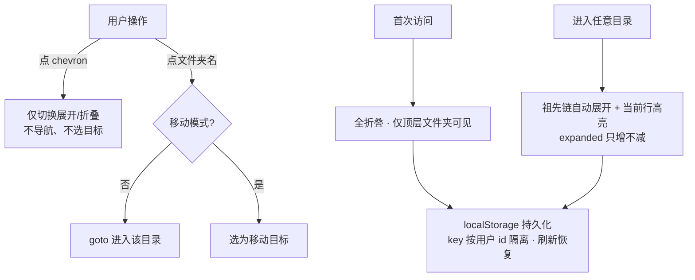

# 文件管理器目录树产品级完善设计

- 日期：2026-09-07
- 状态：设计定稿，待实现
- 范围：`apps/web`（`FolderTree.svelte` 组件 + load 数据 + 纯函数 util + 测试）

## 1. 背景与问题

文件管理页（`/?dir=<id>`）左栏目录树当前实现（`apps/web/src/lib/components/FolderTree.svelte`）把 owner 全部文件夹**永久平铺**（仅缩进表示层级），存在 6 个产品级缺口：

1. 无法折叠/展开——文件夹多时左树一屏塞满（用户主诉）
2. 展开状态刷新即丢
3. 从右栏/深链进入深层目录时，左树不自动展开祖先链，无法定位当前位置
4. emoji 图标（🏠📁）、无 chevron，视觉不达产品级
5. 无子项计数、空文件夹无视觉提示
6. 无 a11y 语义（`aria-expanded` 等）

## 2. 目标与非目标

### 目标

- 折叠/展开：chevron 与点名分工明确；展开状态按用户隔离持久化（localStorage）
- 默认策略：首访全折叠（仅顶层文件夹可见）；导航进任意目录自动展开其祖先链（只增不减）
- 视觉精修：内联 SVG 图标（chevron 旋转过渡 + folder/folder-open 两态）、空文件夹淡化、行淡入、`focus-visible`
- 每行显示直接子项总数（hover title 拆分子文件夹/文件数）
- 树逻辑提取为纯函数并单测覆盖（项目惯例：组件薄、逻辑可测）

### 非目标

- **不做**递归组件、子块高度动画、虚拟滚动（方案 C，已评估否决：C₂ 动画与 C₃ 虚拟化互斥；flat 渲染是未来虚拟化的最短升级路径，见 §3.1）
- 不改右栏文件列表（emoji、布局均不动）
- 不给文件管理页新增深色模式适配（该页现状即无深色，超范围）
- 不改后端数据模型 / API 契约（仅 load 多返回一个聚合字段）
- 不做"全部展开/折叠"按钮、拖拽排序（YAGNI）

## 3. 关键决策（均经用户确认）

### 3.1 flat 渲染保持不变（B 方案，否决 C）

- C₁ 递归组件：结构上无实际收益，测试重写
- C₂ 高度动画：要求嵌套容器，与虚拟化互斥；VS Code / GitHub 文件树均无高度动画（chevron 旋转即止），效率工具用户偏好瞬时展开
- C₃ 虚拟滚动：当前量级（单用户自部署，几百~几千节点）收益为 0；将来量级真到几万节点，在 flat 结构上加窗口是局部手术，纯函数零改动
- 廉价甜点：行插入 80ms 淡入（`transition:fade`），不与虚拟化冲突

### 3.2 交互语义



- **默认展开策略**：首访（无记忆）expanded = ∅（顶层文件夹作为根的孩子天然可见，全部折叠）
- **记忆恢复**：SSR 首帧按全折叠渲染，hydrate 后 `$effect` 恢复记忆态（轻微跳变可接受，与 theme 初始化同模式）
- **自动展开**：`currentId` 变化 → 其全部祖先 folder id 并入 expanded（不含自身；右栏已展示其子项，左树只负责定位）
- **只增不减**：导航/恢复不主动折叠任何节点，用户手动折叠才折叠
- 无子文件夹的行 chevron 位置留白占位（对齐）；根目录行（"根目录"）无 chevron（根级永远显示）
- 移动模式（`selecting=true`）下 chevron 照常可用，点名语义切换为选目标（现状保留）

### 3.3 数据来源

- `listFolders(ownerId)` 不动（已返回全量文件夹扁平列表，前端组树）
- 新增 `folderChildCounts(ownerId)`：一条 `GROUP BY parent_id, type` 聚合直接子项数
- localStorage 脏数据（已删文件夹的 id 残留）无害——expanded 集合中多余 id 不影响渲染，不做清理

## 4. 数据与 API 变更

### 4.1 `apps/web/src/lib/server/documents.ts`

```ts
export function folderChildCounts(ownerId: string): Map<string, { folders: number; files: number }> {
    // SELECT parent_id, type, COUNT(*) AS cnt
    // FROM documents WHERE owner_id = ? AND parent_id IS NOT NULL
    // GROUP BY parent_id, type
}
```

- 放在 `listFolders` 旁；owner 过滤必须保留（多用户隔离）
- 返回 Map（devalue 支持，`tagsByDoc` 已有先例）

### 4.2 `+page.server.ts` load

返回值增加 `folderCounts: folderChildCounts(locals.user.id)`，其余不动。

## 5. 前端设计

### 5.1 纯函数 `apps/web/src/lib/shared/folder-tree.ts`

与 `theme.ts` / `mermaid-zoom.ts` 同层（前端共享，非 server）。

```ts
export type TreeFolder = {
    id: string;
    name: string;
    parentId: string | null;
    childFolders: number; // 直接子文件夹数（由 +page.svelte 从 folderCounts 合并）
    childFiles: number;   // 直接子文件数
};

export type FlatNode = TreeFolder & { depth: number };

export function ancestorsOf(folders: TreeFolder[], id: string): string[];
// 祖先 folder id 链（自顶向下，不含自身）；parentId 链带深度保护（上限对齐 search.ts 的 MAX_TREE_DEPTH=1000，防脏数据死循环）

export function visibleNodes(folders: TreeFolder[], expanded: ReadonlySet<string>): FlatNode[];
// 深度优先 walk：节点入列后，仅当其 id ∈ expanded 才继续 walk 其子
// 孤儿节点（parentId 非空但父不在集合中）不渲染（DB 外键保证不发生，防御显示层悬挂）
```

- 组件内不再有树逻辑；计数由 `+page.svelte` 将 `data.folders` + `data.folderCounts` 合并成 `TreeFolder[]` 传入组件（组件入参自带计数，不感知后端结构）

### 5.2 `FolderTree.svelte` 组件

Props：`folders: TreeFolder[]`、`currentId`、`selecting`、`onSelect`，新增 `storageKey: string`（由 `+page.svelte` 以 `rr:tree-expanded:<userId>` 组装传入；组件不耦合路由/user 语义，保持可独立理解与测试）。

内部状态与 effects：

```ts
let expanded = $state<Set<string>>(new Set());

// ① 初始化（挂载后跑一次）：读 localStorage，有记忆则替换 expanded
// ② currentId 变化：ancestorsOf(currentId) 并入 expanded
// ③ expanded 变化：写 localStorage（JSON 数组；①②触发③属正常收敛，最终态=实际展开集）
```

- localStorage key：`rr:tree-expanded:<userId>`（按用户隔离，防多账号共享浏览器互相污染）
- 读写均包 try/catch（隐私模式写失败忽略，同 ThemeToggle 模式）

### 5.3 视觉

| 项 | 实现 |
|---|---|
| chevron | 内联 SVG，展开态 `rotate(90deg)`，`transition: transform 120ms`；无子项时渲染等宽占位 |
| 文件夹图标 | 内联 SVG 两态：folder（折叠）/ folder-open（展开）；GitHub octicon 调性 |
| 根目录行 | 文案"根目录"，无 chevron；active 蓝底保留 |
| 空文件夹 | `childFolders + childFiles === 0` 时整行 `opacity: 0.6` |
| 子项计数 | 行右缘灰色小字（≈0.75rem），`> 0` 才显示；`title="N 个子文件夹 · M 个文件"` |
| 行淡入 | keyed each 内 `transition:fade={{ duration: 80 }}`（展开插入的行淡入） |
| 键盘可达 | chevron 与行均为 `<button>`；chevron 加 `aria-expanded`；`:focus-visible` outline（#0969da，对齐项目 focus 风格） |
| 移动端 | 布局不动（现有 `max-height: 32vh` 滚动容器天然受益于折叠能力） |

### 5.4 `+page.svelte` 改动

- 组装 `TreeFolder[]`（folders + folderCounts 合并）传给 FolderTree
- 传 `userId`（localStorage key 隔离用）
- 其余（selectDir / 移动模式 / hint 文案）不动

## 6. a11y 与安全

- 折叠行不渲染 DOM（非 `display:none`），屏幕阅读器不读隐藏项；`aria-expanded` 声明展开态
- name 经 Svelte 文本插值输出，无 `{@html}`，无新 XSS 面
- 计数来自服务端聚合，客户端不参与计算（不可被篡改展示）

## 7. 测试策略

### 7.1 新增 `apps/web/tests/folder-tree.test.ts`

- `ancestorsOf`：多层链正确、顶层（parentId=null）返回空、超深链/环防御不死循环
- `visibleNodes`：全折叠仅顶层、展开单层、多层展开、无子文件夹节点、孤儿节点不渲染、depth 递增正确

### 7.2 补 `apps/web/tests/documents.test.ts`

- `folderChildCounts`：混合层级计数正确、空owner、纯文件/纯文件夹、owner 隔离（不数到别人 children）

### 7.3 组件层

项目无组件测试基建，不为单组件引入；`svelte-check` 0 错 + 手动冒烟覆盖。

### 7.4 手动冒烟（dev）

建 3 层嵌套目录，验证：chevron 切换不导航 / 点名导航 / 刷新后展开状态恢复 / 深链 `/?dir=<深层id>` 进入自动展开祖先并高亮 / 移动模式选目标 / 空文件夹淡化 / 计数与 title / Tab 键盘操作。

## 8. 验收清单

- [ ] `bun run test` 全绿（新增 folder-tree 测试 + documents 计数测试）
- [ ] `bun --filter remote-reader-web check` 0 错
- [ ] §7.4 手动冒烟全过
- [ ] 行为回退确认：点名导航 / 移动模式 / 新建文件夹 / 重命名 / 删除在树上的表现不劣于现状（新建的文件夹出现在正确位置；删除的文件夹从树上消失且 localStorage 残留 id 无害）

## 9. 实现现状

- 2026-09-07：spec 定稿，未实现。
