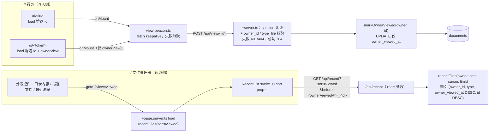

# 「最近浏览」视图（owner 阅读顺序）设计

- **创建日期**: 2026-09-12
- **状态**: 已实现并 merge `master`（实现计划：`../plans/2026-09-12-recently-viewed.md`）
- **上游文档**: [Remote Reader 设计文档](./2026-07-18-remote-reader-design.md)（§3 架构 / §5 文件管理器）、[「最近文档」平铺视图设计](./2026-09-08-recent-documents-view-design.md)（本视图复用其全部机制）

---

## 1. 背景与问题

用户跨浏览器/设备工作时，想快速定位「先前读到哪篇文档」：文件管理器现有「目录内容」（按位置）与「最近文档」（按 `updated_at`，即 Agent 上传/覆盖动静）两个视角，都不等于「我自己看过什么」。`updated_at` 会被 Agent 上传推高，但用户读过一篇旧文档不会改变它——阅读轨迹与更新轨迹是两条时间轴。

现状事实：

| # | 事实 | 含义 |
|---|---|---|
| 1 | `documents.last_viewed_at` 由 `readDocumentContent()` → `touchDocument()` 写入，服务 `/d/<id>`（owner 登录态）与 `/s/<token>`（**匿名**）两条路径 | 它记录的是「任何人的任何内容读取」，不是「owner 的浏览」 |
| 2 | `app.html` 开启 `data-sveltekit-preload-data="hover"`，悬停链接即跑 load → touch | 服务端 load 无法区分预取与真实导航（`__data.json` 预取请求与真实导航不可辨），load 内写「浏览时间」必然误记 |
| 3 | `last_viewed_at` 是冷热分层判定输入（`isColdCandidate` 用 `max(last_viewed_at ?? created_at, updated_at)`） | 改其写入语义会悄悄改变归档行为——两种语义必须两列 |
| 4 | 「最近文档」机制已参数化友好：`recentFiles()` keyset 分页 + `documents_owner_type_updated_idx` + `/api/recent` + `RecentList.svelte`（无限滚动 / re-sync / 行内操作） | 新排序维度 = 现有机制加一个 sort 参数，不推翻 |

## 2. 目标与非目标

### 2.1 目标

- 文件管理器右栏分段控件扩为三段：**目录内容 | 最近文档 | 最近浏览**；新视图按 owner 本人浏览时间倒序平铺，URL `?view=viewed` 可刷新/分享
- 浏览判定口径（经用户确认）：owner 登录态打开 `/d/<id>` 算一次；owner 登录态打开 `/s/<token>`（如从 IM 点 Agent 发的链接）也算；匿名 `/s/` 访问不算；hover 预取不算
- 服务端持久化（SQLite），天然跨浏览器/设备
- 复用 `RecentList` 全部交互：无限滚动、re-sync、行内重命名/移动/删除/标签、冷档 chip、路径面包屑

### 2.2 非目标（YAGNI，明确推迟）

- 文档内滚动位置记忆（「定位到位置」= 定位到文档；「读到第几屏」是独立需求，如需要另立）
- 浏览历史明细表（只存最近一次浏览时间，不存次数/轨迹/时长）
- 匿名访客阅读归因（无用户身份，无法归属）
- 未读 badge / 按阅读完成度等智能排序

## 3. 关键决策（均经用户确认）

| 决策点 | 结论 | 理由 |
|---|---|---|
| 视图共存 | 加第三分段「最近浏览」，不动现有两视图 | 「更新时间轴」（Agent 传了什么）与「浏览时间轴」（我读到哪）语义正交；混排（替换排序/排序切换）要么丢信息要么 UI 与游标复杂化 |
| 数据模型 | 新列 `owner_viewed_at`，不复用 `last_viewed_at` | §1 表 #1/#3：现有列 = 分层信号（任何人任何访问，含预取，保守侧无害）；新列 = 阅读顺序信号（仅 owner 真实浏览）。一列两语义是耦合的起点 |
| 写入机制 | 查看页组件 `onMount` 发 fire-and-forget POST，服务端校验后写库 | 机制性排除 hover 预取（预取只跑 load、不挂载组件）；服务端 load 无法区分预取（§1 表 #2） |
| 浏览口径 | `/d/` 打开 + `/s/` 打开且登录态为 owner | 覆盖 owner 两条真实阅读路径；匿名无法归因，一律不算 |
| 读取机制 | `recentFiles` / `/api/recent` / `RecentList` 参数化 `sort: 'updated' \| 'viewed'` | 复用 2026-09-08 spec 全部机制与论证；默认 `updated` 向后兼容 |

## 4. 架构与数据流



写入与读取完全解耦：写入侧只表达「owner 刚真实浏览了这篇」，读取侧只按 `owner_viewed_at` 排序，互不感知。

## 5. 数据层

### 5.1 两列语义分工（写进 schema 注释）

| 列 | 语义 | 写入者 | 读取者 |
|---|---|---|---|
| `last_viewed_at`（现有） | 冷热分层信号：任何人的任何内容读取（含匿名 `/s/`、hover 预取），保守推迟归档 | `touchDocument()`（load 内，现状不动） | `isColdCandidate()` |
| `owner_viewed_at`（新增，nullable integer） | 阅读顺序信号：仅 owner 本人真实浏览（组件挂载时上报） | `markOwnerViewed()`（beacon 端点） | `recentFiles(sort=viewed)` |

### 5.2 列与索引（migration，按仓库三处同步规则）

- `schema.ts`：`ownerViewedAt: integer('owner_viewed_at')`；新索引 `documents_owner_type_viewed_idx` on `(owner_id, type, owner_viewed_at DESC, id DESC)`（`sql\`${t.ownerViewedAt} DESC\`` 写法，同 updated 索引先例）
- `SCHEMA_SQL`：**仅** CREATE TABLE 列定义（新库建表即含列）。索引语句**不进 SCHEMA_SQL**——`ensureSchema()` 先 `exec(SCHEMA_SQL)` 再跑列兜底（`db/index.ts` 执行序），存量库上 CREATE TABLE 是 no-op，若索引先于 ALTER 执行，`CREATE INDEX ... ON (owner_viewed_at ...)` 会在 prepare 阶段因列不存在抛错，模块顶层的 `ensureSchema()` 直接炸掉启动。既有 SCHEMA_SQL 索引无此问题：它们只引用一切存量库都有的原始列
- drizzle migration（`db:generate` 产出）
- 运行时兜底：`db/index.ts` 新增 `ensureOwnerViewedColumn(target)`，紧随 `ensureTierColumns` 调用：同款 `PRAGMA table_info` + 缺列则 `ALTER TABLE`，随后**无条件** `CREATE INDEX IF NOT EXISTS documents_owner_type_viewed_idx`——索引创建统一收敛在列补齐之后，新库/存量库两路径皆安全；独立命名而非并入 `ensureTierColumns`，保持函数名与内容语义一致

### 5.3 `markOwnerViewed()`

`documents.ts` 新增：

```ts
export function markOwnerViewed(ownerId: string, docId: string): boolean
```

- `UPDATE documents SET owner_viewed_at = ? WHERE id = ? AND owner_id = ? AND type = 'file'`
- **只动 `owner_viewed_at`**：不碰 `updated_at`（排序语义）、`last_viewed_at`（分层语义）、`storage_tier`
- 返回 `changes > 0`（端点据此 404 / 204）

### 5.4 `recentFiles()` 参数化

签名扩展：`recentFiles(ownerId, sort: 'updated' | 'viewed', cursor, limit)`（默认行为不变）：

- `sort='viewed'`：`WHERE owner_id = ? AND type = 'file' AND owner_viewed_at IS NOT NULL` + `ORDER BY owner_viewed_at DESC, id DESC` + cursor row-value 严格比较（键换 `owner_viewed_at`，机制与 2026-09-08 spec §5.1 同款，id 决胜仅为全序确定性）
- 从未浏览过的文档不出现（它们在「目录内容 / 最近文档」可见，视图各司其职）
- 冷归档行照常出现（列表只读元数据，与 recent 视图现状一致；点开走既有回热路径）

## 6. 端点

### 6.1 `POST /api/view/[id]`（新，写入侧）

- 认证：session（hooks → `locals.user`），无 → 401
- `markOwnerViewed` 返回 false（不存在 / 非本人 / 非 file）→ 404（不泄露存在性，与库内既有口径一致）
- 成功 → 204 无 body
- 无需限流：恶意 owner 只能刷自己的顺序，无跨用户影响；每次真实浏览一条按 PK 的 UPDATE

### 6.2 `GET /api/recent`（扩展）

- 新参数 `sort`：`'updated'`（默认，向后兼容）| `'viewed'`，其他值 → 400（沿用 limit/before 的严格校验风格）
- `before` 按 sort 解释：`<updatedAt>_<id>` 或 `<ownerViewedAt>_<id>`（格式校验同现状）

## 7. 页面与组件

### 7.1 查看页写入点

- `/d/[id]/+page.server.ts`：load 增返 `id`（现仅 title/html/tags/updatedAt/sizeBytes）
- `/s/[token]/+page.server.ts`：load 增返 `id` + `ownerView: locals.user?.id === doc.ownerId`。hooks 全局解析 session，`/s/` 免登录特性不变（无 session 时 `ownerView=false`）；匿名页面多暴露的 doc id 是不透明随机串，无权限放大（`/d/` 与 API 均需认证）
- `$lib/shared/view-beacon.ts`（新）：`reportView(id)` = `fetch('/api/view/' + id, { method: 'POST', keepalive: true })`，失败静默——阅读顺序是便利功能，丢一次上报可接受；`keepalive` 提高关页前送达率
- 两个 `+page.svelte` 各在 `onMount` 调一次（`/s/` 仅 `ownerView` 时）。正确性边界：SSR 不执行 onMount；`invalidateAll`（如 setTags 后）不重挂载组件 → 不误记；前进/后退/刷新重挂载 → 重新记一次，语义正确（确实重现了阅读）

### 7.2 文件管理器

- `+page.server.ts` load：`view` 扩为 `'dir' | 'recent' | 'viewed'`（非法值回落 `'dir'`，同现状模式）；`view=viewed` 时返回 `viewed = recentFiles(owner, 'viewed', null, RECENT_PAGE_SIZE)`（内嵌 tags），其余分支 `viewed: []`（与 `recent` 字段平行）
- `RecentDoc` 类型加 `ownerViewedAt: number | null`（直接沿用 drizzle 行键：两条 wire 路径 `...r` 零映射展开，避免另起 `viewedAt` 名导致映射漏写——`/api/recent` 路径的 `as` 断言会绕过类型检查把 bug 漏到运行时）
- `RecentList.svelte` 加 `sort: 'updated' | 'viewed'` prop：`loadMore` / `reSync` 的请求带 `sort`、cursor 取对应字段（`updatedAt` / `ownerViewedAt`）、相对时间列显示排序键对应时间（viewed 时「看过 · X 前」）；哨兵 / 行内操作 / re-sync 状态机零改动
- 分段控件三段：目录内容 | 最近文档 | 最近浏览；`view=viewed` 时 FolderTree `currentId=undefined`（同 recent 现状）、h1 =「最近浏览」、空状态「还没有浏览记录，打开过的文档会出现在这里。」、新建文件夹表单仅目录视图显示（现状不变）

## 8. 性能

| 环节 | 分析 |
|---|---|
| beacon 写入 | 每次真实浏览一条按 PK 的 UPDATE，SQLite 毫秒级，单实例无锁竞争面 |
| viewed 查询 | 新索引精确匹配（等值前缀 owner_id + type + DESC 排序），与 updated 查询同构 |
| 客户端 | onMount 一次 fire-and-forget fetch，不阻塞渲染 |

## 9. 安全

- 端点 session 认证 + owner 校验在**服务端**（客户端 `ownerView` 仅避免无效请求，非信任边界）
- 404 不泄露文档存在性；匿名 `/s/` 页面数据仅增不透明 doc id
- 不动 md 渲染 / share token / 磁盘 / CSP（同源 POST）

## 10. 测试计划

| 层 | 用例 |
|---|---|
| `documents.test.ts` | `recentFiles sort=viewed`：排序 / 排除未浏览 / cursor 排除自身 / owner 隔离 / 仅 file；`markOwnerViewed`：命中 / 非本人 false / folder false / 只动 `owner_viewed_at`（`updated_at`、`last_viewed_at` 不变） |
| `recent-api.test.ts` | `sort=viewed` 返回与分页 / 非法 sort 400 / 默认 updated 回归 |
| 新 `view-api.test.ts` | 无 session 401 / 不存在 404 / 他人文档 404 / folder 404 / 成功 204 且库内 `owner_viewed_at` 更新 |
| 新（模式照抄 `tiering-schema.test.ts` 存量库用例） | 存量库升级回归：旧形状 documents（无 `owner_viewed_at` 列）→ `ensureSchema()` 无抛错 + 列与 `documents_owner_type_viewed_idx` 索引齐备 + 幂等重跑 |
| load 测试 | `/` `view=viewed` 返回 viewed 且 children 空；`/d/` 返回 id；`/s/` ownerView 有/无 session 两态 + id |
| 存量 | 现有 342 测试零回归（默认 `sort=updated` 行为不变是关键回归面） |

## 11. 实现清单（文件级）

1. `schema.ts` + `SCHEMA_SQL`（仅列）+ migration + `ensureOwnerViewedColumn`（ALTER 后建 `documents_owner_type_viewed_idx`）
2. `documents.ts`：`markOwnerViewed()` + `recentFiles()` sort 参数 + 单测
3. `routes/api/view/[id]/+server.ts`（新）+ 测试
4. `routes/api/recent/+server.ts`：sort / before 扩展 + 测试
5. `$lib/shared/view-beacon.ts`（新）；`$lib/shared/recent.ts`：`RecentDoc.ownerViewedAt`
6. `routes/d/[id]`、`routes/s/[token]`：load 增返字段 + onMount 上报 + load 测试
7. `routes/+page.server.ts`：`view=viewed` 分支 + 测试；`RecentList.svelte` sort prop；`+page.svelte` 三段控件接线
8. 验证：svelte-check 0 错 + 全量测试绿 + 手动冒烟（登录开 `/d/` → 换浏览器登录 → 「最近浏览」浮顶；匿名开 `/s/` 不入序；列表页 hover 链接不入序；「最近浏览」视图滚动翻页走通——loadMore cursor 用 `ownerViewedAt`）
