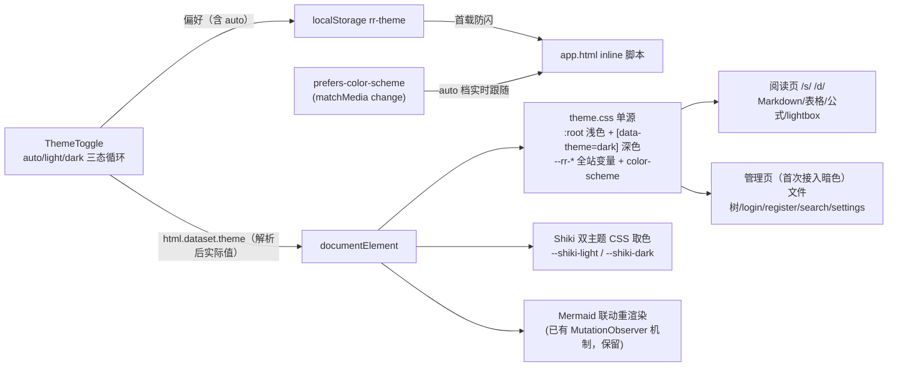
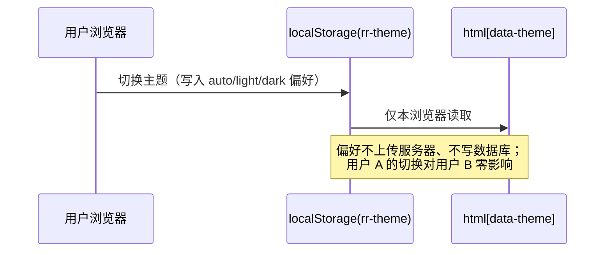

# 全站主题系统精修设计（浅色/深色 + 自动档）

- 日期：2026-09-13
- 状态：设计定稿，待实现
- 上游依赖：无（纯前端视觉/交互层，不改存储与 API 契约）

## §1 背景与动机

当前项目已有浅色/深色两档主题（`data-theme` 属性 + `ThemeToggle` 循环切换 + `app.html` 防闪脚本 + localStorage `rr-theme` 持久化），但存在四个问题：

1. **代码高亮单主题**：Shiki 服务端硬编码 `github-dark`（`apps/web/src/lib/server/markdown.ts` 的 `THEME` 常量），SSR 输出内联深色样式——浅色模式下代码块仍是突兀的深色块，与页面调性不协调。
2. **主题变量分散**：`--rr-*` CSS 变量定义只存在于 `/s/[token]/+page.svelte`（26 处）和 `MarkdownViewer.svelte`（2 处），没有单源。
3. **管理页面未接入主题**：全站 9 个路由文件的页面样式散布大量硬编码颜色（含 border 色值的宽口径 grep 匹配 97 行；文件管理器、login/register、search、`/d/[id]`、`+layout.svelte`、settings 三页），深色系统下这些页面依旧白底刺眼。
4. **切换交互两态**：只有浅⇄深循环，首次访问跟随系统但手动切换后永久固定，没有显式「自动」档。

## §2 目标 / 非目标

### 目标

- G1 浅色模式下代码块（Shiki）呈现浅色调性，与页面协调；深色模式维持现状调性
- G2 全站所有页面（阅读页 `/s/` `/d/`、文件管理器、login/register/search/settings、layout）统一接入同一套主题变量，两档下观感协调
- G3 切换交互升级为三档循环：自动 → 浅色 → 深色；「自动」档实时跟随系统 `prefers-color-scheme` 变化
- G4 主题变量单源化：全站唯一变量定义点
- G5 主题偏好按浏览器隔离（localStorage，纯客户端，用户间/用户组间互不影响）

### 非目标

- N1 不做跨设备/跨用户账号级主题同步（免登录场景无账号可挂靠；YAGNI）
- N2 不新增第三/第四套色调主题（用户已确认只精修现有两档）
- N3 不改 Markdown 渲染管线语义（markdown-it 规则、XSS 防线、RENDER_CACHE 机制均不动）
- N4 不改 CSP 策略（Shiki 现状即输出内联 style 属性，双主题模式不引入新类型）

## §3 已确认决策记录

| 决策点 | 结论 | 来源 |
|---|---|---|
| 主题档位 | 只精修现有浅色/深色两档 | 用户澄清问答 1 |
| 切换交互 | 三档 + 「自动」跟随系统 | 用户澄清问答 2 |
| 精修范围 | 全站协调（管理页首次接入暗色） | 用户澄清问答 3 |
| 实现方案 | 方案 A：变量单源 + Shiki 双主题 CSS 变量模式 | 用户方案确认 |
| 偏好隔离 | 每浏览器 localStorage 独立，不做服务端持久化 | 用户确认问答 |

## §4 架构



主题偏好数据流（说明隔离性）：



## §5 模块设计

### §5.1 主题变量单源：`apps/web/src/styles/theme.css`（新建）

- 由 `apps/web/src/routes/+layout.svelte` 顶部 `import '../styles/theme.css'` 全局引入。
- **全站唯一 `--rr-*` 变量定义点**：
  - `:root { color-scheme: light; --rr-bg: …; … }` 浅色默认值，沿用现有 GitHub 调性精修值
  - `[data-theme="dark"] { color-scheme: dark; … }` 深色覆盖
- 变量清单两层：
  - **保留现有 13 个原名**（消费方零改动）：`--rr-bg`、`--rr-card-bg`、`--rr-card-border`、`--rr-text`、`--rr-text-muted`、`--rr-link`、`--rr-border`、`--rr-border-soft`、`--rr-inline-code-bg`、`--rr-inline-code-text`、`--rr-code-bg`、`--rr-shadow`、`--rr-toggle-bg`
  - **新增管理页面所需**：按钮（`--rr-btn-bg`/`--rr-btn-border`/`--rr-btn-text`/`--rr-btn-primary-bg`/`--rr-btn-primary-text`）、输入框（`--rr-input-bg`/`--rr-input-border`）、语义色（`--rr-danger`/`--rr-success`）、hover 态（`--rr-hover-bg`）。**实现时按 75 处硬编码色的实际归拢结果收敛最终清单**，不预设用不上的变量。
- `/s/[token]/+page.svelte` 中变量定义块**整体删除**（消费方用法不变）。`MarkdownViewer.svelte` 内的 2 处定义（`--rr-mono` / `--rr-mono-west`）是等宽字体栈变量，与主题色无关，**保留原位**不上移。

### §5.2 Shiki 双主题：`apps/web/src/lib/server/markdown.ts`

- `const THEME = 'github-dark'` 改为 `const THEMES = { light: 'github-light', dark: 'github-dark' } as const`。
- `createHighlighter({ langs: LANGS, themes: [THEMES.light, THEMES.dark] })`——预载双主题（内存增量：一个额外主题的 token 色表，量级小）。
- 高亮调用改 dual themes 模式（Shiki 官方 CSS Variables 用法）：

  ```ts
  hl.codeToHtml(code, {
      lang: lang || 'text',
      themes: { light: THEMES.light, dark: THEMES.dark },
      defaultColor: false
  })
  ```

  输出的每个 token 内联样式形如 `color:var(--shiki-light);--shiki-dark:…`——一份 HTML 携带两套取色。
- **代码块背景从内联色改为 CSS 控制**：`pre` 背景走 `--rr-code-bg`（浅色 = github-light 页面底色系，深色 = 现深底），`theme.css` 中加取色规则：

  ```css
  [data-theme="dark"] .shiki,
  [data-theme="dark"] .shiki span {
      color: var(--shiki-dark);
  }
  ```

- 未预载语言 fallback 路径同步：text 重渲染走同一 dual 参数；最终转义裸块兜底输出同样携带双取色变量，形如 `<pre data-rr-code="…" class="shiki" style="color:var(--shiki-light);--shiki-dark:var(--rr-code-text-dark,#e1e4e8)">`（替代现硬编码深色串）。
- `data-rr-code="ascii|prose"` stamp 逻辑、mermaid 排除、math 规则、table_open/close 包装**全部不动**。
- `RENDER_CACHE` 机制不动：缓存的是双主题 HTML，切主题纯 CSS 取色，缓存继续命中。

### §5.3 三档切换：`theme.ts` + `ThemeToggle.svelte` + `app.html`

- `apps/web/src/lib/shared/theme.ts`：
  - 新增 `ThemePref = 'auto' | 'light' | 'dark'`（用户偏好），`Theme = 'light' | 'dark'`（实际生效值）语义分离
  - `resolveTheme(pref: ThemePref, prefersDark: boolean): Theme`——`'auto'` 时按 `prefersDark` 解析；存储值兼容：读到旧值 `'light'`/`'dark'` 视为显式偏好，无效值/缺失视为 `'auto'`
  - 新增 `cycleTheme(pref: ThemePref): ThemePref`——`auto → light → dark → auto`
  - `THEME_STORAGE_KEY = 'rr-theme'` 不变
- `ThemeToggle.svelte`：
  - 点击循环三档：写 localStorage（try/catch 包裹，写入失败仅不持久化）+ 按 `resolveTheme` 结果设置 `documentElement.dataset.theme`
  - 图标三态：自动（半日月）/ 浅色（太阳）/ 深色（月亮）；`aria-label` 与 `title` 标明当前档位（如「主题：自动（当前深色），点击切换到浅色」）
  - 保留既有 MutationObserver（`data-theme` 属性监听，多实例/外部改动同步）
  - 新增 `matchMedia('(prefers-color-scheme: dark)')` 的 `change` 监听：当前偏好为 auto 时，系统切换实时更新 `data-theme`（无 matchMedia 的环境跳过注册）
  - onMount 读 localStorage 得偏好初始化（兼容旧两值）
- `apps/web/src/app.html` 防闪脚本升级：读 `rr-theme`；值为 `'light'`/`'dark'` 直接用；`'auto'`/缺失/无效 → `matchMedia('(prefers-color-scheme: dark)')` 解析；`matchMedia` 或 localStorage 异常 → try/catch 兜底 `'light'`（现状语义保持）。

### §5.4 保持不变的联动机制

- **Mermaid**：`MermaidViewer.svelte` 已有 `data-theme` MutationObserver → 重渲染（light→`'default'`，dark→`'dark'`），原样保留。
- **KaTeX**：默认 currentColor 取色，天然随主题，不动。

### §5.5 全站硬编码色迁移清单

| 文件 | 硬编码色处数（宽口径匹配行） | 动作 |
|---|---|---|
| `routes/+page.svelte`（文件管理器） | 26 | → `--rr-*`，首次接入暗色 |
| `routes/login/+page.svelte` | 18 | 同上 |
| `routes/register/+page.svelte` | 18 | 同上 |
| `routes/search/+page.svelte` | 17 | 同上 |
| `routes/d/[id]/+page.svelte` | 5 | 同上 |
| `routes/+layout.svelte` | 7 | 同上 |
| `routes/settings/tokens/+page.svelte` | 3 | 同上 |
| `routes/settings/shares/+page.svelte` | 2 | 同上 |
| `routes/settings/tags/+page.svelte` | 1 | 同上 |
| `routes/s/[token]/+page.svelte` | 变量定义块 | 定义删除、消费保留 |
| `MermaidViewer` / `TableFullscreen` | 各 1（遮罩 rgba）+ fallback 字色 | 遮罩暗色保留（双主题惯例）；fallback 字色换 `--rr-code-text` |

（行数按「含 border 色值的宽口径 grep」统计，一行可能含多处；实现时以逐文件替换清单为准。）

迁移原则：只做「色值 → 变量」替换与必要的变量补齐；不改这些页面的布局、间距、结构。

## §6 偏好隔离（对用户确认问题的正式回答）

- 主题偏好存于**访问者浏览器** `localStorage('rr-theme')`，纯客户端；不上传服务器、不写数据库、无任何 API 传输。
- 任何用户切换主题只影响其本人浏览器；免登录 `/s/<token>` 访客同理；同一用户多设备也各自独立。
- 跨设备同步属 N1 非目标。

## §7 测试与验收

### 单测（vitest，node 运行时）

- `apps/web/tests/theme.test.ts` 扩展：
  - `resolveTheme`：auto+prefersDark→dark、auto+!prefersDark→light、显式 light/dark 直通、无效值→auto 语义
  - `cycleTheme`：循环顺序 auto→light→dark→auto
  - 旧存储值 'light'/'dark' 兼容
- `apps/web/tests/markdown.test.ts` 扩展：
  - 高亮输出含 `--shiki-light` 与 `--shiki-dark`（dual 模式生效）
  - fallback（未预载语言）路径同样含双变量
  - 既有断言（`data-rr-code` stamp、mermaid 排除、math、table 包装）全部保持

### 类型检查

- `bun --filter remote-reader-web check` 零错误。

### 视觉验收（Playwright，dev server）

对 light / dark 两态分别截图核对协调感：

1. `/s/<token>`：正文、浅色代码块、行内代码、表格、mermaid 图、KaTeX 公式、mermaid lightbox
2. `/`（文件管理器）：列表、目录树、按钮
3. `/login`
4. 切换即时生效无残色；刷新页面首屏无浅/深闪跳（防闪脚本验证）

## §8 边界与错误处理

| 场景 | 处理 |
|---|---|
| localStorage 写入失败（隐私模式） | try/catch 忽略；DOM 已更新，本次会话生效不持久化（现状语义） |
| 老浏览器无 `matchMedia` | 防闪脚本 try/catch 兜底 light；Toggle 跳过 change 监听注册 |
| 无 JS 环境（SSR 首屏后脚本被禁） | 与现状一致：`app.html` inline 脚本即 JS；无 JS 时落 `:root` 浅色默认值，内容完整可读 |
| Shiki 高亮抛错（未预载语言） | 现有 text 重渲染 + 转义裸块双级兜底，均改输出双变量形式 |
| 多标签页 | （低成本加分项，允许不做）`storage` 事件同步 `data-theme` |
| `RENDER_CACHE` 命中旧单主题 HTML | 进程内缓存随部署重启自然失效；实现含重启，无需迁移代码 |

## §9 实现现状

**已实现并合并本 worktree 分支**（2026-09-13，commit 链 10 个）：

| Commit | 内容 |
|---|---|
| `4404146` | theme.ts 三档纯函数（parseThemePref/resolveTheme/cycleTheme，兼容旧两值存储） |
| `29015d9` | app.html 防闪脚本 auto 档（旧值直通、无 matchMedia 兜底 light） |
| `570a705` | ThemeToggle 三档 UI（循环 + matchMedia 实时跟随 + MutationObserver，删 toggleTheme） |
| `a0da695` | Shiki 双主题化（github-light/dark dual themes，defaultColor:false 输出 CSS 变量） |
| `85ff5fe` | theme.css 变量单源（13 个既有变量保名上移 + 管理页语义色 + body 承接 + Shiki 取色） |
| `22da4fe` | 全站 9 路由硬编码色迁移（~126 处 + 9 处补充声明） |
| `0c5833b` | mermaid 降级块字色随主题（--rr-code-text） |
| `5c9ad0e` | 审查收尾（auto 档标签消费 effective、brainfuck 断言判别力 shiki-themes、pre.shiki 从属注释） |
| `89a9d2f` | 补迁移 FolderTree/RecentList（spec §5.5 清单遗漏的两个组件，视觉验收 P1）+ 新增 --rr-success-soft |
| `5ca827c` | 补引入 katex.min.css（与 JS 同步懒加载；存量缺陷，视觉验收 F2——修复 .katex-mathml 源文本暴露） |

**执行中的关键裁定与偏差**：
- §5.5 迁移清单按 routes/ 枚举，遗漏了 components/ 下的 FolderTree（12 处）与 RecentList（31 处）——视觉验收双 oracle 审查发现（深色下树选中态冰蓝块、非选中节点文字 ≈1.1:1 不可见、最近列表 hover 近白条），已在 `89a9d2f` 补迁移并新增 `--rr-success-soft`（pick 态）
- KaTeX CSS 未引入系 master 存量缺陷（非本分支引入），因显性破坏阅读页（主入口）观感且修复仅一处懒加载 import，随视觉验收一并修复（`5ca827c`），保持「纯文本零下载」设计
- 按钮上下文的 `#1f2328` 统一映射为 `--rr-btn-text`（与已迁移路由同名 class 完全一致）；`.rename-form`/`.tag-form` input 的 `#0969da` 边框映射为 `--rr-accent`
- 组件内 `var(--rr-x, #浅色fallback)` 防御式回退值保留（theme.css 全局引入后永不触发，不驱动实际取色）

**测试**：365/365 全绿（theme 7 用例 + markdown 13 用例含 `--shiki-light/--shiki-dark`/`shiki-themes` 双主题断言）；svelte-check 0 errors（3 个既有 autofocus a11y warnings 为存量）。

**视觉验收**：Playwright 1280×800（share 全页 1835）双档 × 8 页 + hover 态 + FOUC 探针（dark 下 bodyBg=rgb(13,17,23) 无白闪）+ 三档切换循环实测（auto→light→dark→auto，localStorage 持久化、aria-label 动态携带当前生效主题）。双 oracle 并行审查（设计系统/功能 + 视觉保真/CJK）→ 修复 3 项 blocking（FolderTree/RecentList、KaTeX CSS、截图环境 CJK/emoji 字体）→ 新鲜证据终轮裁决。终轮结论：PASS（REVISE 项全部闭环，见下）。

**遗留备案（存量/低优先，不阻塞）**：
- topnav 登出按钮、tokens/shares/tags 页部分按钮为原生 UA 按钮（`color-scheme` 兜底可读，未套用站点 `.btn` 样式）——建议后续统一
- login/register 模板 SVG logo `stroke="#0969da"` 硬编码（深色下 3.3:1 可辨，装饰性）
- 深色下 login 错误横幅文本 ≈4.34:1（略低于 4.5 AA，有 danger-border 补偿）
- search `.tag-filter` 与页面同底色无区块感（迁移前原行为保真）
- login/register `.card` 深色阴影 rgba(0,0,0,0.08) 失效（层次靠底色差+边框承担，GitHub dark 同模式）
- 场景覆盖缺口：tokens 米黄 reveal 块、search chip/mark 高亮、多级目录树未入镜（代码侧变量消费已核验正确）

**终审备案（review-work 6 线 + 视觉终轮全 PASS 后的小项记录，均非阻塞）**：
- 管理页（/、/d/、/search、/settings、login/register）无 ThemeToggle 入口——master 现状亦如此（切换钮仅在 /s/），暗色系统用户经 auto 自动获得正确档位、偏好经 localStorage 跨页生效；建议后续 topnav 补一个（约 5 行）
- `markdown.ts` 最终转义裸块兜底的 style 串 `color:var(--shiki-light);--shiki-dark:#e1e4e8` 中 `--shiki-light` 未定义（继承正文色）且 `--shiki-dark` 实际不可达（极罕见路径，两档渲染行为正确；与 §5.2 示意写法有简化偏差）——后续调整时建议改为 `--shiki-light:#1f2328;--shiki-dark:#e1e4e8` 双定义形式
- `✏` 重命名按钮为裸 U+270F（无 FE0F 变体选择符）→ 文本呈现单色铅笔（master 存量，与主题无关；加 `️` 即可彩色化，+page.svelte 与 RecentList.svelte 各一处）
- TableFullscreen 在无 `window.matchMedia` 的极端环境会 pageerror（spec §8 未承诺该组件兜底，真实浏览器 IE10+ 均具备）——建议补一行 typeof 守卫
- SSR 首屏 ThemeToggle aria-label 短暂为默认值「自动（当前浅色）」，hydration 后修正（SSR 无法预知客户端偏好，固有窗口；`data-theme` 与页面配色由防闪脚本保证正确）
- 全仓 CSP 头从未在代码中设置（CLAUDE.md「H6 CSP report-only」仅落地了 /api/csp-report 接收端点）——pre-existing 文档-代码漂移，与本分支无关，N4 前提不受影响
- 代码质量 NITPICK×4：防御式 fallback 三种策略并存（MermaidViewer 裸用 / ThemeToggle、MarkdownViewer 带 fallback）、ThemeToggle 内联重复 `Theme` 联合类型、enhanceKatex 为 floating promise（存量模式）、本 spec §9 若干笔误

## §10 待做清单（实现计划输入）

1. 新建 `apps/web/src/styles/theme.css`（变量单源 + Shiki dark 取色规则）并接入 `+layout.svelte`
2. `markdown.ts` 双主题改造 + fallback 双变量化
3. `theme.ts` / `ThemeToggle.svelte` / `app.html` 三档 + 自动改造
4. 全站 9 文件硬编码色迁移 + overlay 盘点迁移
5. 单测扩展（theme / markdown）+ check + 全量测试
6. Playwright 视觉验收
