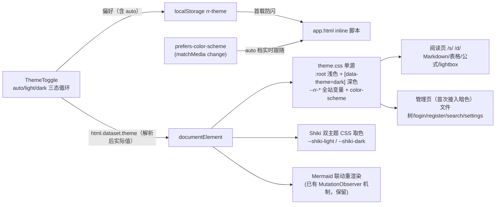
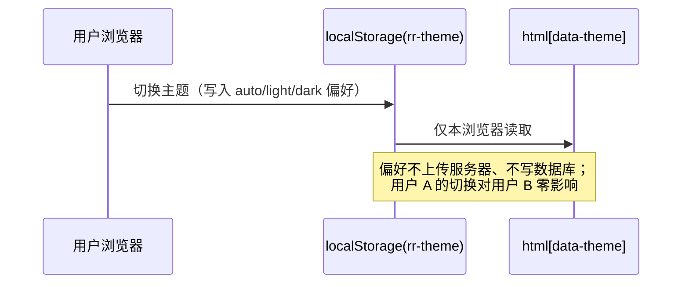

# 全站主题系统精修设计（浅色/深色 + 自动档）

- 日期：2026-09-13
- 状态：设计定稿，待实现
- 上游依赖：无（纯前端视觉/交互层，不改存储与 API 契约）

## §1 背景与动机

当前项目已有浅色/深色两档主题（`data-theme` 属性 + `ThemeToggle` 循环切换 + `app.html` 防闪脚本 + localStorage `rr-theme` 持久化），但存在四个问题：

1. **代码高亮单主题**：Shiki 服务端硬编码 `github-dark`（`apps/web/src/lib/server/markdown.ts` 的 `THEME` 常量），SSR 输出内联深色样式——浅色模式下代码块仍是突兀的深色块，与页面调性不协调。
2. **主题变量分散**：`--rr-*` CSS 变量定义只存在于 `/s/[token]/+page.svelte`（26 处）和 `MarkdownViewer.svelte`（2 处），没有单源。
3. **管理页面未接入主题**：全站 8 个路由文件共 75 处硬编码颜色（文件管理器 20、login/register 各 15、search 14、`/d/[id]` 4、`+layout.svelte` 4、settings/tokens 2、settings/shares 1），深色系统下这些页面依旧白底刺眼。
4. **切换交互两态**：只有浅⇄深循环，首次访问跟随系统但手动切换后永久固定，没有显式「自动」档。

## §2 目标 / 非目标

### 目标

- G1 浅色模式下代码块（Shiki）呈现浅色调性，与页面协调；深色模式维持现状调性
- G2 全站所有页面（阅读页 `/s/` `/d/`、文件管理器、login/register/search/settings、layout）统一接入同一套主题变量，两档下观感协调
- G3 切换交互升级为三档循环：自动 → 浅色 → 深色；「自动」档实时跟随系统 `prefers-color-scheme` 变化
- G4 主题变量单源化：全站唯一变量定义点
- G5 主题偏好按浏览器隔离（localStorage，纯客户端，用户间/用户组间互不影响）

### 非目标

- N1 不做跨设备/跨用户账号级主题同步（免登录场景无账号可挂靠；YAGNI）
- N2 不新增第三/第四套色调主题（用户已确认只精修现有两档）
- N3 不改 Markdown 渲染管线语义（markdown-it 规则、XSS 防线、RENDER_CACHE 机制均不动）
- N4 不改 CSP 策略（Shiki 现状即输出内联 style 属性，双主题模式不引入新类型）

## §3 已确认决策记录

| 决策点 | 结论 | 来源 |
|---|---|---|
| 主题档位 | 只精修现有浅色/深色两档 | 用户澄清问答 1 |
| 切换交互 | 三档 + 「自动」跟随系统 | 用户澄清问答 2 |
| 精修范围 | 全站协调（管理页首次接入暗色） | 用户澄清问答 3 |
| 实现方案 | 方案 A：变量单源 + Shiki 双主题 CSS 变量模式 | 用户方案确认 |
| 偏好隔离 | 每浏览器 localStorage 独立，不做服务端持久化 | 用户确认问答 |

## §4 架构



主题偏好数据流（说明隔离性）：



## §5 模块设计

### §5.1 主题变量单源：`apps/web/src/styles/theme.css`（新建）

- 由 `apps/web/src/routes/+layout.svelte` 顶部 `import '../styles/theme.css'` 全局引入。
- **全站唯一 `--rr-*` 变量定义点**：
  - `:root { color-scheme: light; --rr-bg: …; … }` 浅色默认值，沿用现有 GitHub 调性精修值
  - `[data-theme="dark"] { color-scheme: dark; … }` 深色覆盖
- 变量清单两层：
  - **保留现有 13 个原名**（消费方零改动）：`--rr-bg`、`--rr-card-bg`、`--rr-card-border`、`--rr-text`、`--rr-text-muted`、`--rr-link`、`--rr-border`、`--rr-border-soft`、`--rr-inline-code-bg`、`--rr-inline-code-text`、`--rr-code-bg`、`--rr-shadow`、`--rr-toggle-bg`
  - **新增管理页面所需**：按钮（`--rr-btn-bg`/`--rr-btn-border`/`--rr-btn-text`/`--rr-btn-primary-bg`/`--rr-btn-primary-text`）、输入框（`--rr-input-bg`/`--rr-input-border`）、语义色（`--rr-danger`/`--rr-success`）、hover 态（`--rr-hover-bg`）。**实现时按 75 处硬编码色的实际归拢结果收敛最终清单**，不预设用不上的变量。
- `/s/[token]/+page.svelte` 中 26 处变量定义块**整体删除**（消费方用法不变）；`MarkdownViewer.svelte` 内 2 处定义同样上移。

### §5.2 Shiki 双主题：`apps/web/src/lib/server/markdown.ts`

- `const THEME = 'github-dark'` 改为 `const THEMES = { light: 'github-light', dark: 'github-dark' } as const`。
- `createHighlighter({ langs: LANGS, themes: [THEMES.light, THEMES.dark] })`——预载双主题（内存增量：一个额外主题的 token 色表，量级小）。
- 高亮调用改 dual themes 模式（Shiki 官方 CSS Variables 用法）：

  ```ts
  hl.codeToHtml(code, {
      lang: lang || 'text',
      themes: { light: THEMES.light, dark: THEMES.dark },
      defaultColor: false
  })
  ```

  输出的每个 token 内联样式形如 `color:var(--shiki-light);--shiki-dark:…`——一份 HTML 携带两套取色。
- **代码块背景从内联色改为 CSS 控制**：`pre` 背景走 `--rr-code-bg`（浅色 = github-light 页面底色系，深色 = 现深底），`theme.css` 中加取色规则：

  ```css
  [data-theme="dark"] .shiki,
  [data-theme="dark"] .shiki span {
      color: var(--shiki-dark);
  }
  ```

- 未预载语言 fallback 路径同步：text 重渲染走同一 dual 参数；最终转义裸块兜底输出同样携带双取色变量，形如 `<pre data-rr-code="…" class="shiki" style="color:var(--shiki-light);--shiki-dark:var(--rr-code-text-dark,#e1e4e8)">`（替代现硬编码深色串）。
- `data-rr-code="ascii|prose"` stamp 逻辑、mermaid 排除、math 规则、table_open/close 包装**全部不动**。
- `RENDER_CACHE` 机制不动：缓存的是双主题 HTML，切主题纯 CSS 取色，缓存继续命中。

### §5.3 三档切换：`theme.ts` + `ThemeToggle.svelte` + `app.html`

- `apps/web/src/lib/shared/theme.ts`：
  - 新增 `ThemePref = 'auto' | 'light' | 'dark'`（用户偏好），`Theme = 'light' | 'dark'`（实际生效值）语义分离
  - `resolveTheme(pref: ThemePref, prefersDark: boolean): Theme`——`'auto'` 时按 `prefersDark` 解析；存储值兼容：读到旧值 `'light'`/`'dark'` 视为显式偏好，无效值/缺失视为 `'auto'`
  - 新增 `cycleTheme(pref: ThemePref): ThemePref`——`auto → light → dark → auto`
  - `THEME_STORAGE_KEY = 'rr-theme'` 不变
- `ThemeToggle.svelte`：
  - 点击循环三档：写 localStorage（try/catch 包裹，写入失败仅不持久化）+ 按 `resolveTheme` 结果设置 `documentElement.dataset.theme`
  - 图标三态：自动（半日月）/ 浅色（太阳）/ 深色（月亮）；`aria-label` 与 `title` 标明当前档位（如「主题：自动（当前深色），点击切换到浅色」）
  - 保留既有 MutationObserver（`data-theme` 属性监听，多实例/外部改动同步）
  - 新增 `matchMedia('(prefers-color-scheme: dark)')` 的 `change` 监听：当前偏好为 auto 时，系统切换实时更新 `data-theme`（无 matchMedia 的环境跳过注册）
  - onMount 读 localStorage 得偏好初始化（兼容旧两值）
- `apps/web/src/app.html` 防闪脚本升级：读 `rr-theme`；值为 `'light'`/`'dark'` 直接用；`'auto'`/缺失/无效 → `matchMedia('(prefers-color-scheme: dark)')` 解析；`matchMedia` 或 localStorage 异常 → try/catch 兜底 `'light'`（现状语义保持）。

### §5.4 保持不变的联动机制

- **Mermaid**：`MermaidViewer.svelte` 已有 `data-theme` MutationObserver → 重渲染（light→`'default'`，dark→`'dark'`），原样保留。
- **KaTeX**：默认 currentColor 取色，天然随主题，不动。

### §5.5 全站硬编码色迁移清单

| 文件 | 硬编码色处数 | 动作 |
|---|---|---|
| `routes/+page.svelte`（文件管理器） | 20 | → `--rr-*`，首次接入暗色 |
| `routes/login/+page.svelte` | 15 | 同上 |
| `routes/register/+page.svelte` | 15 | 同上 |
| `routes/search/+page.svelte` | 14 | 同上 |
| `routes/d/[id]/+page.svelte` | 4 | 同上 |
| `routes/+layout.svelte` | 4 | 同上 |
| `routes/settings/tokens/+page.svelte` | 2 | 同上 |
| `routes/settings/shares/+page.svelte` | 1 | 同上 |
| `routes/s/[token]/+page.svelte` | 26（定义） | 定义删除、消费保留 |
| `MermaidViewer` lightbox / `TableFullscreen` overlay | 实现时盘点 | overlay 背景等换 `--rr-*` 变量 |

迁移原则：只做「色值 → 变量」替换与必要的变量补齐；不改这些页面的布局、间距、结构。

## §6 偏好隔离（对用户确认问题的正式回答）

- 主题偏好存于**访问者浏览器** `localStorage('rr-theme')`，纯客户端；不上传服务器、不写数据库、无任何 API 传输。
- 任何用户切换主题只影响其本人浏览器；免登录 `/s/<token>` 访客同理；同一用户多设备也各自独立。
- 跨设备同步属 N1 非目标。

## §7 测试与验收

### 单测（vitest，node 运行时）

- `apps/web/tests/theme.test.ts` 扩展：
  - `resolveTheme`：auto+prefersDark→dark、auto+!prefersDark→light、显式 light/dark 直通、无效值→auto 语义
  - `cycleTheme`：循环顺序 auto→light→dark→auto
  - 旧存储值 'light'/'dark' 兼容
- `apps/web/tests/markdown.test.ts` 扩展：
  - 高亮输出含 `--shiki-light` 与 `--shiki-dark`（dual 模式生效）
  - fallback（未预载语言）路径同样含双变量
  - 既有断言（`data-rr-code` stamp、mermaid 排除、math、table 包装）全部保持

### 类型检查

- `bun --filter remote-reader-web check` 零错误。

### 视觉验收（Playwright，dev server）

对 light / dark 两态分别截图核对协调感：

1. `/s/<token>`：正文、浅色代码块、行内代码、表格、mermaid 图、KaTeX 公式、mermaid lightbox
2. `/`（文件管理器）：列表、目录树、按钮
3. `/login`
4. 切换即时生效无残色；刷新页面首屏无浅/深闪跳（防闪脚本验证）

## §8 边界与错误处理

| 场景 | 处理 |
|---|---|
| localStorage 写入失败（隐私模式） | try/catch 忽略；DOM 已更新，本次会话生效不持久化（现状语义） |
| 老浏览器无 `matchMedia` | 防闪脚本 try/catch 兜底 light；Toggle 跳过 change 监听注册 |
| 无 JS 环境（SSR 首屏后脚本被禁） | 与现状一致：`app.html` inline 脚本即 JS；无 JS 时落 `:root` 浅色默认值，内容完整可读 |
| Shiki 高亮抛错（未预载语言） | 现有 text 重渲染 + 转义裸块双级兜底，均改输出双变量形式 |
| 多标签页 | （低成本加分项，允许不做）`storage` 事件同步 `data-theme` |
| `RENDER_CACHE` 命中旧单主题 HTML | 进程内缓存随部署重启自然失效；实现含重启，无需迁移代码 |

## §9 实现现状

（未实现。实现完成后在此追加：改动文件清单、测试计数、验收截图结论。）

## §10 待做清单（实现计划输入）

1. 新建 `apps/web/src/styles/theme.css`（变量单源 + Shiki dark 取色规则）并接入 `+layout.svelte`
2. `markdown.ts` 双主题改造 + fallback 双变量化
3. `theme.ts` / `ThemeToggle.svelte` / `app.html` 三档 + 自动改造
4. 全站 9 文件硬编码色迁移 + overlay 盘点迁移
5. 单测扩展（theme / markdown）+ check + 全量测试
6. Playwright 视觉验收
