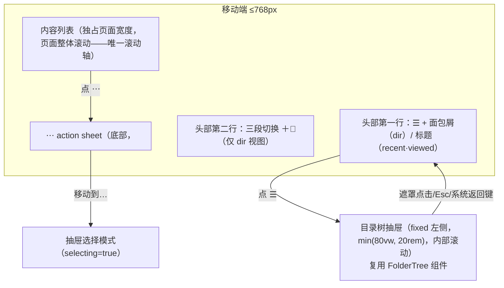
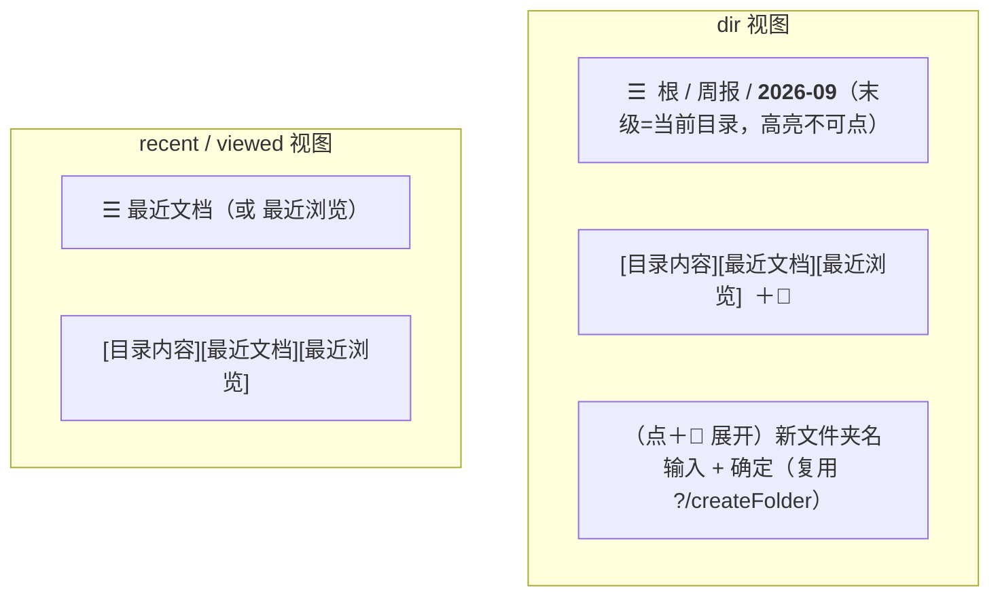
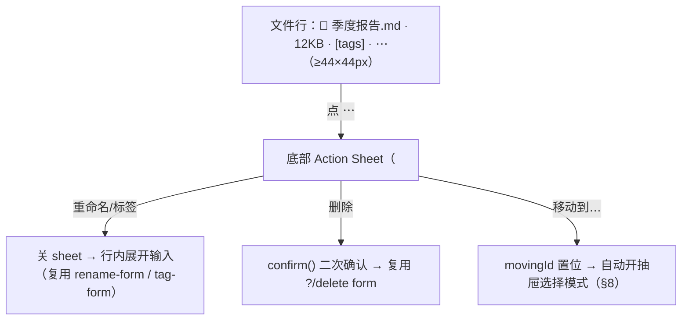

# 移动端文件管理器布局设计（侧滑抽屉 + 面包屑）

- **创建日期**: 2026-09-14
- **状态**: 设计定稿，待实现
- **上游文档**: [Remote Reader 设计文档](./2026-07-18-remote-reader-design.md)（§5 文件管理器）、[「最近文档」平铺视图设计](./2026-09-08-recent-documents-view-design.md)、[「最近浏览」视图设计](./2026-09-12-recently-viewed-design.md)、[全站主题系统精修](./2026-09-13-reader-theme-system-design.md)（语义色变量单源）

---

## 1. 背景与问题

用户实测手机访问文件管理器（`/`），反馈「目录树和目录内容页的结合格格不入，体验非常糟糕」。

现状事实（`apps/web/src/routes/+page.svelte` ≤768px 断点）：

| # | 事实 | 移动端后果 |
|---|---|---|
| 1 | `.fm-left` 纵排置顶、`max-height: 32vh` 内部滚动 | 树**无条件霸占约 1/3 屏幕**，浏览内容的主任务被挤压 |
| 2 | 树内部滚动 + 页面整体滚动**嵌套**（桌面 app-shell 语义残留） | 触屏滚动链割裂：滚到树边缘突跳页面滚动 |
| 3 | 右栏标题只有「根目录/子目录」二字，**无面包屑**（`folderNamesOf` 仅用于 `RecentList` 行内路径） | 不显示当前目录名，无法感知位置、无法快速返回上级 |
| 4 | 「移动模式：点左树选目标」依赖常驻左树 | 移动端树可能已滚出视口，流程断裂 |
| 5 | 每行常驻 ✏ 🏷 📂 🗑 四个 `icon-btn`（桌面尺寸） | 触屏命中区小（高度约 30px），视觉噪音大 |
| 6 | `fm-head`（h1 + 三段切换 + 新建文件夹表单）flex-wrap | 窄屏挤成多行，且 h1「子目录」是无信息量的占位文案 |

用户主场景（经确认）：**浏览优先**——「找某篇文档看」+「查看 Agent 传了什么新东西」；管理能力要求**完整保留**（移动/删除/重命名/标签），仅换触屏友好交互。

## 2. 目标与非目标

### 2.1 目标

- 移动端（≤768px）内容列表独占页面宽度，目录树收进左侧滑出抽屉，消除双重滚动
- 面包屑替换「根目录/子目录」标题：显示当前位置、各级可点跳转
- 行操作收进 `⋯` 菜单 → 底部 action sheet，触屏命中区 ≥ 44×44px
- 「移动文档」在移动端经抽屉选择模式完整可用
- 桌面端（>768px）**零改动**

### 2.2 非目标（YAGNI）

- 移动端手势（左滑操作、长按多选、拖拽排序）
- 抽屉/选择模式/展开态进 URL（瞬态 UI；返回键用 history state 兜住，见 §6.4）
- 桌面端任何行为/视觉变更
- 新后端端点 / 数据模型 / 纯函数（全部复用现有 `?/rename`、`?/setTags`、`?/delete`、`?/move`、`?/createFolder` 与 `folderNamesOf`）
- 平板专用布局（768px 断点两侧，沿用现状）

## 3. 关键决策（均经用户确认）

| 决策点 | 结论 | 备选与否决理由 |
|---|---|---|
| 设计重心 | 浏览优先：内容全屏，树按需唤出 | 管理优先（树常驻）与主场景不符 |
| 管理能力 | 完整保留，换触屏交互 | 「浏览为主管理简化」「纯浏览」被否——用户要移动端可用 |
| 导航形态 | **A 侧滑抽屉 + 面包屑** | B 纯层级导航：深目录换分支要多次返回重钻；C 底部工作表：树深时高度管理复杂、与桌面左树空间映射不一致。A 与桌面共享 `FolderTree` 组件、保留全树快速跳转 |
| 断点 | 沿用 768px | 与现状 `.fm` 响应式断点一致，避免三态 |

## 4. 布局总览

桌面（>768px）：现有双栏 app-shell、常驻左树、行内四按钮——一行 CSS 都不改（仅新增的移动端元素需 `display:none` 隐藏）。

## 5. 头部区重构（`fm-head`）

- **面包屑**：替换 h1。数据零新增——复用 `folderNamesOf(folderById, currentDir)`（已有单测）。渲染：`根` 起始，各级 `<a>` 可点（`goto /?dir=…`），末级纯文本高亮；层级过深时容器 `overflow-x: auto` 横向滚动（3 行 CSS，不做省略号折叠）
- recent/viewed 视图无目录上下文：第一行显示视图标题（「最近文档」/「最近浏览」），汉堡照常可开抽屉（与桌面「左树常驻、currentId 置 undefined」语义一致，选中即跳 `/?dir=…`）
- **＋📁 新建文件夹**（仅 dir 视图）：compact 按钮常驻第二行右端，点击在下方展开输入行（展开态 `$state`，成功后收起）
- 三段切换保持现状组件与文案；375px 实测可容纳（12 个中文字 + padding ≈ 264px）

## 6. 目录树抽屉

### 6.1 结构与行为

- `fixed` 左侧抽屉，宽 `min(80vw, 20rem)`，内部 `overflow-y: auto`（抽屉自身滚动，页面滚动锁定）
- 半透明遮罩（`--rr-scrim`，theme.css 新增语义变量），点击关闭
- 打开：汉堡 `☰`；关闭：选目录后**自动关闭**（保持浏览节奏）、遮罩点击、Esc
- 动画：`translateX(-100% ↔ 0)` 180ms ease-out（与现有 80ms fade 同一轻快调性）
- `FolderTree` 组件零改动直接复用（props 不变）

### 6.2 实现载体：`<dialog>`

原生 top-layer（免手写 z-index 管理）、原生 Esc 关闭、原生焦点管理——不用手写 focus trap。移动端 `<dialog>` 默认居中，需覆盖 `margin`/`inset` 样式为左侧贴边。

### 6.3 滚动锁定

抽屉打开时 `document.body` 加 `overflow: hidden`（dialog top-layer 本就阻断下层交互，此为双保险防背景滚动穿透）；关闭即移除。

### 6.4 系统返回键（移动端关键兜底）

抽屉打开时 `history.pushState({ rrDrawer: true }, '')`；`popstate` 监听里若抽屉开着则关闭。效果：用户按系统返回键 = 关抽屉而非退出整页。**非返回键关闭（遮罩/Esc/选中目录）时须 `history.back()` 消费掉该条 state**——否则残留 state 会让用户下一次按返回键被「空吃」（popstate 触发但抽屉已关，需按两次才真正导航）。不进 URL search params（瞬态 UI，可刷新/分享的 URL 不受污染）。

### 6.5 a11y

- `role="dialog"` + `aria-modal="true"` + `aria-label="目录导航"`
- 关闭后焦点归还汉堡按钮
- 遮罩 `aria-hidden="true"`；抽屉内树的可访问性由 `FolderTree` 现有实现继承（按钮语义/aria-expanded）

## 7. 行操作改造

### 7.1 移动端（≤768px）：`⋯` + action sheet

- `⋯` 按钮命中区 ≥ 44×44px（iOS HIG 44pt / Material 48dp 标准）
- 标签 chips 保持行内显示（浏览识别有价值），仅编辑入口进菜单
- action sheet 同样用 `<dialog>`（原生 Esc/top-layer）；按钮全高 ≥ 48px 行高、分隔线分组、删除红字（`--rr-danger`）
- 文件夹行：菜单去掉「编辑标签」（现状文件夹无标签）

### 7.2 桌面（>768px）：零改动

四按钮常驻（hover 场景高效）。同一 DOM 内两套入口并存，CSS 断点显隐（`.desktop-only` / `.mobile-only`），SSR 无 JS 时桌面入口仍可用。

## 8. 移动文档流程（选择模式）

- 触发：action sheet「移动到…」或 RecentList 行内移动入口 → `movingId` 置位 → **自动打开抽屉**
- 抽屉顶部提示条：「选择移动目标」+ 取消按钮（复用现有 hint 样式与 `moveError` 展示）
- `FolderTree` 传入 `selecting={movingId !== null}`（现有绿色高亮）；选定 → `?/move` 提交 → 抽屉关闭 → `invalidateAll()`（现有逻辑不动）
- 桌面流程不变（常驻左树直接选）

## 9. 视觉与主题

- 抽屉、action sheet、遮罩、面包屑全部取 `theme.css` 语义变量（**禁止组件内写死色值**，沿用主题系统 spec 规矩）；新增 `--rr-scrim`（遮罩）一个变量，深浅两档各定义
- 汉堡 `☰`、`⋯` 用 SVG 图标（与 FolderTree 现有 SVG 图标风格一致，不用 emoji）
- 触屏反馈：行 `:active` 态背景（替代不存在的 hover）

## 10. 测试与验收

| 层面 | 内容 |
|---|---|
| 单测 | 无新纯函数；现有 382 测试全量不回归 |
| 类型 | `svelte-check` 0 错误 |
| Playwright 移动 viewport（375×667） | 抽屉开/关/选目录跳转；系统返回键关抽屉；面包屑各级跳转；⋯ 菜单四操作（重命名/标签/移动全流程/删除）；＋📁 新建文件夹 |
| Playwright 桌面 viewport 回归 | 桌面视觉零变化（截图对比） |
| 双主题 | 抽屉/action sheet/遮罩/面包屑深浅两档各验一遍 |

## 11. 实现切面（供实现计划参考）

预计改动集中三处，均为表现层：

1. `apps/web/src/routes/+page.svelte`：头部重构（面包屑 + ＋📁 展开）、抽屉 dialog、action sheet、移动端断点 CSS 重写
2. 新组件 `apps/web/src/lib/components/ActionSheet.svelte`（或 DrawerMenu 复用同构 `<dialog>` 逻辑，实现时定）
3. `apps/web/src/styles/theme.css`：+`--rr-scrim`

无 load/server/schema/共享层改动。

## 12. 风险与权衡备案

| 风险 | 缓解 |
|---|---|
| `<dialog>` 样式覆盖在旧 WebView 兼容性 | 项目目标浏览器为现代浏览器（theme.css 已用 CSS 变量 + dvh），`<dialog>` 2022 起全绿，风险低 |
| popstate 关抽屉与 SvelteKit 路由的 history 交互 | pushState 带自定义 state 标记，popstate 只消费标记匹配的事件；Playwright 用例覆盖 |
| 面包屑横向滚动嵌套体验 | 仅头部一行、高度固定；实测不佳再升级省略号方案（备案，不在本期） |
| 树记忆的 localStorage 键复用 | 抽屉与桌面共用同一 storageKey，折叠记忆跨端一致（同一浏览器） |
