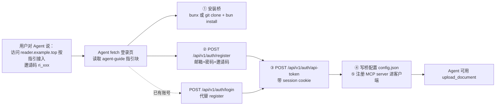

# Agent 自助接入设计（登录页指引 + 认证 JSON API）

> 日期：2026-09-20 · 状态：设计定稿（待实现）

## 1. 背景与目标

当前 Agent 接入 Remote Reader 需要**人工多步操作**：

1. 用户浏览器打开 `/register`，用邀请码手动注册账号
2. 登录后到 `/settings/tokens` 手动创建 API token（一次性 reveal，手动复制）
3. 用户自己 `git clone` 仓库 + `bun install` 安装本地 MCP 桥
4. 用户手动把 token 填进 MCP 客户端注册命令（`claude mcp add ... -e REMOTE_READER_TOKEN=rr_xxx`）

痛点：注册/登录/创建 token 只有网页 form（SvelteKit form action），**没有 JSON API**，Agent 无法程序化完成；登录页没有任何 Agent 接入指引，用户不知道该怎么向自己的 Agent 描述接入过程。

目标：用户对 Agent 说一句话——「请你访问 `https://reader.example.top`，从中获取安装 MCP 的方式进行安装使用，使用邀请码 `ri_xxx` 进行注册」——Agent 即可**自主访问登录页、读取指引、自动完成全部接入**。

## 2. 用户流程



凭据约定：注册邮箱/密码**由 Agent 与用户交互决定**（Agent 可询问用户或自行生成强密码并告知用户保存）；指引块不规定凭据来源。

## 3. 已确认的设计决策

| 决策点 | 结论 |
|---|---|
| 桥的安装来源 | 指引块两种都写：npm 包 `bunx remote-reader-bridge`（预留，发布是独立工程）+ `git clone` 源码（当前可用路径），Agent 自选 |
| 注册凭据（邮箱/密码） | 由 Agent 与用户交互决定，指引块只写要求不规定来源 |
| 指引块交互形态 | `<details>` 折叠块（默认收起，保持登录页视觉干净），**内容始终在 SSR HTML 中，Agent 抓取页面必可见**；无需 JS/输入框/复制按钮 |
| API 端点形态 | 3 个独立端点（register / login / api-token），与 form action 语义完全对齐，session cookie 串联 |
| clone 仓库地址 | env `BRIDGE_REPO_URL`，默认 `https://github.com/earneet/remote-reader` |

## 4. 登录页 Agent 指引块

### 4.1 位置与形态

- 路由：`/login`（未登录主入口；登录页是唯一改动页面，注册页不加）
- 位置：`AuthCard` **下方**新增 `<details id="agent-guide">`，`<summary>` 文案「Agent 自动接入指南（供 AI Agent 阅读）」
- **默认收起**：人类用户看到的登录页保持干净；`<details>` 的内容无论展开与否都在 SSR HTML 中——Agent fetch 页面即可读到全文，这是本设计的核心约束
- 渲染：SSR，零 JS 依赖（项目顶栏菜单已有 `details` 先例）。`login/+page.server.ts` 的 `load` 扩展返回 `{ baseUrl: getBaseUrl(), repoUrl: getBridgeRepoUrl() }`（已登录 redirect 行为不变）
- 样式：跟随主题变量（`--rr-card-bg` / `--rr-border` / `--rr-text` / `--rr-accent` 等，禁写死色值）；宽度 `min(560px, calc(100vw - 2rem))`（内容多于表单卡片，略宽）；移动端适配；代码块用 `<pre><code>` 等宽字体

### 4.2 指引内容大纲（中文，人类与 Agent 均可读）

1. **本站地址**：`{baseUrl}`
2. **安装本地 MCP 桥（二选一）**：
   - 方式一（npm 包，如已发布）：`bunx remote-reader-bridge`
   - 方式二（源码，当前可用）：`git clone {repoUrl} && cd remote-reader && bun install`，桥入口 `<repo>/apps/mcp-bridge/src/index.ts`
3. **注册账号**（需要邀请码；邮箱与密码由 Agent 和用户商量决定）：
   ```
   curl -c cookies.txt -X POST {baseUrl}/api/v1/auth/register \
     -H 'Content-Type: application/json' \
     -d '{"email":"<邮箱>","password":"<密码≥8位>","invite_code":"<邀请码>"}'
   ```
   成功返回 `{"ok":true}` 并种 session cookie（存入 cookies.txt）。已有账号则改用 `POST /api/v1/auth/login`（body 只要 email+password，同样 `-c cookies.txt` 存 cookie）。
4. **创建 API token**：
   ```
   curl -b cookies.txt -X POST {baseUrl}/api/v1/auth/api-token \
     -H 'Content-Type: application/json' -d '{"name":"my-agent"}'
   ```
   返回 `{"token":"rr_..."}`，**仅此一次明文返回**，立即保存。
5. **配置桥**：写 `~/.config/remote-reader/config.json`：`{"baseUrl":"{baseUrl}","token":"rr_..."}`（或设 env `REMOTE_READER_URL` / `REMOTE_READER_TOKEN`）。
6. **注册进 MCP 客户端**：标准 `mcpServers` JSON 模板（入口必须绝对路径）+ `claude mcp add` 命令示例（与 USER_GUIDE §2.1 同款）。

错误处理说明也写入指引：非 2xx 时响应体为 `{"message":"..."}`（邀请码无效 403 / 邮箱已注册 409 / 限流 429），Agent 按 message 自愈或回报用户。

## 5. JSON API 端点（新增 3 个 `+server.ts` 路由）

错误形状统一 SvelteKit `error(status, message)` → 扁平 `{"message":"..."}`（与 `/api/v1/documents` 一致）。成功均为 JSON + 200。

### 5.1 `POST /api/v1/auth/register`

- Body：`{email, password, invite_code}`（JSON；非 JSON body → 400）
- 限流：`register:${getClientAddress()}`（`REGISTER_RATE_LIMIT_MAX` 默认 5，与 form 同桶同键）
- 校验顺序与 form 完全一致：必填 → 400；邮箱格式 → 400；密码 <8 位 → 400；邀请码无效（bootstrap `INITIAL_INVITE_CODE` 或 DB 码预检）→ 403；邮箱已注册 → 409
- 成功：邀请码核销 + 建用户（首用户 admin）**同事务**（复用现有 `redeemInviteCodeTx` 逻辑）→ `setSessionCookie` → `200 {"ok":true}`（**不 redirect**，JSON 语义）
- 安全：与 form 等价——限流键一致、邀请码门槛一致、事务原子性一致；无 cookie 依赖，无 CSRF 顾虑

### 5.2 `POST /api/v1/auth/login`

- Body：`{email, password}`
- 限流：**双桶同 form**——聚合桶 `login-agg:${ip}`（`LOGIN_IP_RATE_LIMIT_MAX` 默认 30）先判，精确桶 `login:${ip}:${email}`（`LOGIN_RATE_LIMIT_MAX` 默认 10）后判
- 时序恒定：用户不存在时对 dummy hash 跑一次 argon2 verify（复用现有 `verifyDummy` 逻辑，防邮箱枚举）
- 成功：`setSessionCookie` → `200 {"ok":true}`；失败：`401 邮箱或密码错误` / `400 邮箱必填` / `429`

### 5.3 `POST /api/v1/auth/api-token`

- 认证：`readSession(cookies)`，无/无效 session → `401`
- Body：`{name}`，空 name → `400`
- 成功：复用 `createTokenForUser(userId, name)` → `200 {"token":"rr_..."}`（明文仅本次响应，与 settings UI 一次性 reveal 同语义；不入日志）
- CSRF：session cookie `SameSite=lax`，跨站 POST 不携带 cookie，天然防护；`+server.ts` JSON 端点无 form origin check，此处不依赖

## 6. 服务层重构（避免逻辑双份）

按项目「服务层错误风格裁定」：预期业务失败用 result 对象，路由层转成 `error()`/`fail()`。

- 新 `apps/web/src/lib/server/registration.ts`：
  - `registerUser({email, password, inviteCode}): Promise<{ok:true, userId:string} | {ok:false, status:number, message:string}>`——含全部校验 + 事务建用户；`register/+page.server.ts` 的 form action 与 `/api/v1/auth/register` 共用（form action 改为调用它后 `fail(status, {error: message})`，行为不变）
  - `authenticateUser(email, password): Promise<{id:string} | null>`——含 dummy verify 时序恒定；login form action 与 `/api/v1/auth/login` 共用
- 限流保留在各自路由层，form 与 JSON 是**同键同桶**的两条入口——同一 `checkRateLimit` Map、键相同即共享计数，两条入口共同消耗同一配额（防换 Content-Type 绕过限流）

## 7. env 变更

- 新增 `BRIDGE_REPO_URL`（可选，默认 `https://github.com/earneet/remote-reader`）：登录页指引块的 clone 地址
- `lib/server/env.ts` 加 `getBridgeRepoUrl()`；同步 `.env.example` + INSTALL.md 环境变量汇总表

## 8. 测试计划（vitest，复用 `tests/helpers.ts resetDb()`）

新文件 `apps/web/tests/auth-api.test.ts`：

- **register**：成功（bootstrap 码 / DB 码各一，断言 200 + Set-Cookie + 用户入库 + DB 码 used_count+1）；400（缺字段 / 邮箱格式 / 密码过短）；403 邀请码无效；409 邮箱已注册（且不烧核销计数）；429 触发限流
- **login**：成功（200 + Set-Cookie）；401（密码错 / 用户不存在，响应一致）；429（聚合桶 / 精确桶）；400 缺邮箱
- **api-token**：成功（200 + `rr_` 明文 + 哈希入库 + name 落库）；401 无 session / 伪造 session；400 空 name
- **回归**：现有 auth/settings/apitokens 测试全绿（form 路径行为不变）
- 指引块：`login load` 返回 `baseUrl/repoUrl` 的单测；`scripts/e2e-check.sh` 加一条冒烟（`curl /login | grep agent-guide` + register→api-token 全链路 curl）

## 9. 文档更新

- `README.md` / `README.en.md`：快速上手补「Agent 自助接入」段
- `docs/USER_GUIDE.md` / `.en.md`：§2 接入方式前补新节（登录页指引 + 3 个 API 端点说明）
- `docs/INSTALL.md` / `.en.md`：`BRIDGE_REPO_URL` 入汇总表
- `AGENTS.md`：特性记录

## 10. 范围外（YAGNI）

- 发布 npm 包 `remote-reader-bridge`（指引文案预留，发布流程是独立工程）
- 一键组合端点（register+login+token 合一）——语义混乱且无法覆盖已有账号场景
- 桥代码改动（本特性纯 Web 侧）
- 注册页指引块（用户只要求登录页）
- 密码重置 / 忘记密码流程

## 11. 实现现状与审查跟进

**实现**：按本 spec 全量落地（提交 76c9b5a..7fa3765，测试 463→486），登录页指引块 + 三端点 + 服务层下沉 + `BRIDGE_REPO_URL` env + 中英文档 + e2e 冒烟（`E2E_INVITE_CODE` 可选全链路）。

**上线后审查（5-Agent 并行 + 逐条复核，发现全闭环）**：

1. 文档同步（IMPORTANT）：`scripts/README.md` e2e 节补齐检查项清单（agent-guide、`E2E_INVITE_CODE` 链路及两项历史遗留）、新成功文案与用法；USER_GUIDE 中英 §4 配置表补 `BRIDGE_REPO_URL` 行；AGENTS.md 环境变量段补列。
2. CSRF 注释精确化：`request.json()` 不校验 Content-Type，"form 不能发 application/json" 单独不构成防线；实际三层——SameSite=lax（主）+ SvelteKit `checkOrigin` 拦 text/plain 跨站 POST + 无 ACAO 头。
3. 跨入口同桶回归锁定：form 与 JSON 双入口共享限流桶的不变量原无测试锁定（限流常量/键字符串双份复制系 §6 有意决策，但键格式漂移会静默分桶、配额翻倍）——补 register 单桶 + login 精确/聚合双桶共 3 个跨入口用例。
4. 卫生上限（LOW→已加固）：email ≤254、password ≤1024（registerUser 400 校验；authenticateUser 对超长密码跳过 argon2 早退 null——注册上限保证不可能为有效密码）、token name ≤100（`MAX_TOKEN_NAME` 服务层导出，settings UI 与 api-token 端点双入口共用）。
5. bootstrap 码恒定时间比较：明文 `===` 改 sha256 后 `timingSafeEqual`（防前缀时序侧信道；存量搬移顺手加固）。

**遗留备案（未做，低优先）**：npm 包 `remote-reader-bridge` 未发布（指引文案已用「如已发布」对冲，Agent 试 bunx 失败一次后回落 clone）；「伪造 session → 401」由 crypto/session 既有篡改测试组合覆盖（端点侧与无 session 同代码路径）。

**已知坑**：vitest 下 Vite 注入 `process.env.BASE_URL='/'`（getBaseUrl 归一化成 `''`）——涉 BaseURL 断言的测试必须显式设值密闭化（auth-api.test.ts 已处理）。
