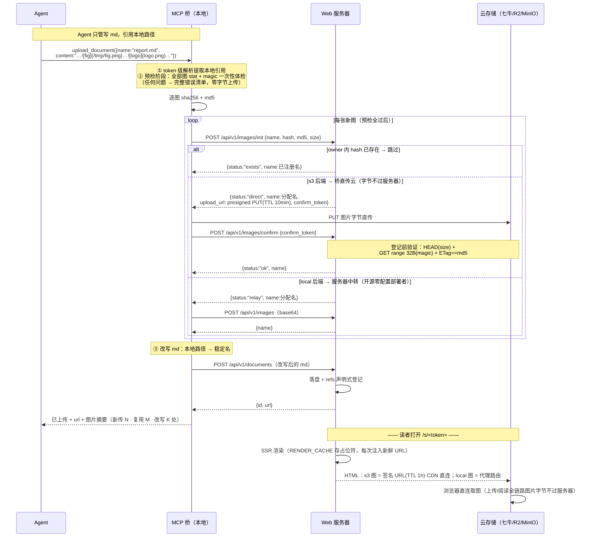

# 图片支持设计（资产池去重 · 桥端编排 · CDN 直连取图 · Lightbox）

> 日期：2026-09-20 · 状态：设计定稿（待实现，细节讨论中）

## 1. 背景与目标

当前 Remote Reader 对**纯文本 Markdown**（无图片引用）渲染友好。用户需求：支持**内嵌图片的 markdown 文件**，且前端提供良好的图片查看体验（放大、全屏、缩放、拖动查看局部）。

图片三种来源（均需支持）：

1. **Agent 本地图片资产**（主场景）：Agent 生成的截图/图表与 md 一起交付——当前完全缺失（相对路径图片 404）
2. **外链 http/https 图片**：markdown-it 默认规则现状已能渲染 ``（CSP 未设置，无拦截）；本次补交互体验
3. **base64 内嵌**：现状已能渲染；受 `MAX_UPLOAD_BYTES` 约束，仅适合小图；本次补交互体验

部署背景：本项目开源在 GitHub，供他人自部署；生产机带宽有限（frp 内网穿透），**大图流量不能流经应用服务器**；已用七牛云（S3 兼容）做冷热分层存储。

### 目标

- Agent 上传带图 md **零新增概念**：仍只调 `upload_document`，引用本地路径，桥自动编排图片上传与引用改写
- 图片存储**去重**：同 owner 同内容（hash）只存一份；重复上传零带宽浪费（预查询跳过）
- **引用管理 + 自动 GC**：记录 md ↔ 图片引用关系；所有引用方删除后图片自动清理
- **存储后端可选**：local / s3（七牛、R2、OSS 网关、MinIO 等 S3 兼容通吃）；数据行记录实际后端，**换后端不破坏旧图加载**（溯源）
- **CDN 直连取图**：s3 后端图片走签名 URL 客户端直连（服务器带宽零消耗），支持七牛 Referer 防盗链
- 前端 **Lightbox**：放大/全屏/缩放（滚轮锚定 + pinch）/拖动平移/双击切换

## 2. 端到端流程



## 3. 已确认的设计决策

| # | 决策点 | 结论 |
|---|---|---|
| 1 | 图片模型 | **owner 级资产池**（脱离 documents 目录树；FM 不显示图片行）——去重与 GC 天然成立 |
| 2 | 稳定名分配 | 服务器分配：同内容 → 幂等返回已有注册名；**同名不同内容 → 自动后缀（`shot-2.png`）**，永不覆盖旧图、名字永不复用（防"改一张图影响所有引用文档"） |
| 3 | MCP 工具面 | `upload_document` 单工具不变（桥内编排图片）；**不新增独立 upload_image MCP 工具**（Web API 保留供桥调用；独立预传工具备案后续） |
| 4 | 去重 + 预查询 | 融合进 `POST /api/v1/images/init`：报 `{name, hash, md5, size}` → 已存在直接返回注册名（零流量）；同时完成名字分配（含后缀） |
| 5 | 上传通道（s3 后端） | **桥直传云**：init 返回 presigned PUT URL（TTL 10min，仅限单 key、不暴露 AK/SK）→ 桥 PUT 直传 → confirm 登记前验证（HEAD size + GET range 32B magic + ETag==md5 诚实性校验）——上传与阅读全链路图片字节不过服务器 |
| 5b | 上传通道（local 后端） | 服务器中转 `POST /api/v1/images`（base64，×1.37 体积）：未配云存储的开源部署者零配置可用；桥按 init 响应 `status: relay` 自动选路，对 Agent 透明 |
| 5c | sha256 与 md5 双哈希 | sha256 = 去重键（行级）；md5 = 诚实性校验（S3 单段 PUT 的 ETag 即内容 MD5，confirm 时比对——桥谎报哈希当场戳穿，验证流量仅几百字节；七牛 ETag 口径列入实测，不标准则退化为 magic+size） |
| 6 | 格式白名单 | png / jpeg / gif / webp；**magic bytes + 扩展名双校验**；SVG 拒绝（可携脚本，XSS 面），错误信息说明 |
| 7 | 单图上限 | `MAX_IMAGE_BYTES` 默认 10MB 原始字节；`BODY_SIZE_LIMIT` 启动校验联动（≥ 10MB × 1.37 × 1.5） |
| 8 | 免登录图片鉴权 | 代理路由走 **refs 白名单**：token → md → 图，且该 md 的 refs 必须命中——share token 持有者不能枚举读 owner 其他未引用图片 |
| 9 | s3 图取图 | **签名 URL 直连 CDN**（TTL 1h，`IMAGE_SIGNED_URL_TTL` 可调）；签名按**行内 backend** 生成（溯源） |
| 10 | 隐蔽开关 | `IMAGE_PROXY_ALL=1` 强制全代理（不向读者暴露云存储域名，牺牲带宽换隐蔽；默认 0 = 直连） |
| 11 | 引用登记 | 声明式（md 上传/覆盖时全量 diff 重算）+ **渲染时惰性补录**（`INSERT OR IGNORE`，图行存在才补）——堵"md 先传图后传"时序洞 |
| 12 | GC | 自动：refs 归零即删（删行先行、blob 后删）；**无手动删除 UI**（资产管理视图备案后续） |
| 13 | 孤儿回收 | fail-fast 半途而废 / 传图未传 md 的图（`refs==0 && age>24h`）由周期任务兜底清理（复用 tiering scheduler tick）；24h 宽限防误杀上传窗口 |
| 14 | fail-fast（两阶段） | **预检阶段**：全部本地图 stat + magic 预判，**一次性完整报告所有问题**（零字节上传）；**上传阶段**：预检全过后逐张 init/传/confirm，中途失败带进度摘要（"已上传 3 张重试自动跳过，失败于第 4/8 张"） |
| 15 | RENDER_CACHE | **占位符两段式**：缓存 HTML 存 `%%RR:IMG:n%%`，SSR 尾部字符串替换注入新鲜签名 URL/代理路由（FIFO 缓存无 TTL，存真签名会过期裂图） |
| 16 | referrer 策略 | 页面全局 `no-referrer` 不变（share token 在 path，绝不外发）；**仅签名 URL 图**在 `` 上加 `referrerpolicy="strict-origin-when-cross-origin"`——跨域只发站点 origin（够七牛 Referer 白名单），token 不泄露 |
| 17 | 存储后端 | BlobStore 接口 + local/s3 内置双实现 + env 选择；**不做运行时动态插件**（代码级扩展：实现接口 + 注册） |
| 18 | 冷却通用化范围 | tiering 改为注入 BlobStore（行为不变）+ documents 冷档行补 `storage_backend` 溯源列（回填 `'s3'`）；**不重构 tiering 本身** |
| 19 | 图片与冷热分层 | 图片资产**不参与**冷热分层（已永久存在选定后端），images 表无 tier 列 |
| 20 | 引用语法 | md 内**裸名**（去 `./` 前缀、去 query/fragment 后全名匹配 owner 图片池）；外链 `http(s)://`/`data:` 原样；含路径分隔符的 src 不匹配 → 裂图占位 |

## 4. 数据模型

```sql
-- 图片资产池（owner 内内容寻址去重）
CREATE TABLE images (
  id               TEXT PRIMARY KEY,
  owner_id         TEXT NOT NULL REFERENCES users(id),
  name             TEXT NOT NULL,            -- 稳定引用名，如 "shot.png"
  content_hash     TEXT NOT NULL,            -- sha256 hex
  mime_type        TEXT NOT NULL,            -- magic bytes 判定结果
  size_bytes       INTEGER NOT NULL,
  storage_backend  TEXT NOT NULL,            -- 'local' | 's3'（溯源：实际存储者）
  storage_key      TEXT NOT NULL,            -- local: 磁盘路径 / s3: 对象 key
  created_at       INTEGER NOT NULL,
  UNIQUE(owner_id, name),
  UNIQUE(owner_id, content_hash)
);

-- 引用关系（N:N，兼代理路由访问白名单）
CREATE TABLE image_refs (
  document_id  TEXT NOT NULL REFERENCES documents(id) ON DELETE CASCADE,
  image_id     TEXT NOT NULL REFERENCES images(id),
  UNIQUE(document_id, image_id)
);

-- 冷档溯源（顺便修复既有隐患：现状 cold 隐含"当前配置的 S3"，换 bucket/服务商旧冷档集体失联）
ALTER TABLE documents ADD COLUMN storage_backend TEXT;  -- hot 行 NULL；冷档行 = 归档时后端
```

- 迁移：Drizzle migration + `ensureSchema` 兜底（同 `ensureOwnerViewedColumn` 先例）；存量冷档行回填 `'s3'`；schema↔ensureSchema 等价性守卫测试同步更新
- `image_refs.document_id` 外键 `ON DELETE CASCADE`（文档删除自动清 refs；配合应用层 GC 检查）
- FTS：图片不入 documents 表，无需处理

## 5. Web API

错误形状统一 SvelteKit `error(status, message)` → 扁平 `{"message":"..."}`。

### 5.1 `POST /api/v1/images/init`

- 认证：Bearer API token + authfail IP 桶；限流：轻调用桶（`images-meta:${tokenId}`，默认 120/min——init/confirm 是几百字节级元数据调用，与重负载的 upload 桶分开）
- Body：`{name, content_hash, content_md5, size_bytes}`
- 校验：name 过 `parsePath` 语义校验（单段）；`size_bytes ≤ MAX_IMAGE_BYTES`（超限 413，避免无谓 presign）
- 响应三态：
  - `{status:"exists", name}`——`(owner, content_hash)` 命中，去重跳过，零流量
  - `{status:"direct", name, upload_url, confirm_token}`——s3 后端：presigned PUT URL（TTL 10min，key = `images/<ownerId>/<content_hash>`，仅限该 key）+ 一次性 confirm_token（内存 Map，TTL 1h，锁定名字分配结果防重试漂移）
  - `{status:"relay", name}`——local 后端：走 5.2 中转
- 名字分配：`(owner, name)` 冲突 → **自动后缀** `shot.png → shot-2.png → …`（对 Agent 透明；名字含空格时 sanitize 为 `-`，其余字符保留）

### 5.2 `POST /api/v1/images`（relay 中转通道）

- 认证/限流：与 `/api/v1/documents` 同款（`upload:` 桶 + authfail 桶）
- Body：`{name, content_base64}`
- 校验链：base64 解码（失败 400）→ `MAX_IMAGE_BYTES`（413）→ **magic bytes 识别**（png/jpeg/gif/webp，失败 415）→ 扩展名与识别一致（不一致 400 提示改名）→ `(owner, hash)` 幂等 / 同名后缀
- 落库：写 blob（local 布局）→ 插行（先存储后落库，崩溃只留无害孤儿 blob）

### 5.3 `POST /api/v1/images/confirm`（直传登记）

- 认证/限流：同 init（轻桶）
- Body：`{confirm_token}`
- 登记前验证（桥直传的内容不过服务器手，验证替代上传时校验）：
  1. HEAD 对象：存在 + `size ≤ MAX_IMAGE_BYTES`
  2. GET range 前 32 字节：magic bytes 与扩展名一致性（同 5.2 白名单口径）
  3. ETag == init 报的 `content_md5`（诚实性校验；七牛 ETag≠MD5 时此项跳过，备案实测）
- 全过 → 插行（backend='s3' + key）→ `{status:"ok", name}`；对象缺失 → `{status:"missing"}`（桥重走 PUT）；校验失败 → 删云对象 → `400 {status:"invalid", reason}`
- token 幂等：重复 confirm 同 token 返回同结果（不重复登记）

### 5.4 `GET /s/[token]/i/[name]`（免登录代理路由）

```
token → md 行（share token 有效）→ owner 内按 name 查 images 行
→ refs 白名单：image_refs 存在 (md.id, image.id) 才放行
→ 按 storage_backend + storage_key 取字节（local 读盘 / s3 get Buffer）
→ 200 + Content-Type=行内 mime + X-Content-Type-Options:nosniff + Cache-Control:no-store
→ 任何失败 404（统一口径，不泄漏存在性）；行内后端实现不存在（如已删 s3 配置）→ 503
```

### 5.5 `GET /d/[id]/i/[name]`（owner 视图）

- `session.user === md.ownerId` 鉴权，其余与 5.4 完全一致（含 refs 白名单）

## 6. MCP 桥编排（`packages/shared` 扩展）

`upload_document` 工具行为扩展（签名不变，对 Agent 零新增概念），**两阶段**：

### 6.1 阶段一：解析 + 预检（零字节上传前完成全部本地检查）

1. **token 级解析**：markdown-it（进 shared 依赖）只 parse 取 image token——正则会误伤 code/fence 里的示例图片语法导致误报，必须真 parse；行内式与引用式（`![alt][ref]` + 定义）都覆盖；带 scheme（`http(s)://`、`data:` 等）的跳过
2. **本地引用判定**：无 scheme 一律视为本地路径（含 Windows/UNC/POSIX 绝对与相对）；相对路径相对桥进程 cwd（MCP 客户端不传 cwd 时桥 cwd 可能 ≠ Agent 工作目录——错误信息主动暴露基准目录供 Agent 自愈）
3. **逐图预检**（收集**全部**问题一次性报告，不修一张冒一张）：
   - `stat`：不存在/断链 → `FILE_NOT_FOUND`；是目录 → `IS_DIRECTORY`；无权 → `PERMISSION_DENIED`；超 `MAX_IMAGE_BYTES` → `TOO_LARGE`
   - 轻量魔数预判（png/jpeg/gif/webp 文件头）：不符 → `UNSUPPORTED_FORMAT`（SVG 单独说明）
   - 读文件 IO 异常 → `READ_ERROR`（系统消息原样透出）
4. **错误输出格式**（MCP `isError` content，机器可解析、每项带自愈建议）：

```
upload_document 失败：图片预检发现 2 个问题，未上传任何字节

[1/2] FILE_NOT_FOUND: "screenshots/shot.png"
  尝试路径: /home/user/project/screenshots/shot.png（相对路径按桥工作目录解析，cwd=/home/user/project）
  建议: 确认文件存在；或改用绝对路径
[2/2] TOO_LARGE: "/tmp/panorama.png"
  实际 38.2MB > 上限 10MB（MAX_IMAGE_BYTES）
  建议: 压缩或裁剪后重试

修正后重新调用 upload_document 即可，相同内容已上传的图片会自动跳过。
```

### 6.2 阶段二：上传（预检全过后）

逐图：sha256 + md5 → `init`：
- `exists` → 复用注册名（零流量）
- `direct` → PUT presigned URL 直传（桥自己的 fetch，超时 300s）→ `confirm` → `missing` 时重 PUT、`invalid` 时 fail-fast 报 reason
- `relay` → `POST /api/v1/images` base64 中转（超时 300s；md 上传维持 60s）

中断失败时错误信息带进度摘要："已成功上传 3 张（重试自动跳过），失败于第 4/8 张：<原因>"。

### 6.3 改写与收尾

- **token 级行内改写**：按 image token 的 `.map` 行号只在这些行内做 src（编码形态）替换为稳定名——防 code block 内示例文本被全局替换污染；fence/code span 内天然无 image token 不误伤
- 同文档内同内容多图：后图 init 命中前图注册名，天然去重
- 上传 md → 返回 Agent：`已上传（id=…）。查看链接：…。图片：新传 N · 复用 M · 引用改写 K 处`

## 7. 渲染与取图

### 7.1 renderMarkdown 扩展

```ts
renderMarkdown(src, { assetResolver, cacheScope })  // cacheScope: '/s/<token>' | '/d/<id>'
```

- 覆盖 markdown-it `image` renderer，按 src 分流：
  - `http(s)://`、`data:`、`/` 开头 → 原样
  - 裸名（去 `./`、query、fragment，URL decode）→ `assetResolver(name)` 返回占位符索引 `%%RR:IMG:n%%`（见 7.2）；无匹配图行 → 输出裂图占位（alt 文本 + 占位样式）
- 所有 `` 补 `loading="lazy" decoding="async"`

### 7.2 占位符两段式（RENDER_CACHE 兼容）

- 渲染缓存键扩展：`sha256(cacheScope + '\0' + src)`（同内容不同查看上下文互不污染；同上下文重复访问照常命中）
- 缓存产物内的图片 src 为占位符 `%%RR:IMG:n%%`；**每次 SSR 返回前**按 assetResolver 的实时结果做字符串替换：
  - 图行 backend=s3 且能签名（`IMAGE_PROXY_ALL` 未开）→ 注入签名 URL + `referrerpolicy="strict-origin-when-cross-origin"` 属性
  - 图行 backend=local 或 `IMAGE_PROXY_ALL=1` → 注入代理路由 URL（5.3/5.4）
  - 图行 backend=s3 但当前无 s3 实现（配置被删）→ 注入"图暂不可用"占位（503 语义）
- 占位符冲突防护：渲染前若 src 原文含 `%%RR:IMG:` 模式，先做转义处理（实现细节 plan 定，原则：内容中出现的字面占位符不得被替换）

### 7.3 refs 渲染惰性补录

- assetResolver 匹配到图行时，若 `(md.id, image.id)` 无 refs 记录 → `INSERT OR IGNORE` 补录（图行存在才补；与删除事务的竞态窗口极小，幽灵 ref 无害）
- 双保险：声明式登记（6.上传时）为主，惰性补录兜乱序

### 7.4 签名 URL

- BlobStore 可选能力 `getSignedUrl(key, ttlSeconds)`；s3 实现基于 SigV4 presign（@aws-sdk 现有依赖加 presigner 或等价实现，plan 定）
- TTL 默认 3600s（`IMAGE_SIGNED_URL_TTL`）；页面 `no-store`，每次刷新重新 SSR 重新签名，无"签名过期裂图"窗口（两段式保证）
- 撤销语义：撤销 share token 后页面立即 404；已分发的签名 URL 在 TTL 内仍可直连取图——**已知权衡**（≤1h，可调短）

## 8. BlobStore 抽象与冷却通用化

```ts
interface BlobStore {
  id: string;                                            // 'local' | 's3'
  put(key: string, data: Buffer, contentType?: string): Promise<void>;
  get(key: string): Promise<Buffer>;
  head?(key: string): Promise<{ size: number; etag?: string }>;
  getRange?(key: string, start: number, end: number): Promise<Buffer>;
  delete(key: string): Promise<void>;
  getSignedUrl?(op: 'get' | 'put', key: string, ttlSeconds: number): Promise<string>;
}
```

- presign 用 `@aws-sdk/s3-request-presigner`（官方包，七牛官方 SDK 示例直接给同款用法，SigV4 参数签名官方明确支持）；PUT 预签 TTL 10min、GET 预签 TTL = `IMAGE_SIGNED_URL_TTL`
- 桥全程不持有云凭证（只收一次性 presigned URL，能力限定单 key）

- 内置实现：
  - `local`：`DATA_DIR/<ownerId>/blobs/<hash 前 2 位>/<hash>`（内容寻址，无扩展名，mime 在行里）
  - `s3`：现有 `object-store-s3.ts` 泛化；图片 key 空间 `images/<ownerId>/<hash>` 与冷档 key 空间隔离
- env：`IMAGE_STORE_BACKEND=local|s3`（默认 local；选 s3 需 `OBJECT_STORE_*` 配置齐全，缺失启动校验 fail-fast）
- **加载永远按行内 `storage_backend + storage_key`**，与当前配置解耦——换后端旧图照常加载
- 冷却通用化：tiering/归档/回热改为注入 BlobStore（行为不变）；documents 冷档行记录 backend（新归档写、存量回填 `'s3'`）；读冷档按行内 backend 路由，行内后端实现不存在 → `ArchiveUnavailableError`（503 语义不变）

## 9. GC 与孤儿回收

- **触发点一：文档删除**：删除事务内**先 SELECT 快照该 md 的 refs 图清单**，再删文档（`ON DELETE CASCADE` 清 refs）→ 对快照逐图检查：`refs==0` → 删 images 行 → 删 blob（先删行后删 blob，崩溃窗口只留无害孤儿 blob，同现有 deleteNode 先例）——不快照则 CASCADE 后无从得知曾引用谁
- **触发点二：覆盖上传**：md 覆盖时 refs 全量 diff 重算（新增登记、失效删除），失效引用触发同款检查
- **触发点三：孤儿周期回收**（tiering scheduler tick 复用）：`refs==0 && age>24h` 的图清理——覆盖 fail-fast 半途而废、传图未传 md 两种孤儿
- 名字不复用：GC 后释放的名字不再分配（防"新图顶替旧名"歧义；名字空间非稀缺）

## 10. 前端

### 10.1 正文图片样式

`max-width:100%`、`height:auto`、圆角、`cursor:zoom-in`、暗色下柔和底色（透明 PNG 观感）；裂图占位样式（alt 文本可见）。

### 10.2 ImageLightbox（新组件）

- 触发：MarkdownViewer 容器事件委托 click ``（mermaid 块非 img，不冲突）
- **复用 mermaid lightbox 基建**（服务性重构，属本次范围）：`gestures` / `overlayOnMount` 从 `MermaidViewer.svelte` 抽到 `$lib/shared/`；`mermaid-zoom.ts` 泛化 `shared/zoom.ts`
- 交互全集：单指/鼠标拖动平移 · 双指 pinch · **滚轮缩放锚定指针位置**（查看局部关键，mermaid 是中心缩放）· 双击 1x⇄2.5x（锚定双击点）· +/−/重置(100%)/浏览器全屏/Esc 关闭 · 焦点圈定 · body 滚动锁 · 缩放范围 0.2x–10x · 百分比显示 · 加载指示
- 外链/base64/签名 URL/代理路由图行为一致（lightbox 只做展示变换，不读像素，无 CORS 障碍）

## 11. 安全清单

- magic bytes 白名单 + 扩展名一致性（relay 路由上传时 + direct 路由 confirm 登记时双重执行）；SVG 拒绝
- **直传内容不信任链**：字节不过服务器 → confirm 时 HEAD size + GET range magic + ETag==md5 三重登记前验证；serve 侧 `Content-Type` 白名单 + `nosniff` 兜底（mime 造假最坏得到裂图，无 XSS 面）
- presigned PUT 最小权限（单 key + 短 TTL + 不下发票据）；confirm_token 一次性 + TTL
- `X-Content-Type-Options: nosniff` + Content-Type 恒白名单四值
- 代理路由 refs 白名单（share token 不能枚举 owner 未引用图片）
- 签名 URL TTL 1h；token 不进 referrer（全局 no-referrer 保持 + 签名图 img 级 strict-origin-when-cross-origin）
- base64 解码失败 400；`BODY_SIZE_LIMIT` 启动校验联动 `MAX_IMAGE_BYTES × 1.37 × 1.5`（relay 通道）
- 限流：init/confirm 轻桶（120/min）+ relay/documents 重桶（60/min）+ authfail IP 桶
- 占位符注入冲突防护（7.2）

## 12. env 变更

| env | 默认 | 说明 |
|---|---|---|
| `IMAGE_STORE_BACKEND` | `local` | `local` \| `s3`（选 s3 需 OBJECT_STORE_* 齐全） |
| `MAX_IMAGE_BYTES` | `10485760` | 单图原始字节上限（base64 前解码） |
| `IMAGE_SIGNED_URL_TTL` | `3600` | 签名 URL 有效期秒 |
| `IMAGE_PROXY_ALL` | `0` | 强制全代理（隐蔽优先） |

同步：`.env.example`、`lib/server/env.ts`、`startup-check.ts`（BODY_SIZE_LIMIT 联动 + backend 选择校验）、INSTALL.md 环境变量汇总表、USER_GUIDE。

## 13. 测试计划（vitest + Playwright）

- `images` API：init（exists/direct/relay 三态、名字后缀、413 预检、轻桶限流）、relay（magic/扩展名 400、415 SVG、413、429、401、hash 幂等、同名后缀、owner 隔离）、confirm（missing/invalid/ok 三态、ETag 校验、token 幂等重放、验证失败删云对象）
- 代理路由：refs 白名单（未引用 404）、token 失效 404、响应头、503（backend 实现缺失）、local/s3 双路径
- `renderMarkdown`：外链原样、裸名占位符、lazy/decoding、referrerpolicy 仅签名图、占位符转义、缓存键隔离（同 src 不同 cacheScope 不同产物、同 scope 命中）
- 两段式替换：签名注入/代理注入/503 占位
- refs：声明式登记、覆盖 diff 重算、惰性补录幂等、CASCADE
- GC：三触发点 + 孤儿回收（fake timers，24h 宽限）+ 名字不复用
- 桥编排（shared 单测，mock api）：token 级解析（code block 内示例不误伤）、预检一次性报告全部问题（六类错误码分类、诊断上下文、进度摘要）、init exists 跳过、direct/relay 双路、confirm missing 重 PUT、后缀名改写、fail-fast 错误信息
- BlobStore：local 布局、s3 key 空间、getSignedUrl 存在性
- 冷档溯源：回填、读路由、503
- startup-check：新校验
- Playwright e2e：上传带图 md（本地图片文件）→ `/s/` 渲染（relay 中转 + direct 直传双模式）→ lightbox 开/关/滚轮缩放/拖动/双击/全屏 → 删除文档后图 404

## 14. 已知权衡与备案（不实现）

| 项 | 说明 |
|---|---|
| **七牛 ETag=MD5 口径** | 单段 PUT 的 ETag= 内容 MD5 是 S3 标准行为，七牛网关需实测；不标准 → confirm 退化为 magic+size 校验（放弃 md5 诚实性校验，无伤大雅） |
| **七牛 presign PUT 签 Content-Type** | 签上可强制桥传对 mime；七牛兼容性实测，不签则依赖登记时 magic 兜底 |
| **七牛 2026-04-08 新政策** | 该日期后**新建**空间经 `s3.*.qiniucs.com` 浏览器访问强制 `Content-Disposition: attachment`——对 `` 子资源是否生效官方不明确，**上线前实测**；中招则 INSTALL.md 指引自定义域名/旧空间路径 |
| **七牛 S3 空间名 ≠ 空间名** | 空间名全局不唯一时自动生成 S3 空间名，presign 的 Bucket 必须用 S3 空间名（控制台空间概览查）——INSTALL.md 部署节写明 |
| **Referer 防盗链配置口径** | 白名单填站点域名（无 scheme；`*.example.com` 不含裸域需两条）；「允许空 Referer」建议**开启**（门禁本质是 presign 签名；关闭则地址栏直开 403）；签名+Referer 叠加关系以 curl 实测锁定 |
| 无行孤儿 blob（云侧） | PUT 成功后 confirm 前崩溃的云对象无行可扫——key 内容寻址（`images/<owner>/<hash>`），同内容重传覆盖复用自然消化，永不重传者容忍 |
| 本地无行孤儿 blob | relay 写盘后插行前崩溃同理，容忍 |
| 独立 `upload_image` MCP 工具 | Agent 显式预传图场景，备案后续 |
| 资产管理视图 UI | owner 图片池列表 + 引用数 + 手动删除，备案后续 |
| 图片内容版本更新 | 同名覆盖全局生效，备案（当前同名自动后缀是保守正确行为） |
| SVG / avif | SVG 需 CSP sandbox 方案；avif magic（ftyp box）后续加 |
| 图片宽高解析（防 CLS） | 上传时解析尺寸入行、渲染输出 width/height，备案后续 |
| 桥端 hash→name 本地缓存 | 同机重复图连预查询都省，纯优化备案 |
| 多 worker 并发 | 单实例假设（与现状一致）；images 并发插入靠 UNIQUE 索引兜底 |

## 15. 实现现状

待实现。
