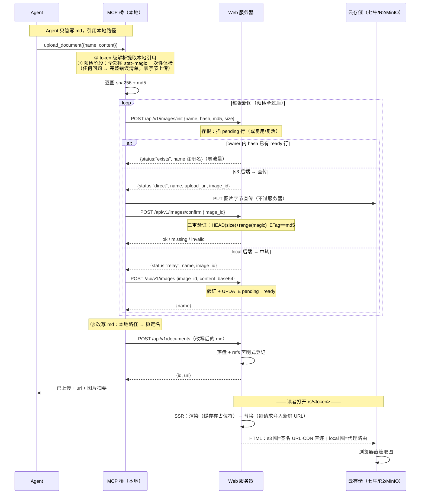
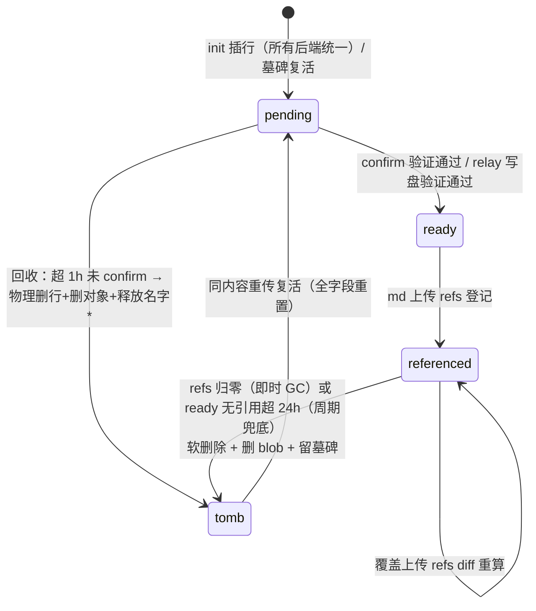

# 图片支持设计（资产池去重 · 桥直传云 · CDN 直连取图 · Lightbox）

> 日期：2026-09-20 · 状态：设计定稿 v3（细节讨论中；存储结构经 Oracle 对抗审查修复）

## 1. 背景与目标

当前 Remote Reader 对**纯文本 Markdown** 渲染友好。用户需求：支持**内嵌图片的 markdown 文件**，前端提供放大/全屏/缩放/拖动查看局部体验。

图片三种来源（均支持）：**Agent 本地图片资产**（主场景，当前缺失）、外链 http/https（现状已渲染，本次补交互）、base64 内嵌（现状已渲染，补交互）。

部署背景：开源项目供他人自部署；生产机带宽有限（frp 内网穿透）——**图片字节全链路（上传+阅读）不流经应用服务器**；已用七牛云（S3 兼容）做冷热分层。

### 目标

- Agent 上传带图 md **零新增概念**：仍只调 `upload_document`，桥自动编排（解析→预检→上传→改写）
- **去重**：owner 内按内容 hash 只存一份，重复上传零流量（init 预查）
- **存根 + 自动 GC**：init 即建存Stub 行，两段 deadline（pending 1h / ready 无引用 24h），引用归零即清
- **存储后端插件式**：BlobStore 无状态接口 + local/s3 内置 + 行级 backend 溯源（换后端不炸旧图）
- **上传直传云**（presigned PUT）+ **阅读 CDN 直连**（presigned GET）——服务器只过元数据
- 前端 **Lightbox**：放大/全屏/滚轮锚定缩放/pinch/拖动/双击

## 2. 端到端流程



## 3. 已确认的设计决策

| # | 决策点 | 结论 |
|---|---|---|
| 1 | 图片模型 | owner 级资产池（脱离 documents 目录树；FM 不显示图片行） |
| 2 | 稳定名 | **服务器分配**（init 响应的 name 是唯一权威，桥不得用请求名改写 md）；同名不同内容自动后缀 `shot-2.png`；ready 过的名字永不复用（墓碑 UNIQUE 占位）；pending 超时释放名字（从未被引用，安全）；名字空格 sanitize 为 `-` |
| 3 | MCP 工具面 | `upload_document` 单工具不变；不新增独立 upload_image MCP 工具（备案） |
| 4 | 去重+预查 | 融合进 init：报 `{name, hash, md5, size}` → exists 复用（零流量）/ pending 共享 / 墓碑复活 / 新建 |
| 5 | 上传通道 s3 | 桥直传云：presigned PUT（TTL=插件 `uploadUrlTtlSeconds`，默认 600s，单 key 最小权限，桥全程不持有云凭证）→ confirm 登记前验证 |
| 5b | 上传通道 local | 服务器中转（base64 ×1.37）：**local 模式 init 同样插 pending 行**，relay = UPDATE pending→ready + 写盘（非独立入口，无独立查重） |
| 5c | 双哈希 | sha256=去重键（行级）；md5=confirm 诚实性校验（S3 单段 PUT ETag=MD5；七牛口径实测，不标准则退化 magic+size） |
| 6 | 格式白名单 | png/jpeg/gif/webp；magic bytes + 扩展名双校验；SVG 拒绝（XSS） |
| 7 | 单图上限 | `MAX_IMAGE_BYTES` 默认 10MB；BODY_SIZE_LIMIT 启动校验联动 ×1.37×1.5（relay 通道） |
| 8 | 免登录鉴权 | 代理路由 refs 白名单（token→md→图，且该 md 的 refs 命中）；share token 不能枚举 owner 未引用图 |
| 9 | s3 取图 | 签名 URL 直连 CDN（TTL=`IMAGE_SIGNED_URL_TTL` 默认 1h）；按行内 backend 签名（溯源） |
| 10 | 隐蔽开关 | `IMAGE_PROXY_ALL=1` 强制全代理（默认 0=直连） |
| 11 | 引用登记 | 声明式（md 上传/覆盖 diff 重算）+ 渲染时**替换阶段**惰性补录（`INSERT OR IGNORE`，仅 ready 行；缓存命中路径也执行） |
| 12 | GC | 全自动（refs 归零软删除墓碑 + 删 blob）；无手动删除 UI（备案） |
| 13 | 孤儿回收 | 周期任务（tiering tick 复用，分批 LIMIT）：pending 超 1h 物理删（释放名字）；ready 无 refs 超 24h 软删 |
| 14 | fail-fast 两阶段 | 预检阶段一次性报告全部问题（零字节上传）；上传阶段中断带进度摘要 |
| 15 | RENDER_CACHE | 占位符两段式：`%%RR:IMG:<contentHash 前 8>:<n>%%`（自指不可能构造，天然防冲突）；缓存 value 从 string 变 `{html, names[]}`；替换每请求执行 |
| 16 | referrer | 页面全局 no-referrer 不变（token 不外发）；仅签名 URL 图加 img 级 `strict-origin-when-cross-origin`（发 origin 供七牛 Referer 白名单） |
| 17 | 存储后端 | BlobStore 无状态接口 + 注册表路由 + 行级溯源；**不做运行时动态插件**（代码级扩展） |
| 18 | 冷却通用化 | tiering 注入 BlobStore（行为不变）+ documents 冷档行补 backend 溯源列；不重构 tiering |
| 19 | 图片与分层 | 图片不参与冷热分层（无 tier 列）；有 refs 的 local 图常驻本地盘（备案接受） |
| 20 | 引用语法 | md 内裸名（去 `./`、query、fragment，URL decode 后全名匹配 owner 池）；外链/data: 原样；含路径分隔符不匹配 |
| 21 | 存根模型 | init 即插行（status=pending）；行 id 即 confirm 持久令牌（抗服务器重启）；两段 deadline 见 §4 |
| 22 | 软删除墓碑 | ready 图 GC 不物理删行，置 `deleted` 留墓碑（UNIQUE 占位实现名字永不复用，无应用层竞态）；同内容重传时复活（全字段重置） |
| 23 | 插件元数据 | 插件自声明 `id`（公共契约，有数据即冻结）；核心启动建注册表 `Map<id, store>`；`uploadUrlTtlSeconds?` 可选（默认 600）；presign `opts?` 不透明透传缝（未来七牛 imageView2 等） |
| 24 | 插件能力分级 | L0 = put/get/delete/head（+getRange）→ 全功能可用（上传走 relay、取图走代理，吃服务器带宽）；L1 = +presign → 直传+直连。**presign 永远是加速项不是依赖，代理路由是万能兜底** |

## 4. 数据模型（完备版，经 Oracle 审查修复）

### 4.1 DDL

```sql
CREATE TABLE images (
  id              TEXT PRIMARY KEY,              -- generateId()，兼 confirm 持久令牌
  owner_id        TEXT NOT NULL REFERENCES users(id),
  name            TEXT NOT NULL,                 -- 服务器分配的稳定引用名，owner 内唯一
  content_hash    TEXT NOT NULL,                 -- sha256 hex，去重键
  content_md5     TEXT NOT NULL,                 -- md5 hex，confirm 诚实性校验
  mime_type       TEXT NOT NULL,                 -- magic 判定，恒白名单四值
  size_bytes      INTEGER NOT NULL,              -- pending=init 报称；ready 后=实测回写
  status          TEXT NOT NULL DEFAULT 'pending',  -- 'pending' | 'ready' | 'deleted'
  storage_backend TEXT NOT NULL,                 -- 写入时锁定的插件 id（溯源）
  storage_key     TEXT NOT NULL,                 -- 插件自解释：local 'blobs/<owner>/<h2>/<hash>' / s3 'images/<owner>/<hash>'（per-owner 内容寻址）
  created_at      INTEGER NOT NULL,              -- pending deadline 计时起点（复活时重置）
  ready_at        INTEGER,                       -- confirm/relay 时刻（关联 deadline 起点；墓碑保留）
  UNIQUE(owner_id, content_hash),
  UNIQUE(owner_id, name)
);
CREATE INDEX images_status_created ON images(status, created_at);  -- pending 回收扫描
CREATE INDEX images_status_ready   ON images(status, ready_at);    -- ready 回收扫描

CREATE TABLE image_refs (
  document_id TEXT NOT NULL REFERENCES documents(id) ON DELETE CASCADE,
  image_id    TEXT NOT NULL REFERENCES images(id),
  created_at  INTEGER NOT NULL,
  PRIMARY KEY (document_id, image_id)
);
CREATE INDEX image_refs_image ON image_refs(image_id);  -- GC 反查 / 白名单 EXISTS

ALTER TABLE documents ADD COLUMN storage_backend TEXT;  -- NULL=hot；非空=cold 行实际归档后端
-- 回填：UPDATE documents SET storage_backend='s3' WHERE storage_tier='cold'
```

- **storage_key 为 per-owner 内容寻址**（`<owner>/<hash>`）——同 owner 同 hash 必同一行（UNIQUE 保证），无跨行/跨 owner blob 共享，删除无连带风险
- **documents 双列纪律**：`storage_tier` 与 `storage_backend` 由归档/回热路径**单点写入**（归档写 backend、回热清 NULL），一致性由测试锁定（防双真相源漂移）
- 迁移：Drizzle migration + `ensureSchema` 兜底（`ensureImagesTables()` / `ensureDocumentsStorageBackendColumn()`）；schema↔ensureSchema 等价性守卫测试同步

### 4.2 状态机



\* pending 释放名字安全：从未 ready、从未被引用，无顶替歧义。

### 4.3 GC 安全包（Oracle 审查修复，全部为不变量）

1. **条件式写路径**：一切回收/GC 的 UPDATE/DELETE 必须带 status 条件（乐观锁）：`DELETE … WHERE id=? AND status='pending'`、`UPDATE … SET status='deleted' WHERE id=? AND status='ready'`——0 行即跳过后续动作
2. **删 blob 前反查 key 活行**：物理删 blob 前在同一 tick 内 `SELECT … WHERE storage_key=? AND status IN ('pending','ready')`，有活行则跳过删除（下轮再看）——封死"行删后重传同 key 新行 → 延迟的 blob DELETE 误删活图"数据丢失链
3. **refs 补录事务边界**：同步事务内 `SELECT status='ready'` 校验 + INSERT（better-sqlite3 同步无 await，与其他事务天然串行）
4. **GC 软删事务边界**：事务内复查 `refs==0` 后条件式 UPDATE；blob 删除在事务提交后（失败仅日志，孤儿由下轮/墓碑清理兜底）
5. **confirm 0 行回查分流**：UPDATE pending→ready 0 行后回查行状态——ready → 幂等 ok；deleted/无行 → missing（桥重走 init，防 GC 后谎报成功）

### 4.4 关键并发语义（UNIQUE 兜底）

| 场景 | 行为 |
|---|---|
| 同 owner 同内容并发 init | 撞 `UNIQUE(owner,hash)` → 后到者共享同一 pending 行的 presign（key 同内容寻址，谁的 PUT 先到都一样），任一 confirm 即转正；**响应返回行内注册名**（可能异于请求名） |
| 同名不同内容并发 init | 撞 `UNIQUE(owner,name)` → 后缀循环重试；**每轮重试前重查 hash 分支**（防撞 hash UNIQUE 死循环）；后缀上限 16 |
| 名字超长 | 基名+后缀超 parsePath 单段限制 → 截断基名再试（上限内保证可分配） |
| 并发复活同一墓碑 | 复活 UPDATE 带 `WHERE status='deleted'`，0 行者重查走 pending 分支 |
| confirm 与回收竞态 | 回收删行后 confirm → missing → 桥重走 init（重新分配，损失极小） |

### 4.5 查询路径 × 索引

| 流程 | 查询形状 | 命中 |
|---|---|---|
| init 去重 | `owner=? AND content_hash=?` 按 status 分支 | UNIQUE 索引 |
| 名字后缀分配 | `owner=? AND name LIKE 'shot%.png'` | UNIQUE(name) 前缀 |
| 渲染替换按名查行 | `owner=? AND name=? AND status='ready'` | UNIQUE(name) |
| refs 白名单 | `EXISTS(… document_id=? AND image_id=?)` | PK 左前缀 |
| refs 归零判定 | `NOT EXISTS(… image_id=?)` | image_refs_image |
| pending 回收 | `status='pending' AND created_at<now-1h` | images_status_created |
| ready 回收 | `status='ready' AND ready_at<now-24h` | images_status_ready |

## 5. Web API

错误形状 SvelteKit `error(status, message)` → `{"message":"..."}`。

### 5.1 `POST /api/v1/images/init`

- 认证 Bearer token + authfail IP 桶；限流轻桶 `images-meta:${tokenId}`（默认 120/min）
- Body `{name, content_hash, content_md5, size_bytes}`；校验 name 单段合法、size≤上限（413 预检）
- 逻辑（按序）：查 `(owner,hash)`——ready → `{status:"exists", name}`；pending → `{status:"direct"|relay 视后端, name, image_id, upload_url?}`（共享行）；deleted 墓碑 → 复活（全字段重置：status→pending、created_at=now、ready_at=NULL、backend=当前、key 新生成、md5/size 按新报值）→ 同新行响应；无行 → 插 pending → 同上
- 后端为 s3 → `direct` + presigned PUT（key=`images/<owner>/<hash>`，TTL=`store.uploadUrlTtlSeconds ?? 600`）；后端为 local → `relay`
- 名字冲突（不同内容）→ 后缀循环（§4.4）

### 5.2 `POST /api/v1/images`（relay）

- 认证/限流：与 documents 同款重桶；Body `{image_id, content_base64}`
- 验证：base64 → 大小 → magic → 扩展名一致（同白名单口径）
- 通过 → 写盘（local 布局）+ 事务内 `UPDATE … SET status='ready', ready_at=now, size_bytes=实测 WHERE id=? AND status='pending'`（0 行回查分流同 §4.3-5）→ `{name}`

### 5.3 `POST /api/v1/images/confirm`

- 认证/限流同 init；Body `{image_id}`
- 验证（行必须在 owner 作用域且 status='pending'）：HEAD size≤上限；GET range 32B magic+扩展名；ETag==行内 content_md5
- 通过 → 条件式 UPDATE pending→ready + size 回写 → `{status:"ok", name}`；对象缺失 → `{status:"missing"}`；校验失败 → 删云对象 → `400 {status:"invalid", reason}`
- 0 行 → 回查：ready→ok；否则 missing

### 5.4 `GET /s/[token]/i/[name]` 与 5.5 `GET /d/[id]/i/[name]`（代理路由）

- /s/：share token → md 行 → refs 白名单（该 md 必须引用此图）→ 按行 backend+key 取字节 → `200 Content-Type=行内 mime + nosniff + no-store`
- /d/：`session.user===md.ownerId`，其余同
- 失败统一 404；行内后端无实现 → 503

## 6. MCP 桥编排（两阶段）

### 6.1 阶段一：解析 + 预检（零字节上传）

1. markdown-it（进 shared）token 级解析取 image token（行内式+引用式；code/fence 天然不误伤）
2. 无 scheme 的 src 视为本地路径；相对路径按桥 cwd（错误信息暴露基准目录供 Agent 自愈）
3. 逐图 stat + 轻量魔数预判，**一次性报告全部问题**，六类错误码：`FILE_NOT_FOUND`（含绝对路径+cwd 基准）/ `PERMISSION_DENIED` / `IS_DIRECTORY` / `TOO_LARGE`（实际值 vs 上限）/ `UNSUPPORTED_FORMAT`（SVG 单独说明）/ `READ_ERROR`，每类带自愈建议
4. 错误输出为机器可解析多行结构（MCP isError content）

### 6.2 阶段二：上传

逐图 sha256+md5 → init → exists 复用 / direct PUT（桥 fetch 超时 300s）+confirm（missing 重 PUT、invalid fail-fast 报 reason）/ relay base64（超时 300s）。中断带进度摘要（"已上传 3 张重试自动跳过，失败于第 4/8 张"）。

### 6.3 改写与收尾

token 级行内改写（image token 的 `.map` 行内替换 src 编码形态为**服务器返回的注册名**；请求名不作数）。同文档同内容多图天然去重（init 命中同名）。上传 md → 返回 `已上传（id=…）查看链接：… 图片：新传 N · 复用 M · 改写 K 处`。

## 7. 渲染与取图

### 7.1 renderMarkdown 扩展

`renderMarkdown(src, { assetBase?, cacheScope })`；覆盖 image renderer：外链/data:/`/` 开头原样；裸名（decode、去 `./`/query/fragment）→ 嵌占位符；所有 img 补 `loading=lazy decoding=async`。

### 7.2 两段式管线

```
渲染阶段（进 RENDER_CACHE）：md → { html（src=占位符）, names[] }
  占位符：%%RR:IMG:<contentHash 前 8>:<n>%%（自指不可能——伪造者须预知全文 sha256）
替换阶段（每请求执行，缓存命中也走到）：
  按 names[] 查行（只认 ready）→
    活行 → 生成 URL（§7.3 决策树）+ refs 惰性补录（同步事务校验+INSERT OR IGNORE）
    无行/pending/后端缺失 → 替换为裂图占位 span
```

- 缓存命中也每请求查行 = **特性**：图被 GC 后缓存 HTML 里的占位符替换时自然变裂图，缓存不会让已删图僵尸存活
- 50 图页面替换阶段毫秒级（SQLite 索引查询 + 本地 HMAC presign）

### 7.3 URL 决策树

`IMAGE_PROXY_ALL=1` → 全代理；backend=local → 代理路由；backend=s3 且实现存在 → presign GET + `referrerpolicy="strict-origin-when-cross-origin"`；backend=s3 但无实现 → 裂图占位（503 语义 title）。

### 7.4 裂图占位

`<span class="rr-img-missing" title="<原因>">🖼 [alt 或 name]</span>`，虚线框样式，不参与 lightbox。

## 8. BlobStore 与插件体系

```ts
interface BlobStore {
  id: string;                                  // 公共契约：有数据写入即冻结
  uploadUrlTtlSeconds?: number;                // 默认 600；慢后端自声明更长
  put(key, data: Buffer, contentType?: string): Promise<void>;
  get(key): Promise<Buffer>;
  head?(key): Promise<{ size: number; etag?: string }>;
  getRange?(key, start, end): Promise<Buffer>;
  delete(key): Promise<void>;
  presign?(op: 'get' | 'put', key, ttlSeconds, opts?: Record<string, string>): Promise<string>;
}
```

- 内置：`local`（`DATA_DIR/<owner>/blobs/<hash前2>/<hash>`）、`s3`（现 object-store-s3 泛化 + Buffer 化 + `@aws-sdk/s3-request-presigner`，官方七牛示例同款）
- 注册表：启动按 env 实例化，`Map<id, store>`；行内 backend 路由，查无实现 → 503
- 能力分级：L0（put/get/delete/head[+getRange]）全功能——上传 relay、取图代理；L1（+presign）直传直连。**代理路由是万能兜底，presign 永远是加速项**
- 插件独有功能：存储侧行为（生命周期/防盗链/快照）厂商侧自配核心无感；业务感知功能（imageView2 等）v1 不做，`opts` 不透明透传缝预留
- NAS 接入：挂载（复用 local，零代码）/ WebDAV（新插件 ~100 行）/ S3 网关（复用 s3）
- 冷却通用化：tiering 注入 BlobStore；documents 冷档行记录 backend；读冷档按行路由
- 数据结构不为未来预留 `backend_meta` 列（YAGNI；SQLite 加列廉价，等真实消费者）

## 9. GC 与回收

- **触发一·文档删除**：删除事务内 SELECT 快照 refs 清单 → 删文档（CASCADE）→ 逐图：事务内复查 refs==0 → 条件式软删 → 事务后按 §4.3-2 反查删 blob
- **触发二·覆盖上传**：refs 全量 diff 重算（增：校验 ready 后 INSERT；删：移除后同款归零检查）
- **触发三·周期兜底**（tiering tick，分批 LIMIT）：pending 超 1h 物理删（条件式+反查）；ready 无 refs 超 24h 软删（条件式+反查）
- 名字语义：pending 释放、ready 墓碑永不释放（除非 90d 墓碑物理清理——备案后续）
- 全流程遵守 §4.3 安全包五不变量

## 10. 前端（交互规格待细节讨论）

- 正文图片样式：max-width 100%、圆角、cursor zoom-in、暗色柔和底色
- ImageLightbox：复用 mermaid 手势基建（`gestures`/`overlayOnMount` 抽 `$lib/shared/`；`mermaid-zoom` 泛化）；交互全集：拖动/pinch/滚轮锚定缩放/双击 1x⇄2.5x/按钮组/浏览器全屏/Esc/焦点圈定/滚动锁；缩放 0.2x–10x；加载指示
- 外链/base64/签名/代理图行为一致（纯展示变换，无 CORS 障碍）

## 11. 安全清单

- magic 白名单+扩展名一致（relay 上传时 + confirm 登记时双重）；SVG 拒绝
- 直传不信任链：confirm 三重验证 + serve 侧 Content-Type 白名单 + nosniff（mime 造假最坏裂图，无 XSS）
- presign 最小权限（单 key+短 TTL+不下发票据）；行 id 令牌 owner 作用域校验
- refs 白名单（代理路由）；签名 URL TTL 1h；token 不进 referrer
- 限流：init/confirm 轻桶 120/min + relay/documents 重桶 60/min + authfail IP 桶
- BODY_SIZE_LIMIT 启动校验联动；占位符自指防冲突

## 12. env 变更

| env | 默认 | 说明 |
|---|---|---|
| `IMAGE_STORE_BACKEND` | `local` | `local` \| `s3`（选 s3 需 OBJECT_STORE_* 齐全，启动校验） |
| `MAX_IMAGE_BYTES` | `10485760` | 单图原始字节上限 |
| `IMAGE_SIGNED_URL_TTL` | `3600` | 取图签名有效期秒 |
| `IMAGE_PROXY_ALL` | `0` | 强制全代理 |

同步 `.env.example`/`env.ts`/`startup-check.ts`/INSTALL.md/USER_GUIDE。

## 13. 测试计划

- init 四分支/名字后缀（并发/上限/超长截断）/轻桶限流/413 预检
- relay 验证链/UPDATE 条件式/0 行回查
- confirm 三态/ETag 校验/幂等重放/GC 后 confirm→missing/invalid 删对象
- GC 安全包五不变量各设场景测试（条件式竞态/删 blob 反查/补录事务边界/软删复查）
- 墓碑：名字占位/复活全字段重置/并发复活
- 渲染：占位符自指/两段管线/缓存命中仍替换/裂图/缓存键隔离/referrerpolicy
- 桥：六类错误/两阶段/双通道/进度摘要/token 解析不误伤
- 冷档溯源回归；startup-check；schema↔ensureSchema 等价性
- Playwright：relay+direct 双模式全链路 + lightbox 交互 + 删文档图 404

## 14. 已知权衡与备案

| 项 | 说明 |
|---|---|
| 七牛 ETag=MD5 口径 | 实测；不标准 → confirm 退化 magic+size |
| 七牛 presign PUT 签 Content-Type | 实测；不签则 magic 兜底 |
| 七牛 2026-04-08 新空间政策 | 新建空间浏览器直连强制 attachment——`` 子资源是否受影响**上线前实测**；中招则文档指引自定义域名/旧空间 |
| 七牛 S3 空间名 ≠ 空间名 | presign Bucket 必须用 S3 空间名（控制台查）——INSTALL 写明 |
| Referer 配置口径 | 白名单填站点域名（无 scheme；`*.` 不含裸域）；「允许空 Referer」建议开启（门禁靠签名） |
| 签名 URL 撤销残留 | 撤销分享后 ≤TTL 内已分发 URL 仍可取图 |
| 无行孤儿 blob | confirm 前崩溃的云对象（key 内容寻址，重传覆盖消化）+ relay 写盘后插行前崩溃 |
| 独立 upload_image MCP 工具 / 资产管理 UI / 图片内容版本 / width-height 防 CLS / 桥 hash 缓存 | 后续 |
| backend_meta 列 / 墓碑 90d 物理清理 | 等真实消费者 |
| 有 refs 的 local 图永不分层 | 接受（图片小，冷热分层初衷是文档） |

## 15. 实现现状

待实现。
